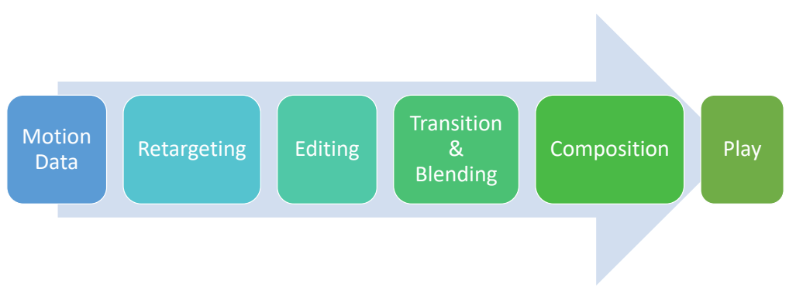
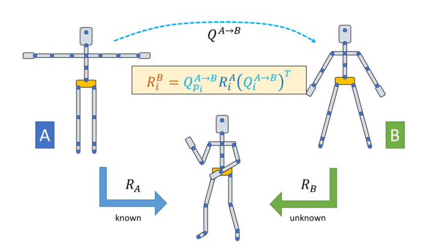
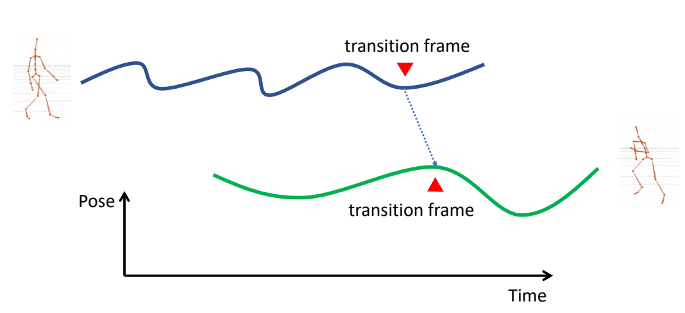
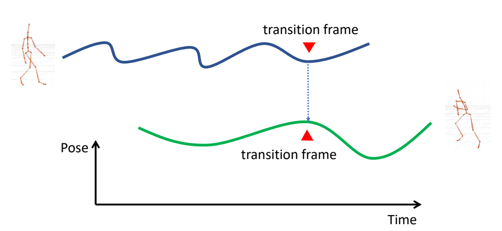
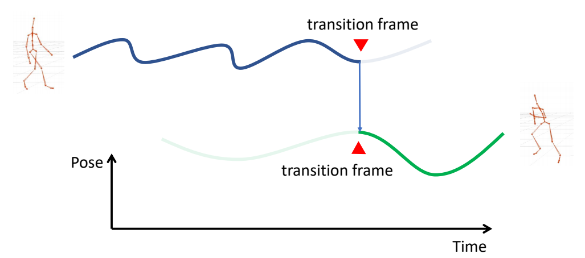
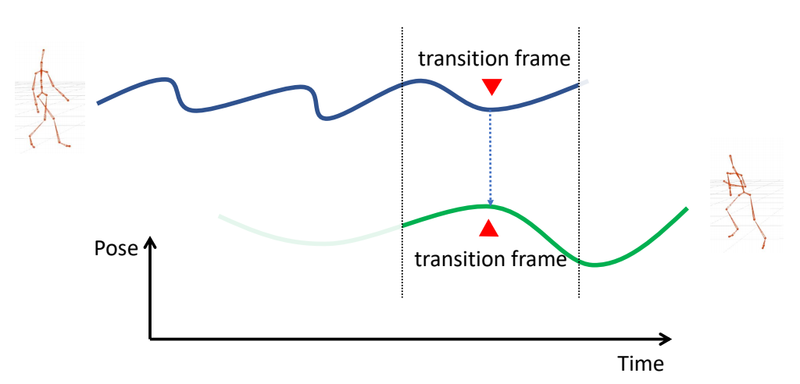
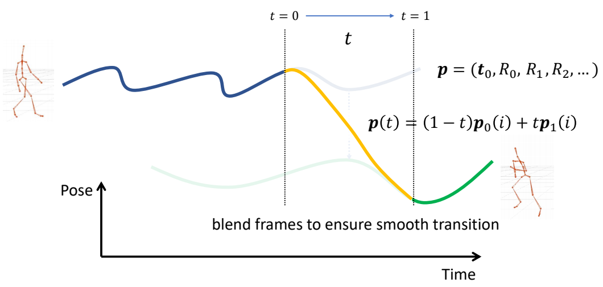
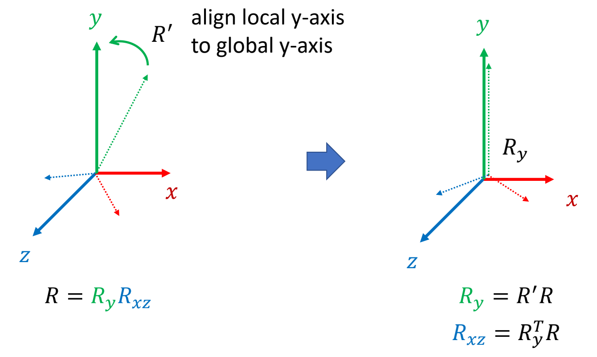

# Lecture 05

P2   
## Outline   

 - Motion Capture     
    - History and modern mocap systems   

 - Motion Synthesis    
    - Motion retargeting    
    - Motion transition     
    - Motion graph    

P3  
## Motion Capture   

How to get motion data?   

> &#x2705; 动画师制作，光学动捕、视觉动捕，外骨骼动捕，惯性传感器，动作估计。    
  

P29   
## Motion Synthesis   

How to use motion data?   

P31    
## Using Motion Data

  

P32   

## Motion Retargeting   

 - Retarget a motion to drive a character with    
    - Different number of bones    
    - Different bone names   
    - Different reference pose   
    - Different bone ratios    
    - Different skeletal structure    
    - ……    

P34   
## Motion Retargeting   

 - A possible retargeting pipeline   
     - Map bone names   
     - Scale translations   
     - Copy or retarget joint rotations to fix reference pose   
     - Postprocessing with IK   
       - Foot-skating   
       - Self penetration    
     - ……

  

  

P38
## Motion Transition 

  

> &#x2705; 有一段走路数据和跑步数据，如何实现人由走到跑的过程。  
> &#x2705;（1）找到两个motion中相似的一帧。  

P39   
## Motion Transition    

  

> &#x2705;（2）两帧在时间上对齐   

P40   
## Motion Transition    

  

> &#x2705;（3）放到这一帧时动作切换。  
> &#x2705; 缺点：会有明显间断。  

P44  
## Motion Transition 

  

> &#x2705; 改进：考虑前后帧，并做插值。   

P45   
## Motion Transition 

  

P46   
## Motion Transition

$$
p(t)=(1-\phi (t))p_0(i)+\phi (t)p_1(i)
$$

> &#x2705; 不一定非要线性插值，定义\\(\phi (t)\\)，或其它混合策略    
> &#x2705; 可能存在的问题：（1）突然转向（2）滑步   
> &#x2705; 当走和跑分别是朝不同方法时会出现以上问题。  
> &#x2705; 解决方法：插值之前动作对齐   

P55  
## “Facing Frame”    
    
 - A special coordinate system that moves horizontally with the character with one axis pointing to the “facing direction” of the character    

  

$$
\begin{align*}
 R & = \theta e_y \\\\
 t & = (t_x,0,t_z)
\end{align*}
$$

> &#x2705; 每个角色有自己的角色坐标系。  
> &#x2705; 原点：Hip在地面上的投影   
> &#x2705; 坐标轴：参考姿态下 y up z forward.    
> &#x2705; 且旋转和平移都受到限制。   

P56   
## “Facing Frame”  

 - A special coordinate system that moves horizontally with the character with one axis pointing to the “facing direction” of the character   

 - Possible definitions of \\(R\\)    
 - \\(R\\) is the **y-rotation** that aligns the z-axis of the global frame to the heading direction    
 - \\(R\\) is the **y-rotation** that aligns x-axis of the global frame to the average direction of the vectors between shoulders and hips    
 - Decomposition root rotation as \\(R_0=R_yR_{xz}\\)     

> &#x2705; 不同的\\(R\\)的定义适配不同的场景，例如上下半身的\\(y\\)轴旋转方向不同。   

P58   
## Rotation Decomposition

  

> &#x2705; 把\\(R\\)分解为\\(R_y\\)和\\(R_{xz}\\)，求\\(R_y\\)   
> &#x2705; \\({R}' \\)能够把local y-axis转到global y-axis的矩阵。   

P62   
## Motion Transition 

 - How to compute this transformation?    

  

> &#x2705; 两个坐标系的转换。

P68   
## Path Fitting

 

> &#x2705; 让角色跟着轨迹移动。    

P69   
## Motion Composition  

 - Computationally generating motions according to   
    - User control   
    - Objects in the same environment   
    - Movements of other characters   
    - ……   

P70  
## Motion Graphs

  

P71   
## Motion Graphs

  

> &#x2705; 动作图的本质是状态机。  

P72  
## Segment Motion Data 

 

> &#x2705; 一段动捕数据，如何做分割，如何确定哪些点可以连到一起。  
> &#x2705; Distance可以有多种定义方式。  
> &#x2705; 根据图确定分段与连接。  

P73  
## Segment Motion Data 

  

 - Distance map   
    - Each pixel represents the difference between a pair of poses   
    - Local minima are potential transition point   

Lucas Kovar, Michael Gleicher, and Frédéric Pighin. 2002. **Motion graphs**.    
*ACM Trans. Graph*. 21, 3 (July 2002),  

P74   
## Motion Synthesis   

 - State-machines   
    - Nodes represent motion clips   
    - Edges represent potential transitions   
    - Transitions are triggered when necessary   
      - User input   
      - Clip end   
    - Check immediate connections for the next clip    
      - May need deeper search   

 

P75   
## Interactive Animation Pipeline

   

> &#x2705; 优点：根据路线从动作库中选择最合适的动作，而不是直接使用路线，因此减少滑步。   
> &#x2705; 缺点：(1) 动作多时动作复杂。  
> &#x2705; (2) 一个片断播完再切动作，响应较慢。  
> &#x2705; (3) 需要提前规划好动捕动作。  
> &#x2705; 如果数据集里没有想要的姿态,可以结合IK.    

P78  
## Motion Matching?   

 - Clip → Pose   
 - Short clip → “Raw” and long motion data   

> &#x2705; 切换粒度更细：1帧 or 0.1 s．    
> &#x2705; 灵活性提升，可控性欠缺。   

---------------------------------------
> 本文出自CaterpillarStudyGroup，转载请注明出处。
>
> https://caterpillarstudygroup.github.io/GAMES105_mdbook/