# Lecture 03

P3   
## Outline   

 - Character Kinematics   
    - Skeleton and forward Kinematics   

 - Inverse Kinematics   
    - IK as a optimization problem   
    - Optimization approaches   
      - Cyclic Coordinate Descent (CCD)   
      - Jacobian and gradient descent method   
      - Jacobian inverse method   

P4   

## Character Kinematics    

kinematics /ˌkɪnɪˈmætɪks/
n. the study of the motion of bodies without reference to mass or force   

$$
-- \text{ Collins English Dictionary }
$$

P8   
## Skeleton

  

P9   
## Skeleton

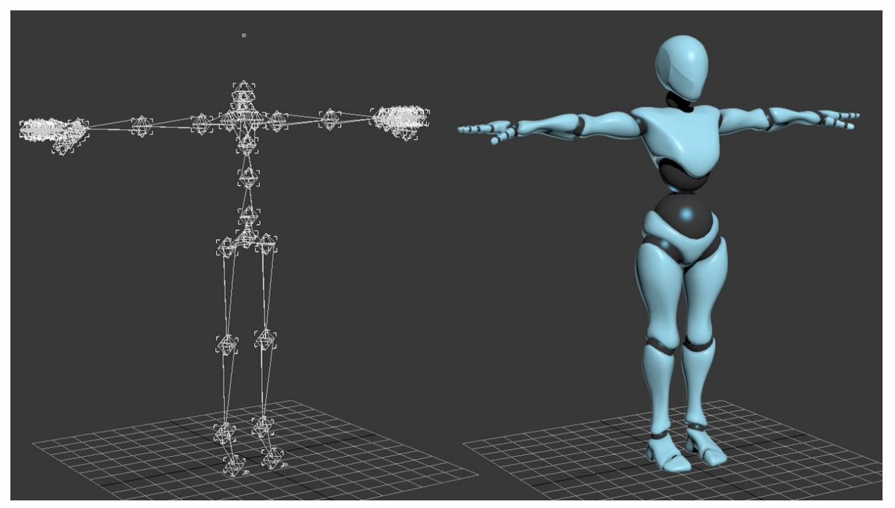  

> &#x2705; 关注关节的位置和旋转    

P13  

## Kinematics of a Chain

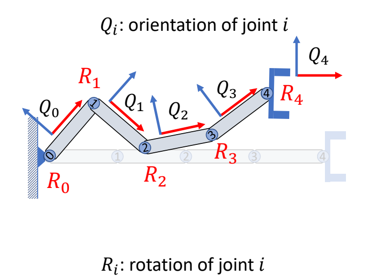  

$$
\begin{matrix}
 Q_0=？\\\\
 Q_1=？\\\\
 Q_2=？\\\\
 Q_3=？\\\\
Q_4=？
\end{matrix}
$$

> &#x2705; FK：要使手臂摆成指定的动作，每个关节在各自坐标系下的旋转是多少

P14    
## Kinematics of a Chain

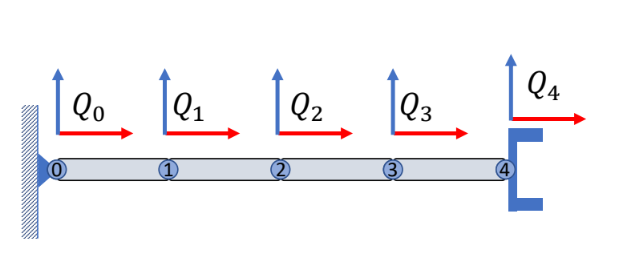  

$$
\begin{matrix}
 Q_0=I\\\\
 Q_1=I\\\\
 Q_2=I\\\\
 Q_3=I\\\\
Q_4=I
\end{matrix}
$$

> &#x2705; 这一个定义了5个关节的手臂。在每个关节上绑上一个坐标系。 

P15    
## Kinematics of a Chain

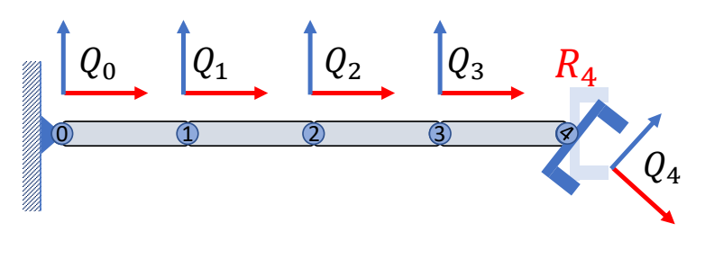  

$$
\begin{matrix}
 Q_0=I\quad\\\\\
 Q_1=I\quad\\\\\
 Q_2=I\quad\\\\\
 Q_3=I\quad\\\\\
Q_4={\color{Red}{R_4}}
\end{matrix}
$$

> &#x2705; \\(Q\\)：在世界坐标系下的朝向   
> &#x2705; \\(R\\)：在局部坐标系下的旋转  

P16   

## Kinematics of a Chain

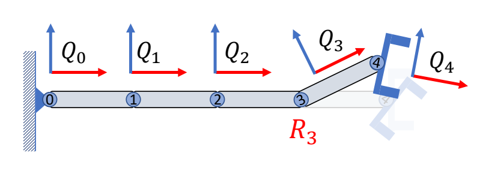 

$$
\begin{matrix}
 Q_0=I\quad\\quad\\\\\
 Q_1=I\quad\\quad\\\\\
 Q_2=I\quad\\quad\\\\\
 Q_3={\color{Red}{R_3}}\quad\\\\\
Q_4={\color{Red}{R_3}}R_4
\end{matrix}
$$

P17    
## Kinematics of a Chain

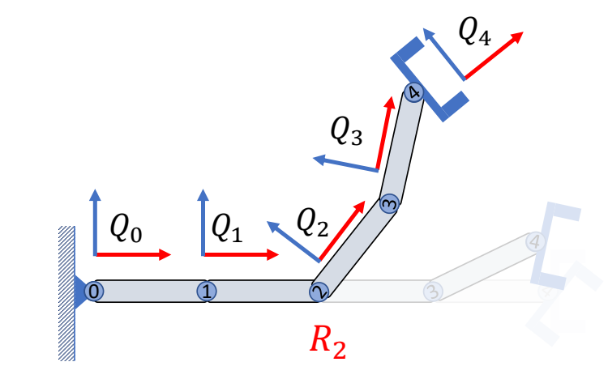 

$$
\begin{matrix}
 Q_0=I\quad \quad\quad   \\\\
 Q_1=I\quad \quad\quad   \\\\
 Q_2={\color{Red}{R_2}}\quad\\quad \\\\
 Q_3={\color{Red}{R_2}}R_3\quad \\\\
Q_4={\color{Red}{R_2}}R_3R_4
\end{matrix}
$$

P18   
## Kinematics of a Chain

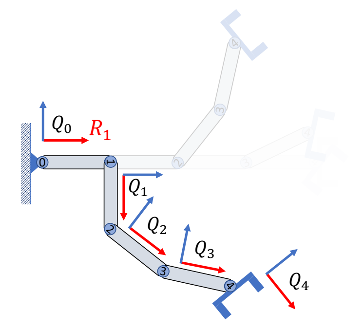  

$$
\begin{matrix}
 Q_0=I\quad \quad \quad \quad \\\\
 Q_1={\color{Red}{R_1}}\quad \quad \quad \\\\
 Q_2={\color{Red}{R_1}}R_2\quad \quad \\\\
 Q_3={\color{Red}{R_1}}R_2R_3\quad \\\\
Q_4={\color{Red}{R_1}}R_2R_3R_4
\end{matrix}
$$

P19   
## Kinematics of a Chain

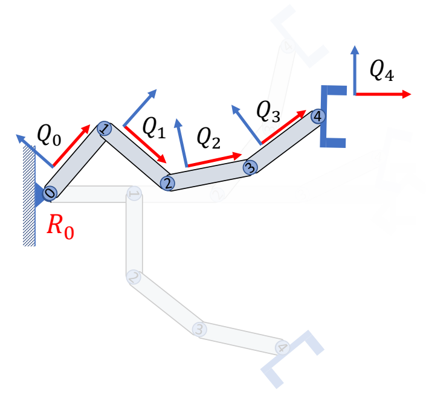  

$$
\begin{matrix}
 Q_0={\color{Red}{R_0}}\quad \quad\quad\quad \\\\
 Q_1={\color{Red}{R_0}}R_1 \quad\quad\quad \\\\
 Q_2={\color{Red}{R_0}}R_1R_2\quad \quad \\\\
 Q_3={\color{Red}{R_0}}R_1R_2R_3\quad \\\\
Q_4={\color{Red}{R_0}}R_1R_2R_3R_4
\end{matrix}
$$

P20   

## Kinematics of a Chain

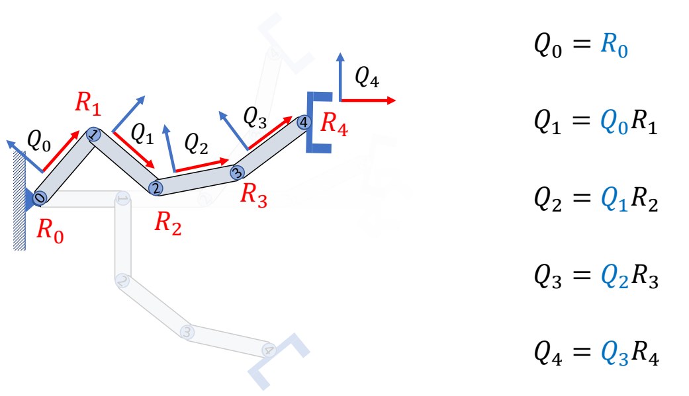  

P21   
## Kinematics of a Chain   

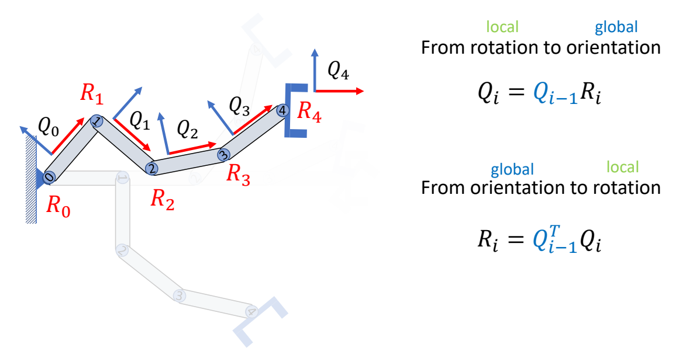  

> &#x2705; 这些 \\(Q\\) 都是全局旋转，\\(R\\) 是局部旋转。  

P23   
## Kinematics of a Chain   

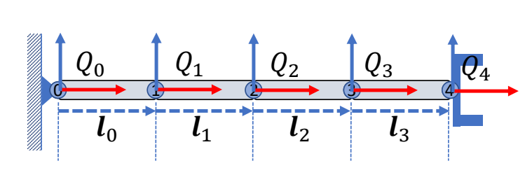  

> &#x2705; \\( 𝒍 \\)：子关节位置在父坐标系下的坐标。   

P31   
## Kinematics of a Chain   

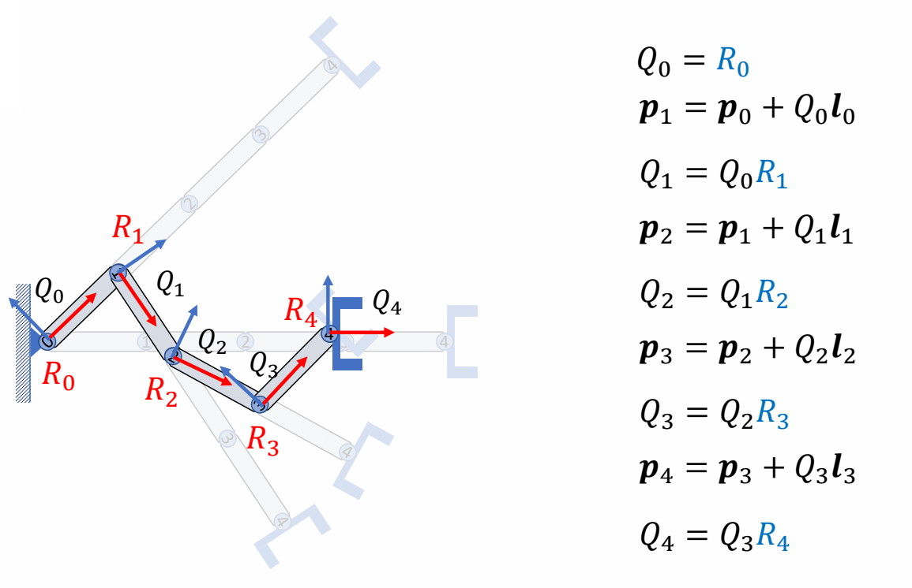

> &#x2705; \\(p\\) 是全局位置，\\( 𝒍 \\) 是局部偏移。   

P37   
## Kinematics of a Chain: Summary

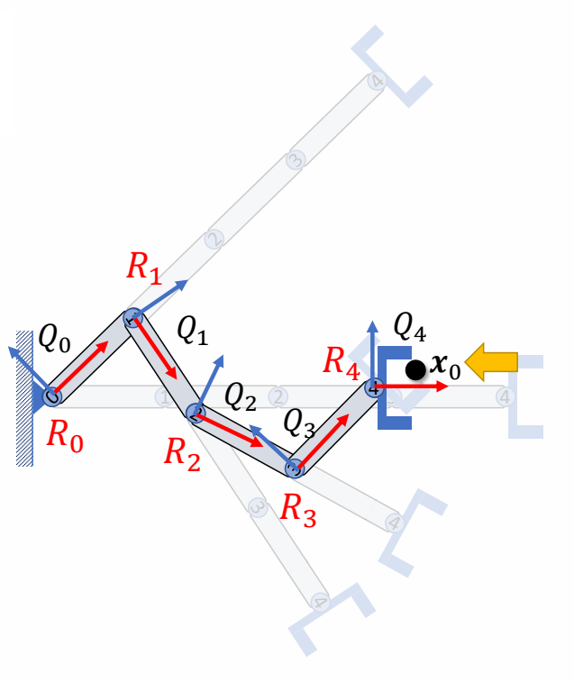  

Forward kinematics:    

Given the rotations of all joints \\(R_i\\), find the coordinates of \\(x_0\\) in the global frame \\(x\\):    

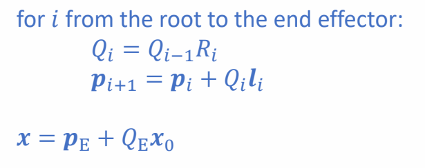  

> &#x2705; \\(x_0\\) 是 \\(R_4\\) 坐标系下的点，求它在某个父坐标系下的位置。    
> &#x2705; \\(p\\)：关节在全局坐标系下的位置   
> &#x2705; 第1步：根据 \\(R_i\\) 和 \\( 𝒍 _i\\) 求出 \\(Q_i\\) 和 \\(P_i\\)    
> &#x2705; 第2步：\\(E\\) 可以是任意父结点，公式都适用    

     
P38    
## Kinematics of a Chain: Summary

Forward kinematics:    

Given the rotations of all joints \\(R_i\\), find the coordinates of \\(x_0\\) in the global frame \\(x\\):    

  

> &#x2705; 是上一页的另一种写法，不需提前算出中间变量。    

P39   
## Kinematics of a Chain: Summary

Forward kinematics:    

Given the rotations of all joints \\(R_i\\), find the coordinates of \\(x_0\\) relative to the local frame of \\(Q_k\\):    

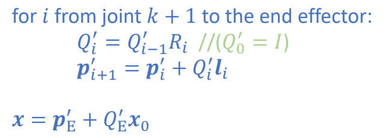  

> &#x2705; 已知全局坐标系下的坐标，求 \\(Q_k\\) 下的坐标。  

P40    
## Kinematics of a Chain: Summary

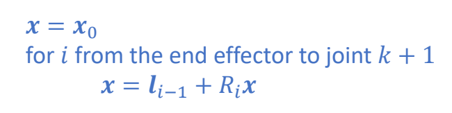  

> &#x2705; 对应上一页的另一种写法   

P41   
## Kinematics of a Character

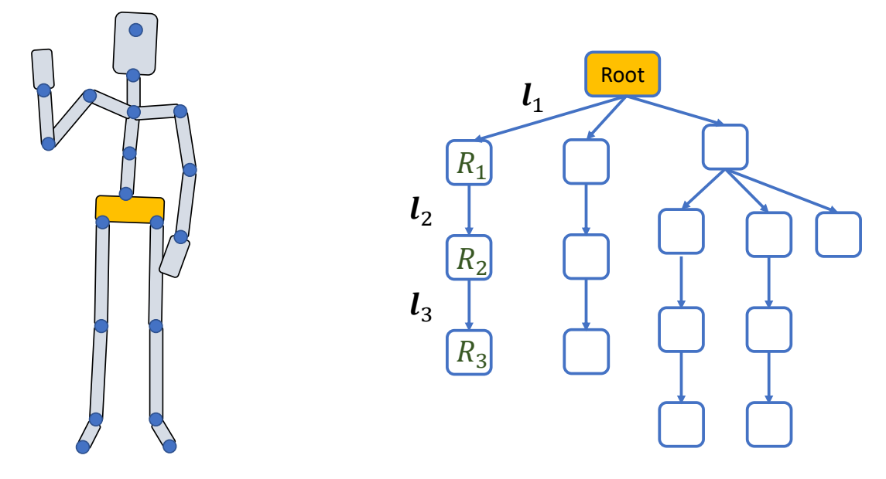  

> &#x2705; 把角色建模成多条关节链。   

P43    
## Root Location

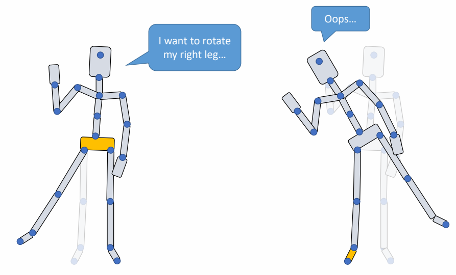  

> &#x2705; 以不同关节为 root，同样旋转会得到不同效果。   

P45   
## Types of Joints

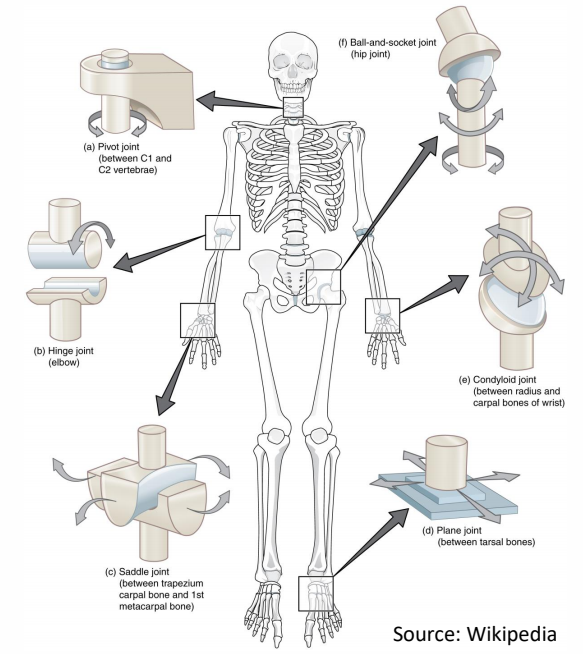  

P46   
## Types of Joints

|||
|---|---|
| 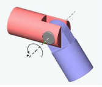 |knee, elbow       hinge joint     revolute joint  |
|  | hip, shoulder      ball-and-socket joint   |

P47   
## Degrees of Freedom (DoF)   

 - Number of independent parameters that define the configuration or state of a mechanical system     

$$
\begin{matrix}
\text{DoF }=6 \\\\
(p,R) \in \mathbb{R} ^3\times so(3)
\end{matrix}
$$

> &#x2705; 自由度：一个物理系统，需要多少参数可以唯一准确地描述它的状态。   
> &#x2705; 6 DOF＝3 平移 ＋ 3 旋转。   

P50   
## Degrees of Freedom (DoF)  

||||
|---|---|---|
| 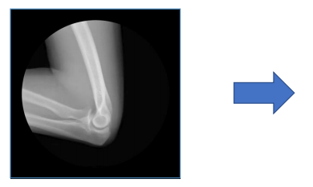  |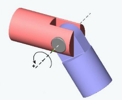  | knee, elbow    \\({\color{Red}{1 \text{DoF}}}\\)     hinge joint    revolute joint  |
| 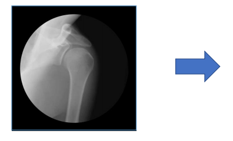  |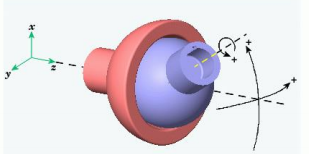 |hip, shoulder    \\({\color{Red}{3 \text{DoF}}}\\)   ball-and-socket joint |

 
> &#x2705; 关节的自由度最多为3，因为不能自主移动。Hips 除外。

P51   
## Degrees of Freedom (DoF)
   
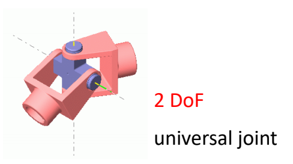  

> &#x2705; 手腕。其实手腕不能自转。

P52   
## 
Joint Limits

||||
|---|---|---|
|   |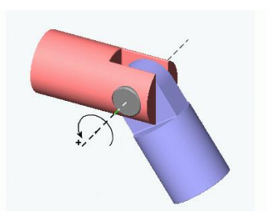    | knee, elbow    \\({\color{Red}{1 \text{DoF}}}\\)    \\(\theta_{\min }\le \theta\le  \theta_{\max } \\)   hinge joint    revolute joint  |
|   |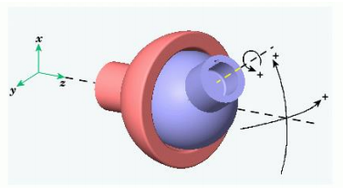 |hip, shoulder    \\({\color{Red}{3 \text{DoF}}}\\)   \\(\theta_{\min }\preceq  \theta \preceq  \theta_{\max } \\)   ball-and-socket joint |

P55  

## Forward Kinematics   

$$
(t_0,R_0,R_1,R_2\dots \dots ) 
$$

$$
\text{root } \mid \text{ internal joints}
$$

joints are typically in the order that every joint precedes its offspring   

for \\(i\\) in joint_list:    

$$
\begin{align*}
 p_i= & i^,\text{ s parent joint} \\\\
  Q_i=& Q_{pi}R_i \\\\
 x_i= & x_{pi} + Q_{pi}l_i
\end{align*}
$$

> &#x2705; 一个动作的参数化表示：   
> &#x2705; 全局位置＋root 朝向＋各关节旋转   
> &#x2705; 通常要求，关节顺序为父在前子在后，这样只须遍历一遍就能完成 FK.    

P57   
## Forward Kinematics
Q2: how should we allow stretchable bones?    

> &#x2705; 答：增加参数，3 Dof 增加为 6 Dof.   

P58   
## Example: motion data in a file     

BVH files   

 - HIERARCHY: defining **T-pose of** the character   
 - MOTION: root position and **Euler angles** of each joints   

See: <https://research.cs.wisc.edu/graphics/Courses/cs-838-1999/Jeff/BVH.html>

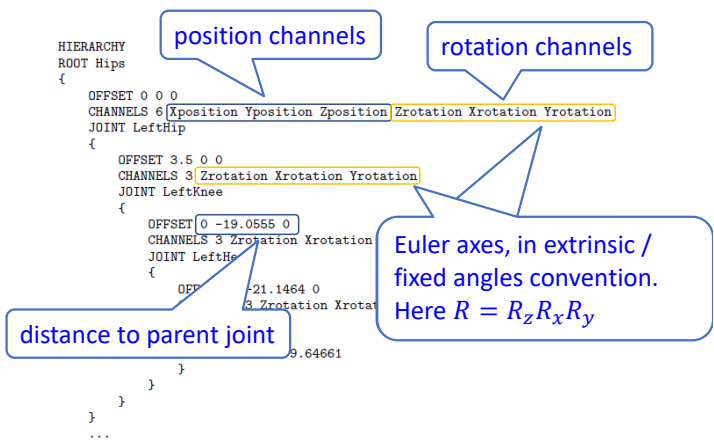  

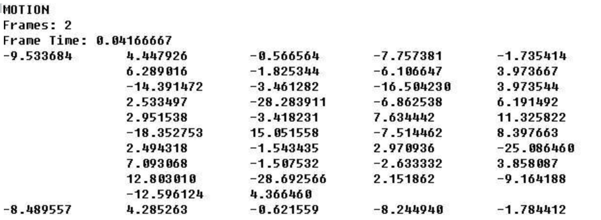  

P59   
## Inverse Kinematics

A. Aristidou, J. Lasenby, Y. Chrysanthou, and A. Shamir. 2018.    
**Inverse Kinematics Techniques in Computer Graphics: A Survey.**    
Computer Graphics Forum    

P61   
## Forward and Inverse Problems   

For a system that can be described by a set of **parameters** \\(\theta \\), and a **property** 𝒙 of the system given by    

$$
x=f(\theta )
$$

Forward problem:     

 - Given \\(\theta \\), we need to compute \\(x \\)    

 - Easy to compute since \\(f\\) is known, the result is unique    

 - DoF of \\( \theta \\) is often much larger than that of \\(x \\). We cannot easily tune \\(\theta \\) to achieve a specific value of \\(x\\). 

Inverse problem:    

 - Given \\(x \\), we need to find a set of valid parameters \\(\theta \\) such that\\(x=f(\theta) \\)   
 
 - Often need to solve a difficult **nonlinear** equation, which can have **multiple** solutions   

 - \\(x\\) is typically meaningful and can be set in intuitive ways   

P62   
## Inverse Kinematics

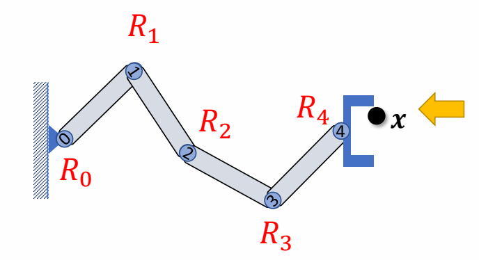  

Given the position of the end-effector \\(x\\), Compute the joint rotations \\(R_i\\)    

P64   
## Solutions of IK Problems

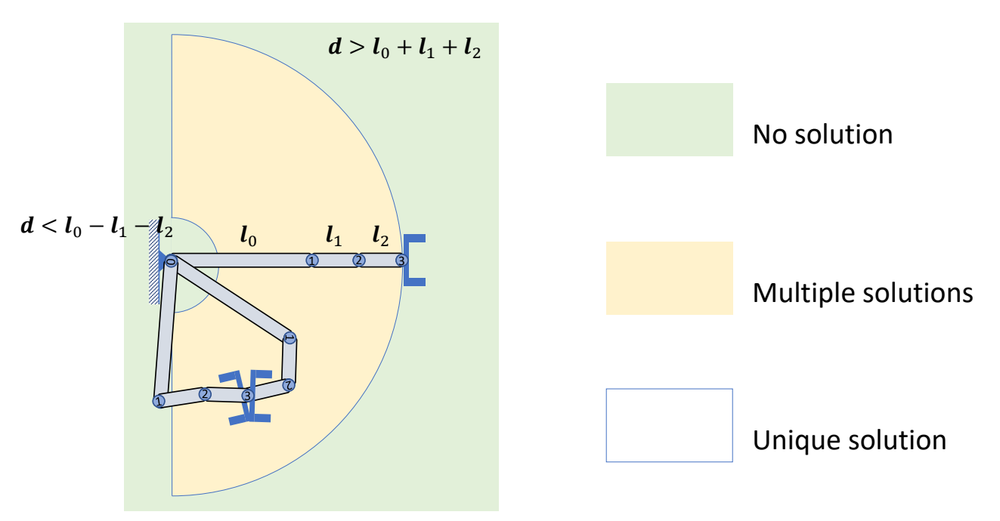  

P67   
  

P68   
## A simple solution to a two-joint IK problem

1. Rotate joint 1 such that   

$$
||l_{ox}||=||l_{02}||
$$

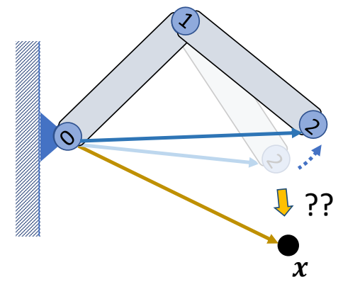  

> &#x2705; 使用余弦公式

P70   
## A simple solution to a two-joint IK problem   

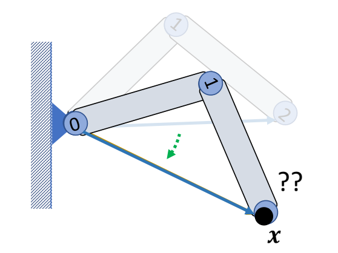  

1. Rotate joint 1 such that   

$$
||l_{ox}||=||l_{02}||
$$

2. Rotate joint 0 such that   

$$
l_{ox}=l_{02}
$$

> &#x2705; 叉乘得到旋轴，点乘得到旋转角。   

P71   
## A simple solution to a two-joint IK problem

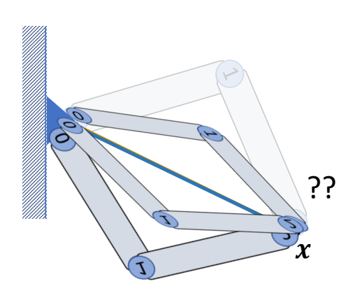  

1. Rotate joint 1 such that 

$$
||l_{ox}||=||l_{02}||
$$

2. Rotate joint 0 such that

$$
l_{ox}=l_{02}
$$

3. Rotate joint 0 around \\(l_{ox}\\) if necessary 

P72   

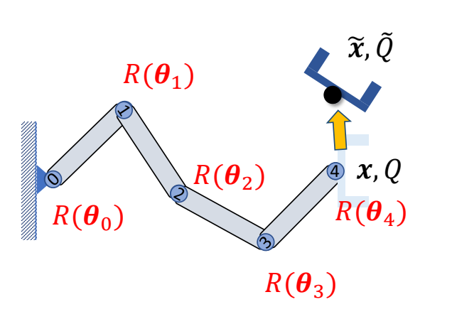  

$$
x=f(\theta )
$$

$$
Q=Q(\theta )
$$

> &#x2705; 机械臂场景，关节有多个，指定末端结点的位置和朝向   

P74   
## IK as an Optimization Problem

  

Find \\(\theta \\) such that      

$$
\tilde{x} -f(\theta )=0
$$

P75  
## IK as an Optimization Problem  

Find \\(\theta \\)  to optimize   

$$
\min_{\theta } \frac{1}{2} ||f(\theta )-\tilde{x} ||^2_2
$$

P87   

> &#x2705; 用迭代的方法，从当前 motion 出发，优化出目标 motion.   

P88   
## Cyclic Coordinate Descent (CCD)   

Update parameters along each axis of the coordinate system   

Iterate cyclically through all axes    

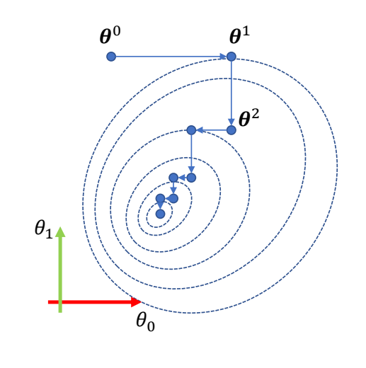  

P90   
## Cyclic Coordinate Descent (CCD) IK  

Rotate joint 3 such that \\(𝒍_{34}\\) points towards \\(\tilde{x}\\)   

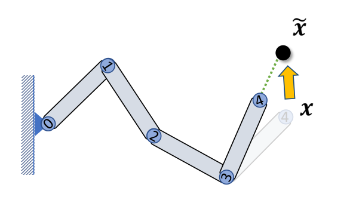  

> &#x2705; 叉乘得到旋转轴，点乘得到旋转角度。  

P92   
## Cyclic Coordinate Descent (CCD) IK   

Rotate joint 3 such that \\(𝒍_{34}\\) points towards \\(\tilde{x}\\)   

Rotate joint 2 such that \\(𝒍_{24}\\) points towards \\(\tilde{x}\\)   

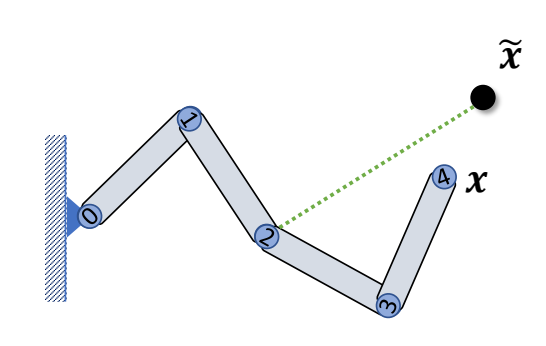  

P93   
## Cyclic Coordinate Descent (CCD) IK

Rotate joint 3 such that \\(𝒍_{34}\\) points towards \\(\tilde{x}\\)   

Rotate joint 2 such that \\(𝒍_{24}\\) points towards \\(\tilde{x}\\)  

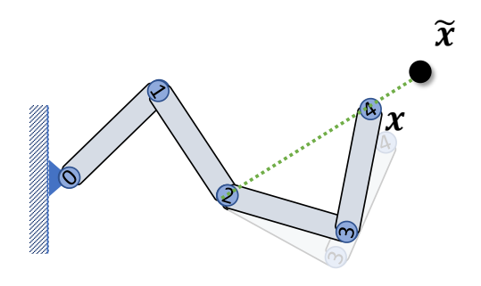  

P94   

## Cyclic Coordinate Descent (CCD) IK

Rotate joint 3 such that \\(𝒍_{34}\\) points towards \\(\tilde{x}\\)   

Rotate joint 2 such that \\(𝒍_{24}\\) points towards \\(\tilde{x}\\)  

Rotate joint 1 such that \\(𝒍_{14}\\) points towards \\(\tilde{x}\\)   

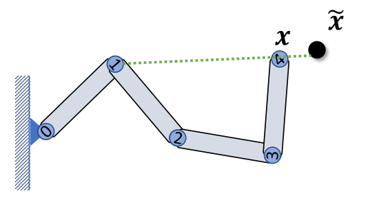 

P95   
## Cyclic Coordinate Descent (CCD) IK

Rotate joint 3 such that \\(𝒍_{34}\\) points towards \\(\tilde{x}\\)   

Rotate joint 2 such that \\(𝒍_{24}\\) points towards \\(\tilde{x}\\)   

Rotate joint 1 such that \\(𝒍_{14}\\) points towards \\(\tilde{x}\\)   

Rotate joint 0 such that \\(𝒍_{14}\\) points towards \\(\tilde{x}\\)   

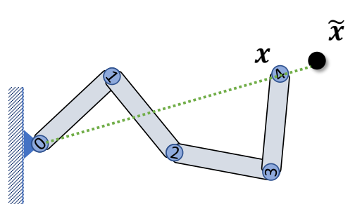  

P96   

## Cyclic Coordinate Descent (CCD) IK  

Rotate joint 3 such that \\(𝒍_{34}\\) points towards \\(\tilde{x}\\)   

Rotate joint 2 such that \\(𝒍_{24}\\) points towards \\(\tilde{x}\\)   

Rotate joint 1 such that \\(𝒍_{14}\\) points towards \\(\tilde{x}\\)   

Rotate joint 0 such that \\(𝒍_{14}\\) points towards \\(\tilde{x}\\)   

Rotate joint 3 such that \\({l}'_{34}\\) points towards \\(\tilde{x}\\)   

……    

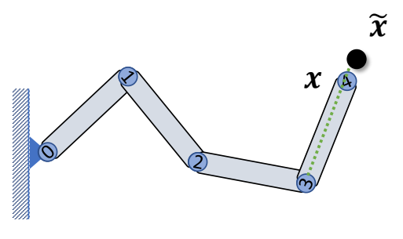  

P97   
## Cyclic Coordinate Descent (CCD) IK

Iteratively rotation each joint to make the end-effector align with vector between the joint and the target    

Easy to implement, very fast    

The “first” joint moves more than the others May take **many iterations** to **converge** Result can be sensitive to the **initial solution**    

> &#x2705; 一个动作序列做 CCD，可能结果不稳定，有跳变。   
> &#x2705; 前面例子是 3210 的调整顺序，也可以是 0123 的顺序。   
> &#x2705; 关于梯度下降法跳过。   
> &#x2705; 先移到的关节调整幅度会大一点，所以一般从末端开始。   

P105   

## Gradient Descent   

$$
\begin{align*}
 \nabla_\theta F(\theta ^i)= & (\frac{\partial f}{\partial \theta }(\theta ^i))^T(f(\theta ^i)-\tilde{x})\\\\
 = & J^T \Delta   
\end{align*}
$$

> &#x2705; \\(J\\) 是 Jacobia矩阵， \\( \Delta \\) 是位置差    

P106   
## Jacobian Transpose   

$$
\theta ^{i+1}=\theta ^i-\alpha J^T\Delta
$$

$$
J= \frac{\partial f}{\partial \theta }=(\frac{\partial f}{\partial \theta_0 }\frac{\partial f}{\partial \theta_1 }\dots \frac{\partial f}{\partial \theta_n } ) 
$$

P114     [⑩]加一页   
> &#x2705; 关节 1 旋转轴 \\(a_1\\)，对 \\(x\\) 位移是怎么影响的？   

P115     [⑩]加一页   

P117     [⑩]加一页   

P119     [⑩]加一页   

P121   
## Jacobian Transpose / Gradient Descent   

First-order approach, convergence can be slow Need to re-compute Jacobian at each iteration   

> &#x2705; 怎么求 \\(J\\)，这里讲了 3 种方法：（1）backward 框架（2）差分（3）几何计算。实际上直接用 1 可以解决，不需要自己去算，因此跳过。   
> &#x2705; 特点：（1）迭代次数比 CCD 少（2）计算量比 CCD 大。   

P122
> &#x2705; 数值插值算法见 GAMES102.   

P124    

## Example: Quadratic Programming   

$$
\min_{\theta } F(\theta )=\frac{1}{2} \theta ^TA\theta +b^T\theta 
$$

where \\(A\\) is positive definite:   

$$
A=A^T,\theta ^TA\theta \ge 0 \text{ for any } \theta 
$$

> &#x2705; 这几页介绍二次函数求极值的问题。   

P126   

$$
\begin{matrix}
 \text{Gradient}: \nabla_\theta  F(\theta )=A\theta +b \\\\
 \text{Optimality condition}: \nabla_\theta  F(\theta ^\ast )=0\\\\
 {\color{Blue} \Downarrow } \\\\
\theta ^\ast =-A^{-1}b
\end{matrix}
$$

P127    
## Gauss-Newton Method   

$$
F(\theta )=\frac{1}{2} ||f(\theta )-\tilde{x} ||^2_2
$$

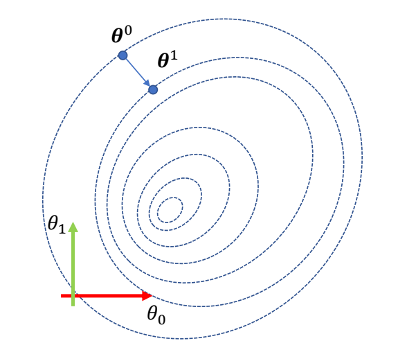   

Consider the first-order approximation of \\(f(\theta)\\) at \\(\theta^0\\)    

$$
\begin{align*}
  f(\theta)\approx & f(\theta^0) + \frac{\partial f}{\partial \theta} (\theta^0)(\theta-\theta^0) \\\\
 = & f(\theta^0)+J(\theta-\theta^0)
\end{align*}
$$

> &#x2705; IK问题可以转化为二次函数求极值问题。   
> &#x2705; 把 \\(f(\theta )\\) 在 \\(\theta ^{\circ} \\) 处一阶泰勒展开。   

P128    

\begin{align*}
  f(\theta)\approx  & \frac{1}{2}||f(\theta^0)+J(\theta -\theta ^0)-\tilde{x}||^2_2    \\\\
 = &\frac{1}{2} (\theta -\theta ^0)^TJ^TJ(\theta -\theta ^0)\\\\
 & +(\theta -\theta ^0)^TJ^T(f(\theta ^0)-\tilde{x})+c 
\end{align*}

> &#x2705; 把它代入目标函数。  

P129   
## Gauss-Newton Method   

$$
\begin{matrix}
 f(\theta)\approx  \frac{1}{2}||f(\theta^0)+J(\theta -\theta ^0)-\tilde{x}||^2_2 \\\\
 \Downarrow \\\\
(\nabla F (\theta ))^T=J^TJ(\theta-\theta^0)+J^T(f(\theta^0)-\tilde{x} )=0
\end{matrix}
$$

first-order optimality condition    

> &#x2705; 令 \\((\nabla F (\theta ))^T=0\\)   

P132   

> &#x2705; \\(J\\) 的维度是 \\(3\times N\\)，因此 \\(J^TJ\\) 不可逆。   

P133   
## Gauss-Newton Method

$$
J^TJ(\theta-\theta^0)=-J^T\Delta 
$$

\\(J^TJ\\) is \\({\color{Red} {\text{NOT}}}\\) invertible, but \\(JJ^T\\) can be invertible      

P134   
## Jacobian Inverse Method
 
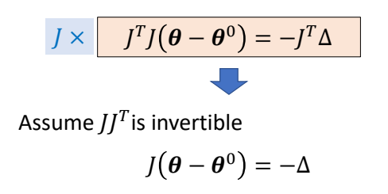  

> &#x2705; \\(\Delta\\) 是当前和目标的末端点位置之差。  

P135   
## Jacobian Inverse Method

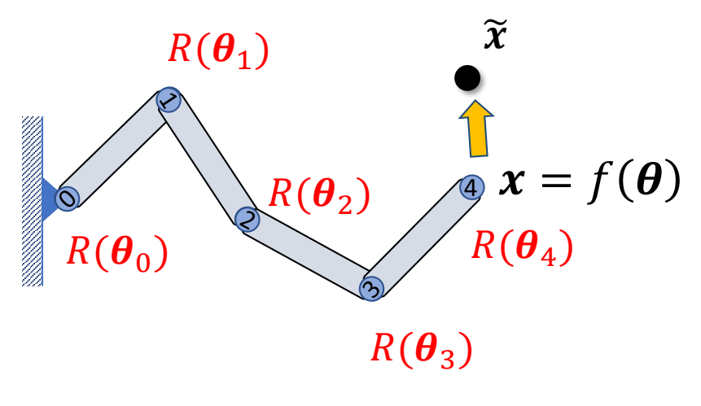  

$$
J(\theta-\theta^0)=\tilde{x} -f(\theta^0)
$$

P137   

$$
\begin{align*}
 \theta = & \theta ^0-J^+\Delta \\\\
 = & \theta ^0-J^T(JJ^T)^{-1}\Delta
\end{align*}
$$

(Moore-Penrose) Pseudoinverse   

P138   

## Gauss-Newton Method

$$
F(\theta )=\frac{1}{2} ||f(\theta )-\tilde{x} ||^2_2
$$

  

$$
J^TJ(\theta-\theta^0)=-J^T\Delta 
$$

If \\(J^TJ\\) is invertible, we have   

$$
\theta = \theta^0 - (J^TJ)^{-1}J^T\Delta
$$

but when can \\(J^TJ\\) be invertible?   

P141   
## Gauss-Newton Method

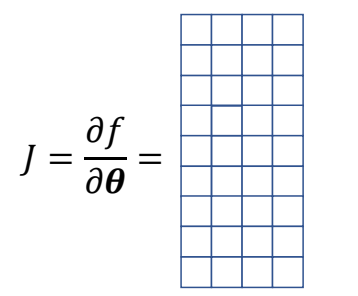  

> &#x2705; 改变IK的约束条件（例如增加中间关节的位置要求）和自由度（例如限制关节的自由度），可改变 \\(J\\) 的形状为方阵或高瘦阵，此时 \\(J^TJ\\) 可逆，则换一种方式求逆。   

P143   
## Jacobian Inverse Method

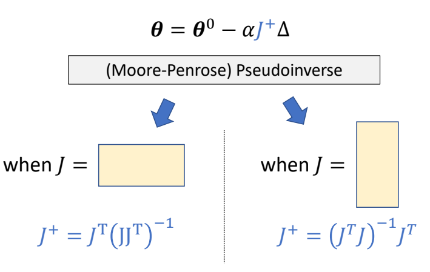     

> &#x2705; 左：欠约束，右：过约束。  

P145   

Usually faster than gradient descent/Jacobian transpose method.   

Any problem? \\(JJ^T/J^TJ\\) can be (near) singular!    

> &#x2705; 快一点是因为 \\(J^＋\\) 是近似的 \\(J\\)，计算量较小，问题是可能得到一个错很远的 \\(J^＋\\)，导致结果不稳定。   

P147   

## Damped Jacobian Inverse Method

$$
J^\ast =J^T(JJ^T+\lambda I)^{-1}
$$

$$
J^\ast =(J^TJ+\lambda I)^{-1}J^T
$$

> &#x2705; 解决方法，引 \\(\lambda\\) 阻尼项   

P148   
Also called Levenberg-Marquardt algorithm    

> &#x2705; 引 \\(\lambda\\) 阻尼顶后，两种方式的计算结果相同。   
> &#x2705; 当 \\(\lambda\\) 很大时，此方法等价于梯度下降法。   

P149   
## Damped Jacobian Inverse Method

Using the minimal rotations to reach the target    

> &#x2705; \\(\lambda\\) 的几何意义

P150  
## Damped Jacobian Inverse Method  

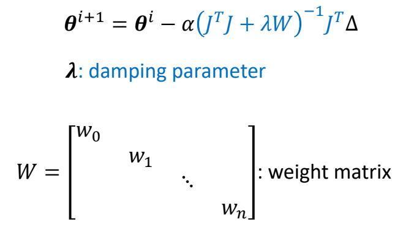  

> &#x2705; 进一步地，分别给每个关节移动权重。  
> &#x2705; 权重越大，移动越小。   

P152   
## Character IK

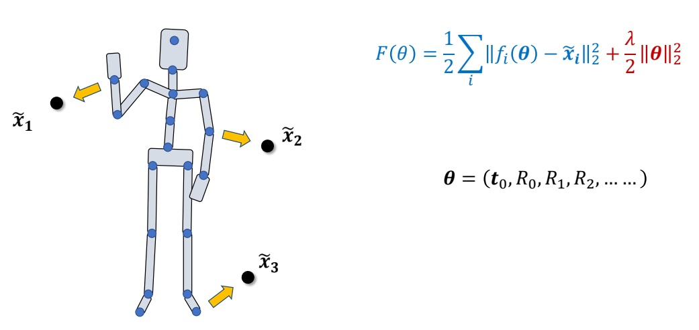  

> &#x2705; 全身 IK，不同链条上都有目标点。   
> &#x2705; 可以同时优化所有链，或选一个或选一些。   
> &#x2705; IK 要更新哪关节也可以自由设定。   

P156   
## Outline   

 - Character Kinematics   
    - Skeleton and forward Kinematics   

 - Inverse Kinematics   
    - IK as a optimization problem   
    - Optimization approaches   
      - Cyclic Coordinate Descent (CCD)   
      - Jacobian and gradient descent method   
      - Jacobian inverse method   

Andreas Aristidou and Joan Lasenby. 2011.   
**FABRIK: A fast, iterative solver for the Inverse Kinematics problem.**   
*Graphical Models*   

> &#x2705; 不同优化方法对应不同 IK 长方法   
> &#x2705; CCD → CCDIK   
> &#x2705; GD → Jacobian GD     
> &#x2705; Gaussian → Jacobian Inverse  
 
P158   
[⑩]加一页   
> &#x2705; Slerp 结合 Sbline.   
> &#x2705; 50 fps → 60 fps：先插值，再采样   
> &#x2705; 惯性插值：UE 基于 SPD 求约束来做 IK   
> &#x2705; 参考 Darel Holden 博客    

---------------------------------------
> 本文出自CaterpillarStudyGroup，转载请注明出处。
>
> https://caterpillarstudygroup.github.io/GAMES105_mdbook/