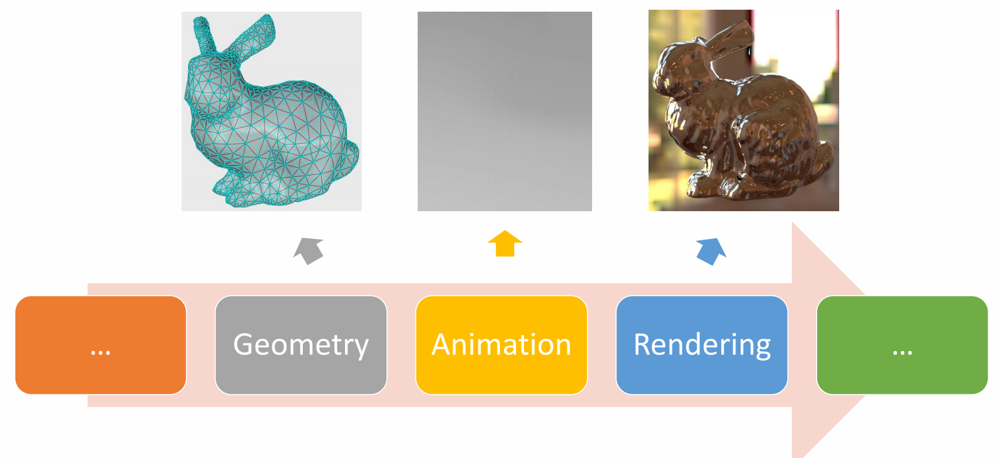

P2   
## Topics for the Day

 

GAMES 105
Fundamentals of Character Animation
GAMES105 课程交流 VCL @ PKU
Libin Liu
School of Intelligence Science and Technology
Peking University
Introduction to
3D Character Animation
Lecture 01:
Libin Liu - SIST, Peking University GAMES 105 - Fundamentals of Character Animation
Instructor
Libin Liu 刘利斌
• Assistant Professor 
• School of Intelligence Science and Technology,
Peking University
• http://libliu.info
VCL @ PKU 3
Libin Liu - SIST, Peking University GAMES 105 - Fundamentals of Character Animation
Welcome & Course Information
• Instructor: Libin Liu (http://libliu.info) 
• Website: https://games-105.github.io/
• Lecture: Monday 8:00PM to 9:00PM (12 Weeks)
• Prerequisites: linear algebra, calculus, 
programming skills (python),
probability theory, mechanics, ML, RL…
• Exercise:
• Codebase: https://github.com/GAMES-105/GAMES-105
• Submission: http://cn.ces-alpha.org/course/register/GAMES-105-Animation-2022/
• Register code: GAMES-FCA-2022 
• BBS: https://github.com/GAMES-105/GAMES-105/discussions
• QQ Group: 533469817 
Libin Liu - SIST, Peking University GAMES 105 - Fundamentals of Character Animation
What is Character Animation
5
Libin Liu - SIST, Peking University GAMES 105 - Fundamentals of Character Animation
What is Character Animation
6
Libin Liu - SIST, Peking University GAMES 105 - Fundamentals of Character Animation
What is Character Animation
7
Libin Liu - SIST, Peking University GAMES 105 - Fundamentals of Character Animation
3D Computer Graphics
8
… Geometry Animation Rendering …
Libin Liu - SIST, Peking University GAMES 105 - Fundamentals of Character Animation
3D Computer Animation
9
Simulation
Animation
Character 
Animation
Libin Liu - SIST, Peking University GAMES 105 - Fundamentals of Character Animation
3D Computer Animation
10
Simulation
Animation
Character 
Animation
rigid bodies,
deformable solids,
ropes, thin shells, cloth,
fluid, smoke, sound…
humans, animals,
virtual creatures,
hands, robots, 
crowds…
Phenomenon
Behavior
Libin Liu - SIST, Peking University GAMES 105 - Fundamentals of Character Animation
3D Computer Animation
11
Simulation
Animation
Character 
Animation
rigid bodies,
deformable solids,
ropes, thin shells, cloth,
fluid, smoke, sound…
humans, animals,
virtual creatures,
hands, robots, 
crowds…
+ Control 
Phenomenon
Behavior
Libin Liu - SIST, Peking University GAMES 105 - Fundamentals of Character Animation
Why Do We Study Character Animation
• A character typically has 20+ joints, or 50-100+ parameters
• It is not super high-dimensional, so most animation can be created manually, 
by posing the character at keyframes
• Labor-intensive, not for interactive applications
• Character animation techniques
• Understanding the mechanism behind motions and behaviors
• Smart editing of animation/ Reuse animation / Generate new animation
• “Compute-intensive”
12
Motion
Model
Control Signals
• Interaction
• Audio/Text
• Abstract tasks
• ……
Libin Liu - SIST, Peking University GAMES 105 - Fundamentals of Character Animation
Character Animation Pipeline
13
+
Rigging & Skinning
Skeletal Animation
Animated Character
Character Animation Pipeline
Libin Liu - SIST, Peking University GAMES 105 - Fundamentals of Character Animation
Physics-based/Dynamic Approaches
19
Neuronal excitation
Forces/torques on skeleton
Physics
Body pose
Muscle activation
Simplified control & physics
Libin Liu - SIST, Peking University GAMES 105 - Fundamentals of Character Animation
Character Animation Methods
20
Physics
low-level control high-level goals
Physics-based/dynamic approaches
Keyframe-based/kinematic approach
Character Animation Methods
21
Keyframe-based/kinematic approach
Physics-based/dynamic approaches
Physics
low-level control
Libin Liu - SIST, Peking University GAMES 105 - Fundamentals of Character Animation
Questions?
108
That’s all for today.
See you next week!
109
aban·don [əˈband(ə)n]
adj. 常看常新

---------------------------------------
> 本文出自CaterpillarStudyGroup，转载请注明出处。
>
> https://caterpillarstudygroup.github.io/GAMES105_mdbook/