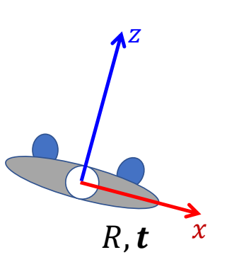
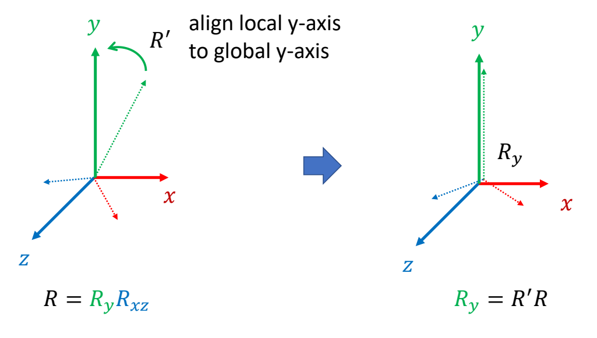
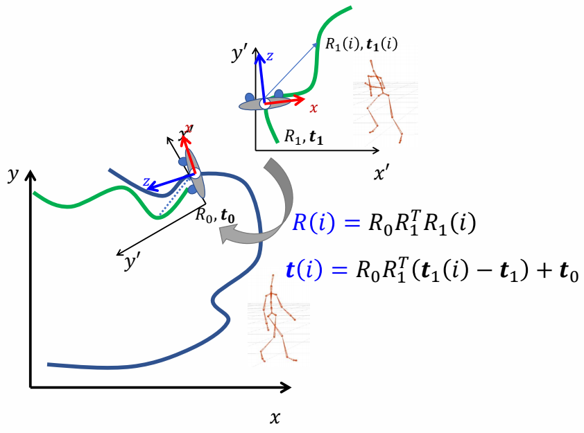
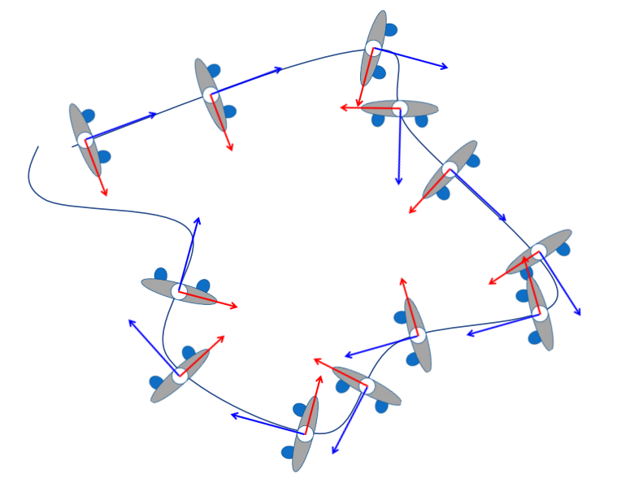
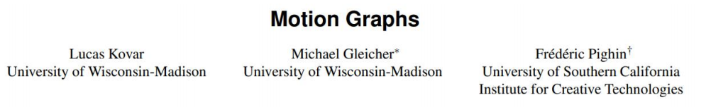
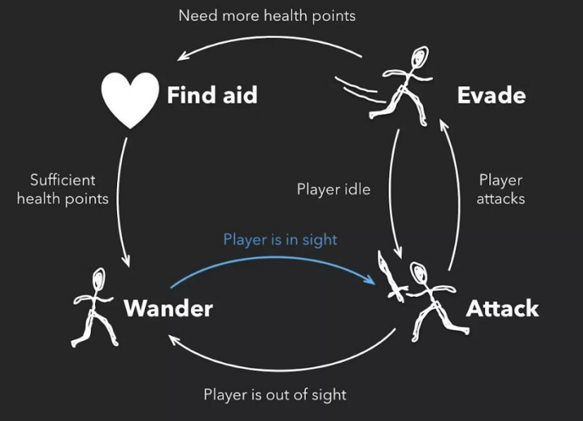
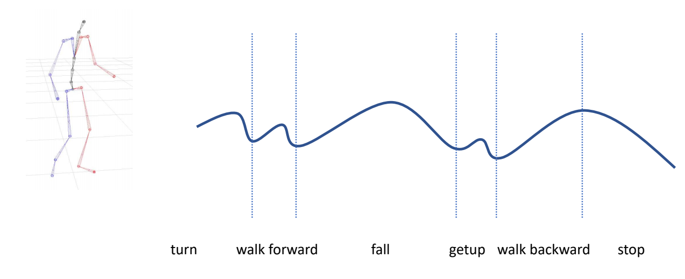
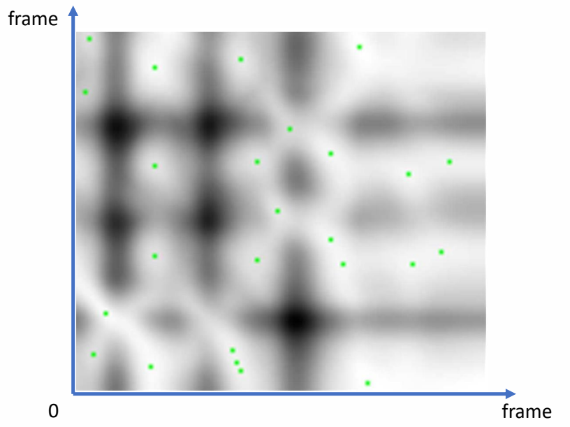
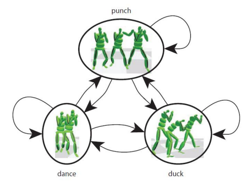
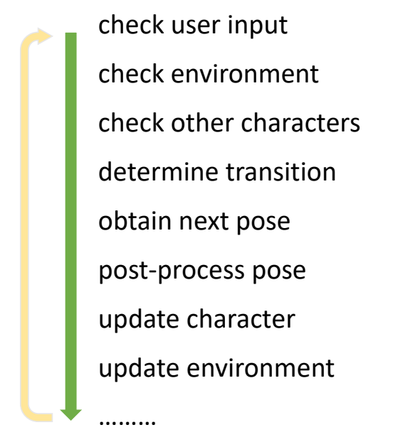

P2   
## Topics for the Day

 - A Mass-Spring System    
    - Explicit Integration   
    - Implicit Integration   
 - Bending and Locking Issues   
 - Shape matching   

P3  
## A Mass Spring System   

P4   
# 弹簧结构   

## An Ideal Spring    

An ideal spring satisfies Hooke’s law: the spring force tries to restore the rest length.    

 

    

\\(E(\mathbf{x})=\frac{1}{2}k (||\mathbf{x}_i −\mathbf{x}_j||−\mathbf{L} )^2\\)

\\(\mathbf{f} _i(\mathbf{x} )=−∇_i\mathbf{E} =−k(||\mathbf{x}_i −\mathbf{x}_j||−L)\frac{\mathbf{x}_i −\mathbf{x}_j}{||\mathbf{x}_i −\mathbf{x}_j ||}\\)

\\(\mathbf{f} _j(\mathbf{x})=−∇_jE=−k (||\mathbf{x}_j −\mathbf{x}_i ||−L)\frac {\mathbf{x}_j −\mathbf{x}_i}{||\mathbf{x}_j −\mathbf{x}_i||}\\)

P5  
## Multiple Springs   

When there are many springs, the energies and the forces can be simply summed up.     

    

$$
E= {\textstyle \sum_{e=0}^{3}}E_e= {\textstyle \sum_{e=0}^{3}} (\frac{1}{2} k(||\mathbf{x} _i −\mathbf{x}_e ||−L_e)^2)
$$

$$
f_i=−\nabla_iE = \textstyle \sum_{e=0}^{3}(−k(||\mathbf{x}_i−\mathbf{x}_e||−L_e)\frac{\mathbf{x}_i−\mathbf{x}_e}{||\mathbf{x}_i−\mathbf{x}_e||})
$$

P6  
### Structured Spring Networks   

    

P7  
### Unstructured Spring Networks   

We can also turn an unstructured triangle mesh into a spring network for simulation.    

  

P8   
## Triangle Mesh Representation   

The basic representation of a triangle mesh uses vertex and triangle lists. 

    

Vertex list: {\\(\mathbf{x} _0, \mathbf{x}_1, \mathbf{x}_2, \mathbf{x}_3, \mathbf{x}_4\\)}    (3D vectors)    

Triangle list: {1, 2, 3, 0, 1, 3, 0, 3, 4}    (index triples)    

| Each triangle has three edges. But there are repeated ones. |    
|----|   

> &#x2705; 已知边的信息，需找出内部边，例如\\(\mathbf{x}_0\mathbf{x}_3\\)，因此要基于此构造边：\\(\mathbf{x}_1\times 4\\)   

P9   
### Topological Construction   

The key to topological construction is to sort triangle edge triples.    

   

Each triple contains: edge vertex index 0, edge vertex index 1 and triangle index (index 0<index). 

    

> &#x2705; 排序：基于边排序后，排序后相同边会靠在一起

P11   
# 积分系统  

## Explicit Integration of A Mass-Spring System   

    

> &#x2705; 整体流程跟刚体运动很像，只是力变得复杂，每个弹簧端点上受到的力都要考虑，但没有了旋转。  
\\( E [e] [0] ：e\\)代表弹簧 ID:0或1代表弹簧两个端点     
图画得不对，先提前把所有的力都算出来，再遍历所有顶点    

P12   
   

Explicit integration suffers from **numerical instability** caused by <u>overshooting</U>, when the stiffness \\(k\\) and/or the time step \\(∆t\\) is too large.     

A naive solution is to use a small \\(∆t\\) . But that slows down the simulation.    

    

> &#x2705; 解决方法：减小\\(\Delta t\\)  
这个方法不解决本质问题，且会降低整个模拟系统的效率   

P13  
## Implicit Integration    

Implicit integration is a better solution to numerical instability.  The idea is to integrate both **x** and **v** implicitly.   

    

消元得：    
    

Assuming that \\(\mathbf{f}\\) is *holonomic*, i.e., depending on \\(\mathbf{x}\\) only, our question is how to solve:    
$$
\mathbf{x} ^{[1]}=\mathbf{x}^{[0]}+∆t\mathbf{v} ^{[0]}+∆t^2\mathbf{M} ^{−1}\mathbf{f} (\mathbf{x}^{[1]})
$$

> &#x2705; \\(holonomic\\)：只跟位置有关，跟速度无关。例如重力，弹力。  
那么 \\(f\\)可以写成关于位置的函数\\(f(x)\\)，但\\(f(x)\\)不一定是线性的。  
因此最后转化为解非线性方程的问题    

P14   

$$
\mathbf{||x||_M^2=x^TMx} 
$$

\\(\mathbf{x} ^{[1]} =\\) argmin \\(F(\mathbf{x})\quad\\)  for   \\(\quad F(\mathbf{x}) = \frac{1}{2∆t^2}||\mathbf{x} −\mathbf{x} ^{[0]}−∆t\mathbf{v} ^{[0]}||_M^2+E(\mathbf{x} )\\)    

Note that this is applicable to every system, not just a mass-spring system.    

> &#x2705; 非线性方程问题为转化为优化问题，\\(3N \times 3N\\)       
其中：\\(\mathbf{M}\\)对角矩阵，描述质量。  
\\(\mathbf{x}\\)为 \\(3N\times 1\\)矢量,描述顶点信息
\\(E\\) 为所有的力的能量   
只有保守力能用能量描述、非保守力（例如摩擦力）则不行。  

P15   
# 优化方法  

## Newton-Raphson Method   

The Newton-Raphson method, commonly known as Newton’s method, solves the optimization problem: \\(x^{[1]}\\) = argmin \\(F(x)\\).   

    

Given a current \\(x^{(k)}\\), we approximate our goal by: 

$$
0={F}' (x)≈{F}'(x^{(k)})+{F}'' (x^{(k)})(x−x^{(k)})
$$

    

> &#x2705; 原理：\\(a = \min F(x)⇒ F'(a)= 0\\)   
Overshooting 的本质：误差会积累和放大 

P16    
Newton’s method finds an extremum, but it can be a minimum or maximum.    

    

 - At a minimum \\(x^∗, {F}'' (x^∗)>0\\).     
 - At a maximum \\(x^∗, {F}''(x^∗)<0\\). 
 - If \\({F}''(x)>0\\) is everywhere, \\(F(x)\\) has no maximum.  \\(=> F(x)\\) has only one minimum.     

> &#x2705; \\(F'(a)= 0,a\\)  有可能是最大值或最小值，因此要判定解是否合理。判定方法： \\({F}''(x)\\)  

P17  
### Newton-Raphson Method 解隐式积分优化问题    

Now we can apply Newton’s method to: \\(x^{[1]} \\)= argmin \\(F(x)\\).
Given a current \\(x^{(k)}\\), we approximate our goal by: 

$$
0=\nabla F( \mathbf{x}) ≈\nabla F (\mathbf{x} ^{(k)})+\frac{∂F ^2(\mathbf{x} ^{(k)})}{∂\mathbf{x} ^2} (\mathbf{x−x} ^{(k)}) 
$$

    

> &#x2705; 按照 \\(\Delta x\\) 的更新公式，只需要用到\\(F'(x)\\) 和 \\({F}''(x)\\)， 不需要知道 \\(F(x)\\).   
此处\\(x\\)是向量，因此\\(F'(x)\\)是向量，\\({F}''(x)\\)是 Hession 矩阵  

P18  
### Simulation by Newton’s Method    

Specifically to simulation, we have:   

$$
F (\mathbf{x} )=\frac{1}{2∆t^2}||\mathbf{x} −\mathbf{x} ^{[0]}−∆t\mathbf{v} ^{[0]}||_\mathbf{M} ^2+\mathbf{E} (\mathbf{x} )
$$

$$
∇F(\mathbf{x}^{(k)})=\frac{1}{∆t^2}\mathbf{M} (\mathbf{x} ^{(k)}−\mathbf{x} ^{[0]}−∆t\mathbf{v} ^{[0]})−\mathbf{f}(\mathbf{x}^{(k)})
$$

$$
\frac{∂^2F (\mathbf{x} ^{(k)})}{∂\mathbf{x} ^2} =\frac{1}{∆t^2} \mathbf{M} +\mathbf{H} (x^{(k)})
$$

> Initialize \\(\mathbf{x} ^{(0)}\\), often as \\(\mathbf{x} ^ {(0)}\\) or \\(\mathbf{x} ^{(0)} +∆t\mathbf{v} ^{(0)}\\)  
 For \\(k=0\dots K\\)   
 Solve \\((\frac{1}{∆t^2} \mathbf{M}+\mathbf{H}(\mathbf{x}^{(k)}))∆\mathbf{x}=− \frac{1}{∆t^2}\mathbf{M}(\mathbf{x}^{(k)}−\mathbf{x}^{[0]}−∆t\mathbf{v}^{[0]})+\mathbf{f}(\mathbf{x} ^{(k)})\\)    
 \\(\mathbf{x}^{(k+1)}←\mathbf{x}^{(k)}+∆\mathbf{x}\\)     
 If \\(||∆\mathbf{x} ||\\) is small	\\(\quad\\) then bre     
 \\(\mathbf{x} ^{[1]}←\mathbf{x} ^{(k+1)}\\)    
 \\(\mathbf{v} ^{[1]}←(\mathbf{x}^{[1]}−\mathbf{x} ^{[0]})/ ∆t\\)    

> &#x2753; 每一个 step 都包含一次迭代优化、能做到实时？ 本节课所讲的套路：分析力 → 隐式积分 → 优化问题 → 更新，对弹簧系统、有限元、弹性体等各种物理模拟同样适用   

P19  
### SolveSpring Hessian

According to Lecture 2, Page 48,      

    

This is because for any \\(\mathbf{x} _{ij}, \mathbf{v} ≠0\\),    

$$
\mathbf{V}^\mathbf{T}\frac{{\mathbf{x} _{ij}\mathbf{x} _{ij}}^\mathbf{T} }{||\mathbf{x} _{ij}||^2}\mathbf{V}=||\frac{{\mathbf{x} _{ij}}^\mathbf{T} \mathbf{v} }{||\mathbf{x} _{ij}||}||^2> 0
$$

$$
\mathbf{V} ^\mathbf{T} (\mathbf{I} -\frac{{\mathbf{x} _{ij}\mathbf{x} _{ij}}^\mathbf{T} }{||\mathbf{x} _{ij}||^2}) \mathbf{V} =\frac{||\mathbf{x} _{ij}||^2||\mathbf{v} ||^2-||{\mathbf{x} _{ij}}^\mathbf{T} \mathbf{v} ||^2}{||\mathbf{x} _{ij}||^2}\ge 0 
$$

> &#x2705; \\(H(x)\\) 是\\(3 N \times 3N\\) 的矩阵、 N 是弹簧数    
每个He是一个\\(3 \times 3\\)矩阵   
最后一个公式分子满足柯西不等式   
\\(||x_{ij}||< Le\\). 代表弹簧处于压缩状态。此时 He 有可能非正定，但拉伸时一定正定。  
He 正定则\\(H(x)\\)半正定，此时弹簧系统有唯一解。  

P20   
When a spring is stretched, \\(\mathbf{H} _e\\) is s.p.d.; but when it’s compressed, \\(\mathbf{H} _e\\) may not be s.p.d.     

As a result, \\(\mathbf{H}(\mathbf{x})\\) may not be s.p.d. (Lecture 2, Page 36).    

\\(\mathbf{A}\\) may not be s.p.d. either.    

    

> &#x2705; \\(\Delta t\\)越少，A越容易正定、弹簧系统越稳定。   
但是A不正定，不代表没有唯一解。   

P22 

### Positive Definiteness of Hessian    

When a spring is compressed, the spring Hessian may not be positive definite. This means there can be multiple local minima (outcomes).    

    

|  Note: This issue occurs only in 2D and 3D. In 1D, \\(E(x)=\frac{1}{2} k(x−L)^2\\) and \\({E}''(x)=k>0\\).|  
|---|

P23   
### Enforcement of Positive Definiteness   

 - Nevertheless, some linear solvers can fail to work if the matrix \\(\mathbf{A}\\) in \\(\mathbf{A}\bigtriangleup \mathbf{x}=\mathbf{b}\\) is not positive definite.    

 - One solution is to simply drop the ending term, when \\({\color{Orange}{ ||\mathbf{x} _{ij}||<\mathbf{L} _e}}:\\)       

     

 - Other solutions exist. For example,     
    - Choi and Ko. 2002. Stable But Responive Cloth. TOG (SIGGRAPH)      

> &#x2705; 不正定最大的问题不是解不唯一，因为解出任意一个解都能让模拟系统进行下去。  
非正定的主要问题，是数学计算上的不稳定，可能导致解不出来；  
简单粗爆的解决方法就是把后面这项删掉。  

P24   
## The Jacobi Method    

We can use the Jacobi method to solve \\(\mathbf{A}∆\mathbf{x}  = \mathbf{b} \\).   

    

The vanilla Jacobi method (\\(α\\) = 1) has a tight convergence requirement on \\(\mathbf{A}\\), i.e., being diagonal dominant.    

The use of \\(α\\) allows the method to converget even when \\(\mathbf{A}\\) is positive definite only.    

P25   
## Linear Solvers – An Incomplete Summary    

|  Intel MKL PARDISO  |  
|-----|  

 - Direct Solvers (LU, LDLT, Cholesky, …)    
    - One shot, expensive but worthy if you need exact solutions.    
    - Little restriction on \\(\mathbf{A}\\)    
    - Mostly suitable on CPUs     

 - Iterative Solvers     
    - Expensive to solve exactly, but controllable    
    - Convergence restriction on \\(\mathbf{A}\\), typically positive definiteness    
    - Suitable on both CPUs and GPUs    
    - Easy to implement    
    - Accelerable: Chebyshev, Nesterov, <u>Conjugate Gradient</u>…    

P26   
## The Jacobi Method with Chebyshev Acceleration    

We can use the accelerated Jacobi method to solve \\(\mathbf{A}∆\mathbf{x} =\mathbf{b} \\).    

> The Accelerated Jacobi Method    
> \\(∆\mathbf{x}  \longleftarrow \mathbf{0} \\)    
> last_\\(∆\mathbf{x}  \longleftarrow \mathbf{0}\\)   
> For \\(k=0\dots \mathbf{K}\\)   
\\(\mathbf{r}  \longleftarrow \mathbf{b} −\mathbf{A} ∆\mathbf{x}\\)    
If \\(||\mathbf{r} ||<\omega \quad\\)	break     
If  \\(k=0	\quad\quad\quad \omega =1\\)   
Else If \\( k=1 \quad \quad\quad\omega =2/(2-\rho^2)\\)    
Else \\(\quad\quad\quad\omega =4/(4-\rho ^2\omega )\\)      
old_\\(∆ \mathbf{x} \longleftarrow ∆ \mathbf{x}\\)    
\\(∆\mathbf{x} ⟵∆\mathbf{x} +\mathbf{αD} ^{−1}\mathbf{r}\\)   
\\(∆\mathbf{x} \longleftarrow \omega ∆ \mathbf{x} +(1−\omega)\\)last_∆\\(\mathbf{x}  \\)   
last_\\(∆\mathbf{x} \longleftarrow \\) old_\\(∆\mathbf{x}\\)    

| \\(\rho  (\rho <1)\\) is the estimated spectral radius of the iterative matrix.    |
|---|

> &#x2705; 这一页老师没讲   
课后答疑：质点的质量可以不同吗？   
答：可以不同。先根据三角形的面积计算三角的质量，再把质量分配到各个顶点上。   
问题二：怎么加速？  
答：用 Jacobian 可以在 GPU 上加速、直接法比迭代法慢。  
P19.   \\( \mathbf{x}_ {ij}\\) 代表顶点\\( \mathbf{x}_ {i}\\)和顶点\\( \mathbf{x}_ {j}\\)的位置的差。   
问题三：共轭梯度    
共轭梯度的效率很大程度上取决于 precondition,但在GPU上能使用的precondition 比较受限、 CPU 上一般选择 Incomplete LU 分解。   
问题四：支持的维度    
直接法比较占内存，因此支持的维度不如迭代法大。  

P27   
# After-Class Reading   

Baraff and Witkin. 1998. Large Step in Cloth Simulation. SIGGRAPH.    

One of the first papers using implicit integration.     

The paper proposes to **use only one Newton iteration**, i.e., solving only one linear system. This practice is fast, but can fail to converge.    

P28   
# Bending and Locking Issues   

P29   
## The Bending Spring Issue    

A **bending** spring offers **little resistance** when cloth is nearly planar, since its length barely changes.     

    

> &#x2705;黑线为三角形面片，每条边一根弹簧，并增加一根蓝线弹簧，构成弯曲弹簧，阻止两个面片弯折。   
存在的问题：小的弯折，弹簧长度几乎不变，抵抗弯曲的力量非常弱。（不适用于类似于纸的弯折效果）。   

P30   
## A Dihedral Angle Model

A dihedral angle model defines bending forces as a function of \\(\theta : \mathbf{f} _i=f (\theta )\mathbf{u} _i\\).    

    

 - First, \\(\mathbf{u}_1\\) and \\(\mathbf{u}_2\\) should be in the normal directions \\(\mathbf{n}_1\\) and \\(\mathbf{n}_2\\).     

 - Second, bending **doesn’t stretch the edge**, so \\(\mathbf{u}_4\\)−\\(\mathbf{u}_3\\) should be orthogonal to the edge, i.e., in the span of \\(\mathbf{n}_1\\) and \\(\mathbf{n}_2\\).

 - Finally, \\(\mathbf{u}_1+\mathbf{u}_2+\mathbf{u}_3+\mathbf{u}_4=\mathbf{0}\\), which means \\(\mathbf{u}_3\\) and \\(\mathbf{u}_4\\) are in the span of \\(\mathbf{n}_1\\) and \\(\mathbf{n}_2\\).    

> &#x2705; Dihedarl Angel:二面角     
\\(x_1, x_2, x_3, x_4\\) 都会受到 bending force. 力的大小相同但方向不同。   

> &#x2705;\\(u_i\\)：描述力的方向，与\\(\theta\\)大小无关。   
\\(f(\theta)\\)：描述力的大小，是关于\\(\theta\\)的函数。   

P31    
Conclusion:

    

> &#x2705; N是未归一化的 normal. N 的方向与 normal 相同。大小为三角形的面积。   

P32   

Planar case:    

\\(\mathbf{f} _i=k\frac{||\mathbf{E}||^2}{||\mathbf{N}_1||+||\mathbf{N}_2||} \sin(\frac{π−\theta}{2})\mathbf{u} _i\\)    

Non-planar case:    

$$
 \mathbf{f} _i=k\frac{||\mathbf{E} ||^2}{||\mathbf{N} _1||+||\mathbf{N} _2||}(\sin(\frac{π−\theta}{2})-\sin(\frac{π−\theta_0}{2}))\mathbf{u}_i
 $$

> &#x2705; Non-planar case：不是指弯曲时的力，而是指静止状态(reference state)为非平面的场景下，弯曲为\\(\theta\\)时的力。\\(\theta_0\\)表示 reference state. 

> &#x2705; 老师没解释公式怎么来的   

P33    
### After-Class Reading    

Bridson et al. 2003. *Simulation of Clothing with Folds and Wrinkles*. SCA.      

Explicit integration.     
Derivative is difficult to compute.    

> &#x2705; 由于完全基于力而不考虑能量，适合用显式积分、此论文适合读完。  

P34    
## A Quadratic Bending Model     

A quadratic bending model has two assumptions: 1) planar case; 2) little stretching.      

    

$$
E(\mathbf{x} )=\frac{1}{2} \begin{bmatrix}
 \mathbf{x}_0 & \mathbf{x}_1 & \mathbf{x}_2 & \mathbf{x}_3
\end{bmatrix}\mathbf{Q} \begin{bmatrix}
\mathbf{x}_0 \\\\
\mathbf{x}_1 \\\\
 \mathbf{x}_2\\\\
\mathbf{x}_3
\end{bmatrix}
$$

$$
\mathbf{Q} =\frac{3}{\mathbf{A} _0+\mathbf{A} _1}\mathbf{qq^T}
$$

\\(\mathbf{q} = \begin{bmatrix}
 (\cot\theta _1+ \cot\theta _3)\mathbf{I} \\\\
 (\cot\theta _0+ \cot\theta _2)\mathbf{I} \\\\
 (-\cot\theta _0- \cot\theta _1)\mathbf{I} \\\\
(-\cot\theta _2- \cot\theta _3)\mathbf{I}
\end{bmatrix}\\)

\\(\mathbf{I}\\) is 3-by-3 identity.    

It’s not hard to see that: \\(E (\mathbf{x} )=\frac{3||\mathbf{q} ^\mathbf{T}\mathbf{x} ||^2}{2(A_0+A_1)}\\).  Also, \\(E (\mathbf{x} )=0\\) when the triangles are flat.    

> &#x2705; \\(\mathbf{q^T}\mathbf{x}\\)在估算两个三角形的拉普拉斯，即两个三角的曲率、当两个三角形共面时， \\(E(\mathbf{x})=0\\)   
\\(E(\mathbf{x})\\) 来自数学上曲率的推导，而不是来自物理意义的推导。  
问题：能量的思想能用在刚体上吗？    
答：这里的能量是弹性能量、刚体无弹性，因此也无所谓能量。   

> &#x2705;二面角方法是纯分析力的方法，比较复杂。此处是解决P29的另一个方法。   
离散曲面的拉普拉斯，见GAMES102   
\\(\mathbf{Q}\\)只与\\(\mathbf{\theta}\\)有关，因此是一个定值。\\(E(\mathbf{x})\\)是关于\\(\mathbf{x}\\)的二次函数，很容易计算\\(E(\mathbf{x})\\)的一阶导（力）和二阶导\\(\mathbf{H} \\)   

P35  
### Pros and Cons of The Quadratic Bending Model

 - Easy to implement:   

 $$
 \mathbf{f} (\mathbf{x} )=−\nabla \mathbf{E} (x)= −\mathbf{Q} \begin{bmatrix}
 \mathbf{x} _0\\\\
 \mathbf{x} _1\\\\
  \mathbf{x} _2 \\\\
 \mathbf{x} _3
 \end{bmatrix}
 $$

 $$
 \mathbf{H} (\mathbf{x} )=\frac{∂^2E(\mathbf{x} )}{∂\mathbf{x} ^2}=\mathbf{Q} 
 $$

 - Compatible with implicit integration.     

 - No longer valid if cloth stretches much.    

 - Not suitable if the rest configuration is not planar.   
     - Cubic shell model.    
     - Projective dynamics model.    
 
 
> &#x2705;方法假设面料拉伸比较小，当面料拉伸太大，\\(\mathbf{\theta}\\)就会改变，\\(\mathbf{Q}\\)就不准了。  

P36   
### A Quadratic Bending
 
Bergou et al. 2006. *A Quadratic Bending Model for Inextensible Surfaces*. SCA.    

P37   
## The Locking Issue    

So far we talked about the mass-spring model and other bending models, **assuming cloth planar deformation and cloth bending deformation are independent**.     

Is it true? Think about a zero bending case. Can a simulator fold cloth freely?     

> &#x2705; 书上例子举得不好、考虑纸这种无弹性的面料，会把它的弹性系数调得很大，导致它法弯折。    

P38    

The fundamental reason is due to a short of degrees of freedoms (DoFs).    
For a <u>manifold</u> mesh, Euler’s formula says:#edges=3#vertices-3-#boundary_edges.     
So if edges are all hard constraints, the DoFs are only: 3+ #boundary_edges.    

> &#x2705; 实操套路：1. 弹簧压缩时让k比较小；2. 假设弹簧在一定长度范围内可自由活动，不受力，以上方法都不解决根本问题；3. 把自由度定义在边上不­是顶点上，但把问题搞得更复杂了。   
在K很大或网格分辨率低时， locking issue 会特别明显。   

> &#x2705; 自由度 = 变量数 - 约束数，每个顶点有3个自由度、每条边是一个约束   
单纯加点不会改善，但让点变密可以改善     

P39   
# Shape Matching    

> &#x2705; Shape Matching 跳过了。   

P40   
## Shape Matching   

The basic idea is to define a quadratic energy based on the rotated reference element. To do so, we split transformation into deformation + rotation.     

    

P41   
## Shape Matching

The basic idea is to define a quadratic energy based on the rotated reference element. To do so, we split transformation into deformation + rotation.

    

P42   
## Shape Matching   

We can then define the quadratic energy as:   

$$
E (\mathbf{x} )=\frac{1}{2}||\mathbf{F−R} ||^2
$$

(\\(\mathbf{R}\\) is the rotation inside of \\(\mathbf{F}\\).  This energy tries to penalize the existence of \\(\mathbf{S}\\)).     

Assuming that \\(\mathbf{R}\\) is constant, this \\(E(\mathbf{x})\\) becomes a quadratic function.  We can then derive the force and the Hessian.    

$$
E(\mathbf{x} ) =\frac{1}{2} ||\begin{bmatrix}
 \mathbf{x} _1-\mathbf{x} _0 &\mathbf{x} _2-\mathbf{x} _0
\end{bmatrix}\begin{bmatrix}
 \mathbf{r} _1-\mathbf{r} _0 &\mathbf{r} _2-\mathbf{r} _0
\end{bmatrix}^{−1}−\mathbf{R}||^2
$$

P43   
# A Summary For the Day    

 - A mass-spring system          
     - Planar springs against stretching/compression	\\(\quad\\)- replaceable by co-rotational model
     - Bending springs				\\(\quad\\)- replaceable by dihedral or quadratic bending
     - Regardless of the models, as long as we have \\(E (\mathbf{x})\\), we can calculate force \\(\mathbf{f} (\mathbf{x} )=−∇ \mathbf{E} (\mathbf{x})\\) and Hessian \\(\mathbf{H} (\mathbf{x} )=∂E^2(\mathbf{x} )/∂\mathbf{x} ^2\\).  Forces and Hessians are stackable.    

 - Two integration approaches    
     - Explicit integration, just need force.  Instability
     - Implicit integration, as a nonlinear optimization problem      
     - One way is to use Newton’s method, which solves a linear system in every iteration:    

 $$
 (\frac{1}{∆t^2}\mathbf{M} +\mathbf{H} (\mathbf{x} ^{(k)}))∆\mathbf{x} =− \frac{1}{∆t^2} \mathbf{M} (\mathbf{x} ^{(k)}−\mathbf{x} ^{[0]}−∆t\mathbf{v} ^{[0]})+\mathbf{f} (\mathbf{x} ^{(k)})
 $$

 - There are a variety of linear solvers (beyond the scope of this class).    
 - Some simulators choose to solve only one Newton iteration, i.e., one linear system per time step.    

---------------------------------------
> 本文出自CaterpillarStudyGroup，转载请注明出处。
>
> https://caterpillarstudygroup.github.io/GAMES103_mdbook/