# Lecture 04

P3   
## Outline

 - Character Kinematics (cont.)   
    - Motion Retargeting    
    - Full-body IK   

 - Keyframe Animation   
    - Interpolation and splines   

P4   

## Recap: Character Kinematics

  

P11   
## Recap: Forward Kinematics

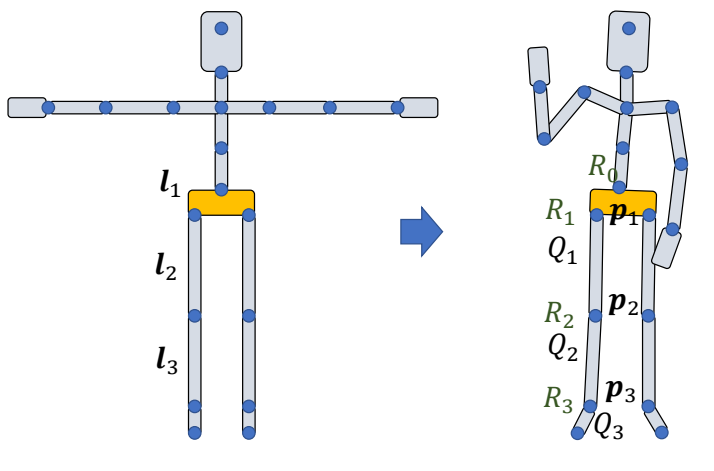  

$$
\begin{align*}
 Q_0= & R_0\\\\
 Q_1= & R_0R_1=Q_0R_1 \\\\
Q_2 = & R_0R_1R_2=Q_0R_2 
\end{align*}
$$

$$
\begin{align*}
 p_1= & p_0+Q_0l_1\\\\
 p_2= & p_0+Q_0l_1 +Q_1l_2\\\\
 = & p_1+Q_1l_2
\end{align*}
$$

$$
\begin{align*}
 R_1= & Q^{-1}_0Q_1\\\\
 R_2= & Q^{-1}_1Q_2
\end{align*}
$$

P15   

## T-Pose

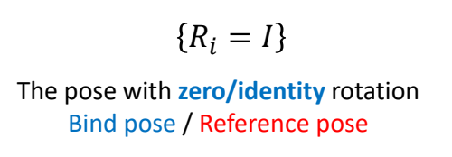  

P16   
## T-Pose? A-Pose?

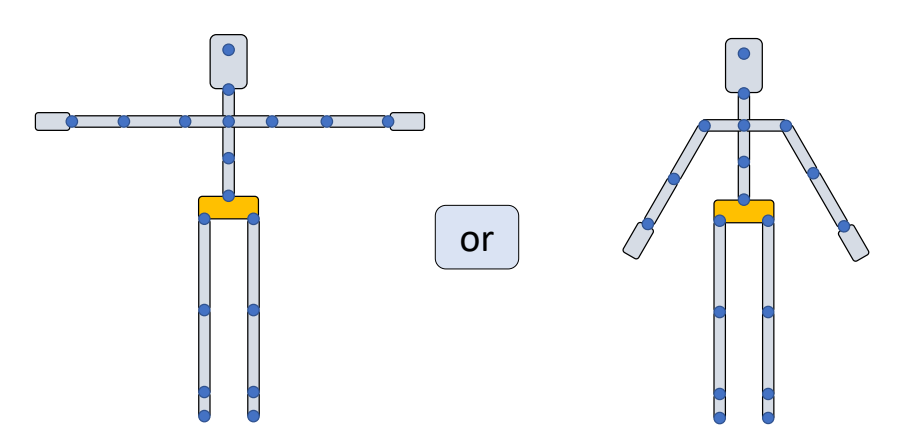  

P17   
## T-Pose? A-Pose?

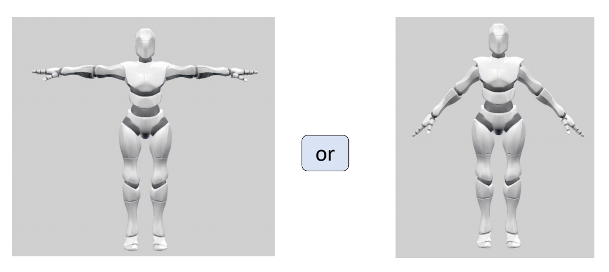  

> &#x2705; 对于骨骼动画来讲，\\(A\\)或T都一样。对于骼骼绑定与蒙皮来讲，更倾向于\\(A\\). 因为\\(A\\)的肩膀是自然状态。  

P19   
## T-Pose? A-Pose?

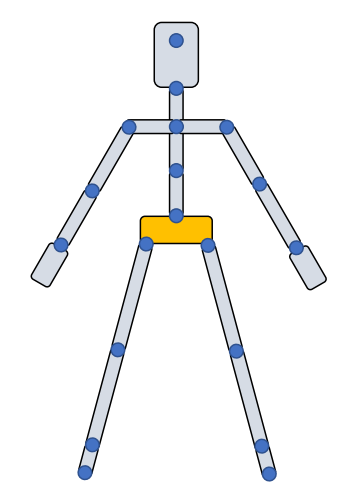  

P20   

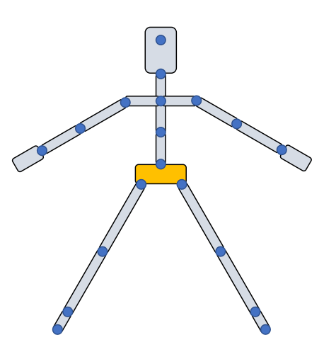  

P21   
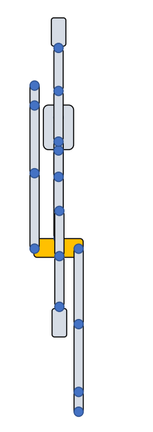  

> &#x2705; 这个动作跟建模师建模时的动作镜像操作有关。  

P23   
## **Same motion** under different reference poses   

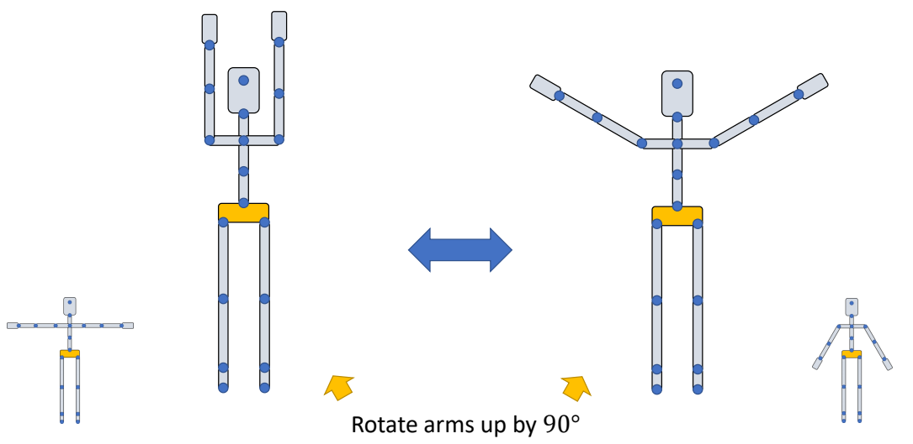  

> &#x2705; 相同的姿态参数放在不同的参考姿态下呈现出的姿态不同。

P29    
## **Retargeting** between reference poses

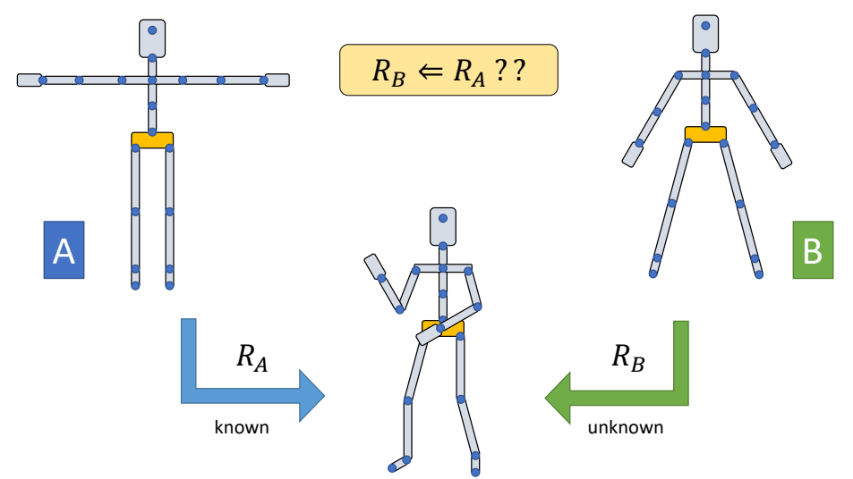  

> &#x2705; 让不同参考姿态的角色做出同样的动作，根据\\(R_A\\)求\\(R_B\\).   
重定向还有其它问题，例和关节长度、穿模。   

P31    
## Retargeting for a single object

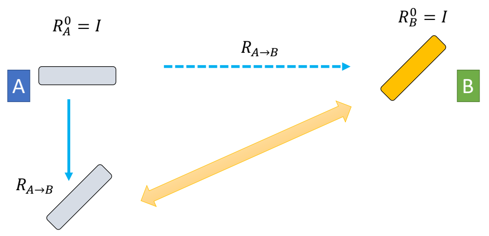  

P33   
## Retargeting for a single object

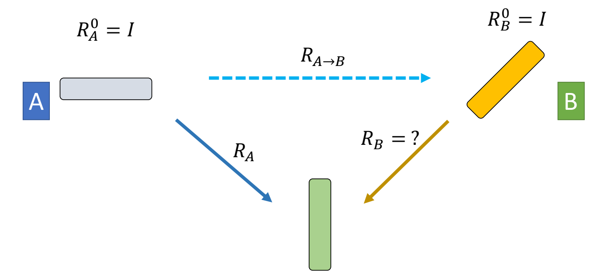  

P37   
## Retargeting for a single object

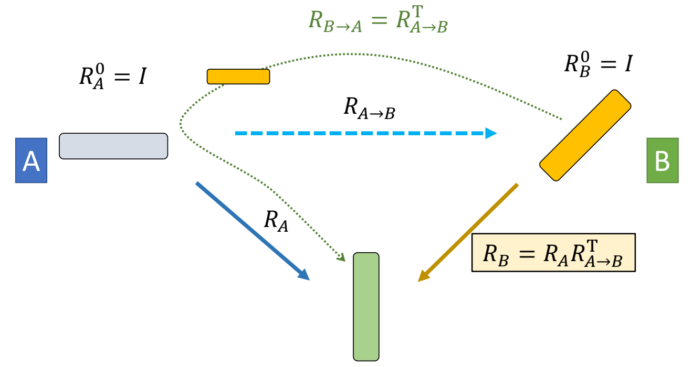  

> &#x2705; 把 B 先转到 A 的姿态，再做指定动作。

P45    

## Retargeting for a chain of links

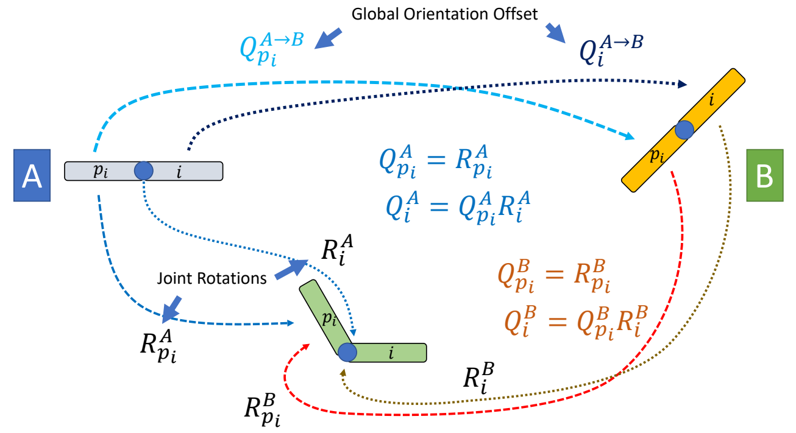  

> &#x2705; 两个关节的场景   

P49    
## Retargeting for a chain of links

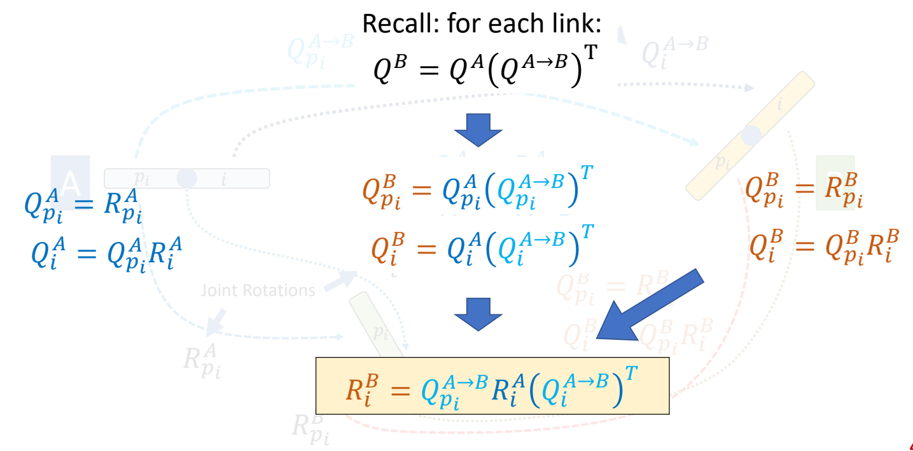  

P51   
## Retargeting for a chain of links

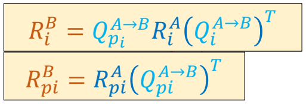  

P52   
## **Retargeting** between reference poses

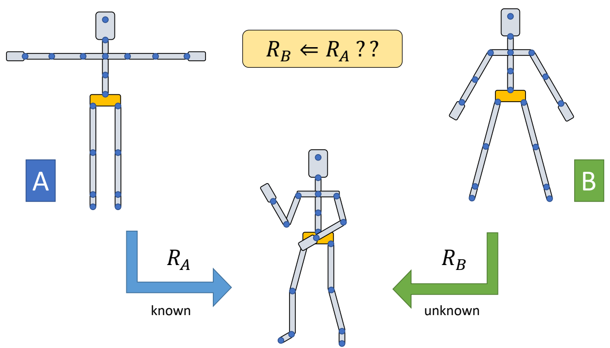  

P53   
## Retargeting between reference poses

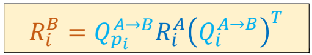  

P54   
## Recap: Character Kinematics

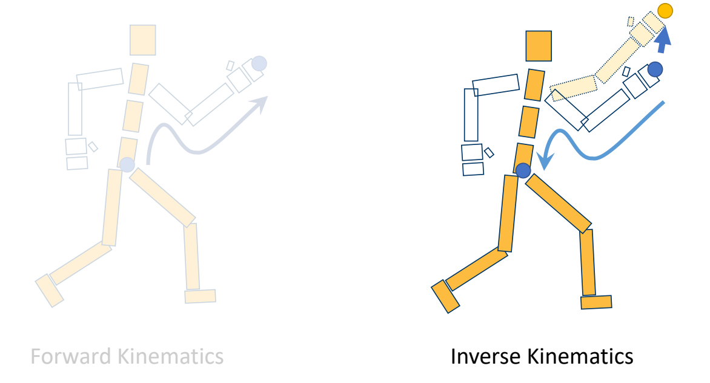  

P58   
## Cyclic Coordinate Descent (CCD) IK

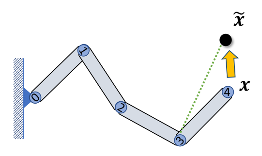  

Rotate joint 3 such that     

P80   
## Cyclic Coordinate Descent (CCD) IK   

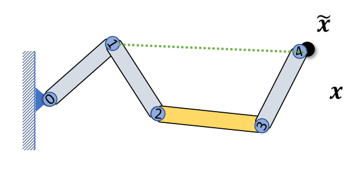  

Rotate joint 3 such that \\(l_{34}\\) points towards \\(\tilde{x} \\)    
Stretch link 2 such that \\((x-\tilde{x})\perp l_{23} \\)   
Rotate joint 1 such that 𝒍14 points towards \\(\tilde{x} \\)   
……    

P90   
## Geometric Method for Jacobian Matrix

Can we parameterize a ball joint using axis-angle \\(\theta u\\) and compute Jacobian as   

$$
\begin{matrix}
 \frac{\partial f}{\partial \theta _i} =\theta u\times r_i & ???
\end{matrix}
$$

  

Jacobian for axis-angle representation has a rather complicated formulation…   

P95   
## Full-body IK

  

The kinematic chain passes the root joint…    

 - Apply IK to the chain   
 - Set root transformation based on the FK along the chain   
 - Revert joint rotations between the foot and the root   

> &#x2705; 固定一只脚，移动身体关节。  
由于链条经过Root，算出Root的状态后再正向更新一下。   
曲线插值与拟合全部跳过，见GAMES 102．

P97   
## Full-body IK

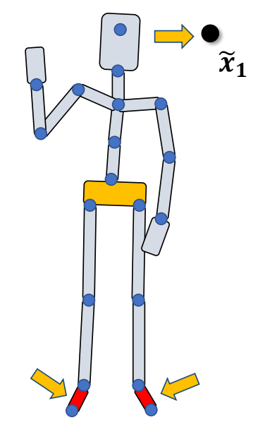  

Two constraints…    

 - Formulate optimization problems     
 - Consider one constraint each time, then fix the broken one    

P98   
## Character Rig

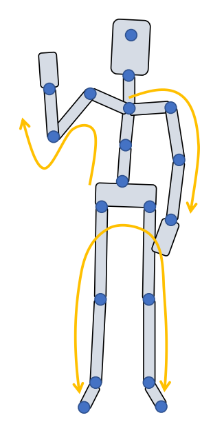  

Created Multiple IK chains   

User activates several IK chains each time, the joints controlled by the other IK chains can move freely   

P101  

# Keyframe Animation and Interpolation

P106   
## Interpolation

 - Given a set of data pairs \\(D=\\){\\((x_i,y_i)\mid i=0,\dots ,N\\)} find a function \\(f(x)\\) such that    

P107   

## Interpolation  

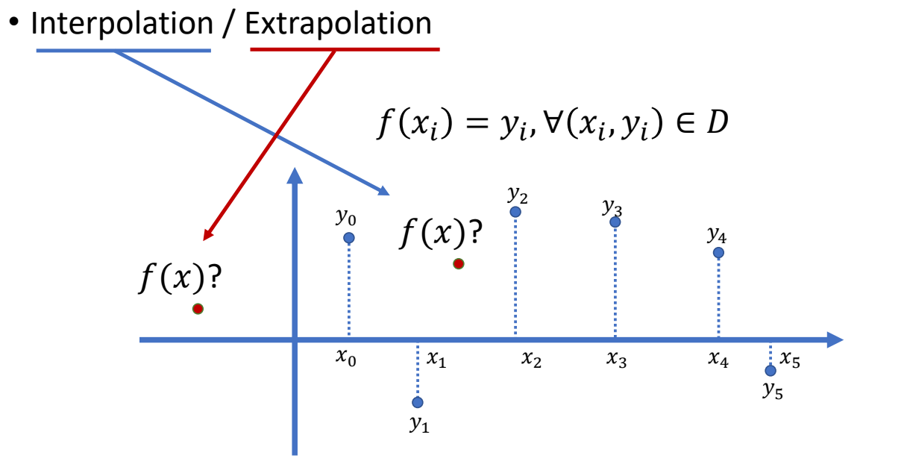  

P113   
## Linear Interpolation

$$
f(x)=(1-t)y_1+ty_2
$$

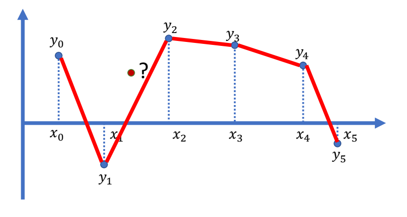  

P114   
## Smoothness

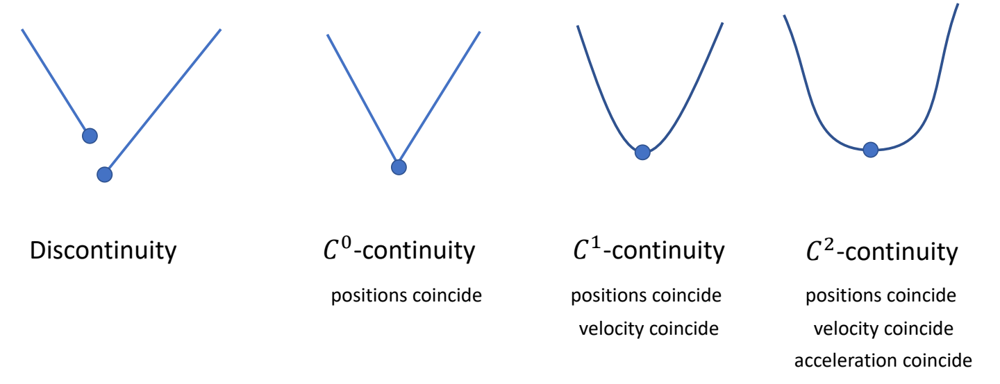  

P115   
## Nonlinear Interpolation?

$$
f(x)=?
$$

P119   
## Polynomial Interpolation

$$
f(x)=a_0+a_1x+a_2x^2+\dots +a_nx^n
$$

Data point set  \\(D=\\){\\((x_i,y_i)\mid i=0,\dots ,N\\)}

$$
\begin{bmatrix}  
  1 & x_0 & x^2_0&\cdots & x^n_0 \\\\  
  1 & x_1 & x^2_1&\cdots & x^n_1 \\\\ 
  \vdots & \vdots & \vdots& \ddots & \vdots \\\\  
  1 & x_N & x^2_N&\cdots & x^n_N  
\end{bmatrix} \begin{bmatrix}
 a_0\\\\
 a_1\\\\
\vdots \\\\
a_n
\end{bmatrix}=\begin{bmatrix}
y_0 \\\\
y_1 \\\\
 \vdots\\\\
y_N
\end{bmatrix}
$$

P122   
## Polynomial Interpolation   

 - Runge's phenomenon   
    - High-degree polynomial can oscillate at the edges of an interval   

P153   
## Interpolation of Rotations

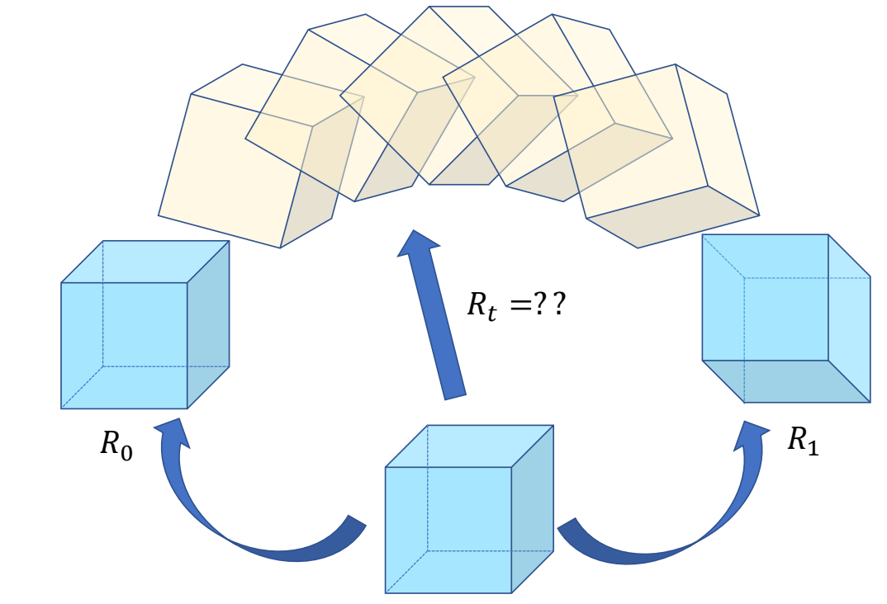  

P154   
## Rotation Representations

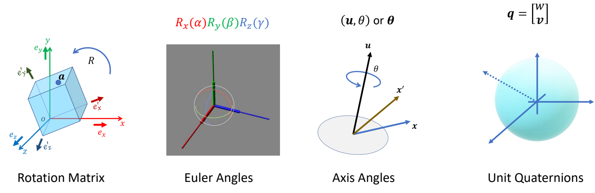  

P157   
## SLERP for Quaternions

$$
q_t=\frac{\sin[(1-t)\theta ]}{\sin \theta } q_0 + \frac{\sin t \theta }{\sin \theta }q_1
$$

$$
\cos \theta = q_0 \cdot q_1
$$

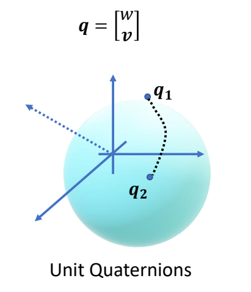  

Constant rotational speed, but only “linear” interpolation    

---------------------------------------
> 本文出自CaterpillarStudyGroup，转载请注明出处。
>
> https://caterpillarstudygroup.github.io/GAMES105_mdbook/