# Lecture 06

P1  

> &#x2705; 基于数据：对现有数据进行连接重组。    
> &#x2705; 基于学习：对数据处理，放入模型，再生成数据。   

P2   
## Outline   

 - Recap: interactive character animation   
     - Motion Graphs   
     - Motion Matching    
 - Statistical Models of Human Motion   
     - Principal Component Analysis   
     - Gaussian Models   
 - Learning-based Models   
     - ……   

P3   
## Recap: Interactive Animation    

How to make a character respond to user command?

P6   
## Motion Graphs

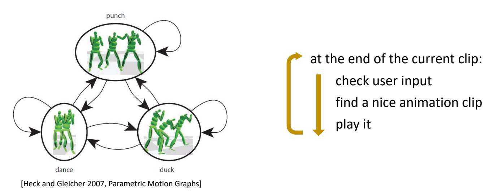   

P9   
## Motion Graphs

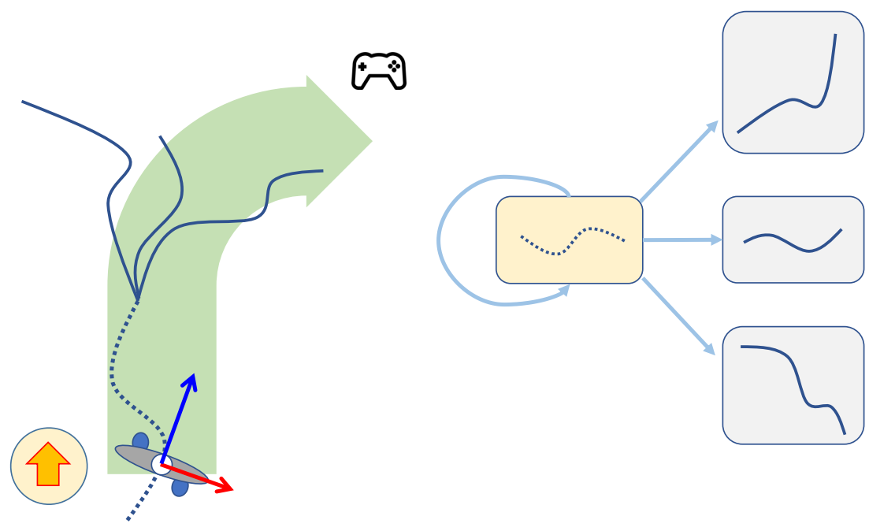   

> &#x2705; 坐标系对齐后，根据用户输选择下一个片断。   
> &#x2705; 可以结合路径规划算，实现一些智能角色。  
> &#x2705; Motion Graph 只是一个底层数据结构。   

P14   
## Need a Faster Response?

|||
|---|---|
| Motion Graphs / State Machines | Motion Fields / Motion Matching |
| 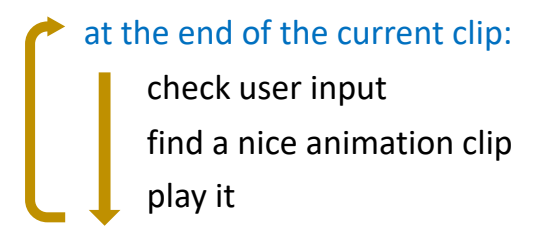 | 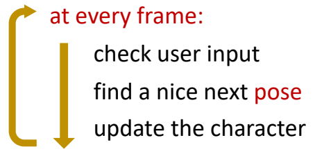   |

> &#x2705; Motion Matching 是将 Motion Fields 简化以后加一些比较好的工程实践。   

P17  

## Motion Fields

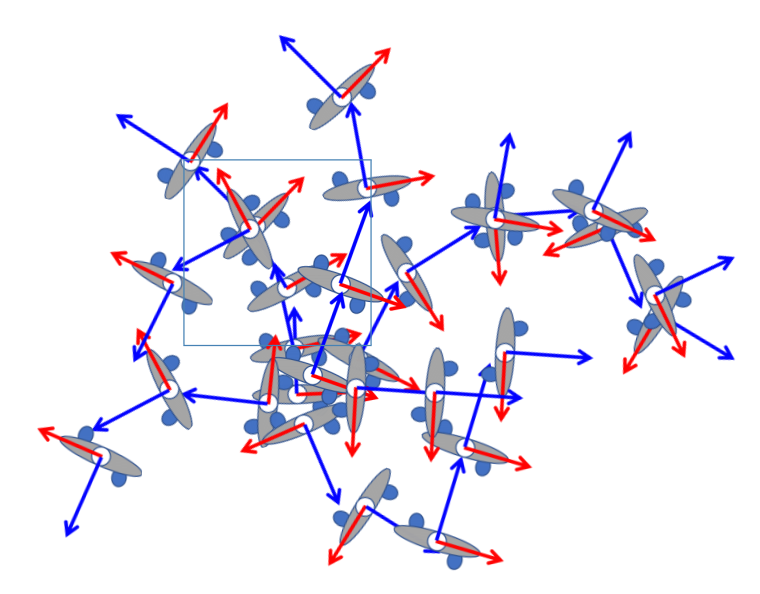   

> &#x2705; 每条链路代表一个动作，灰圈代表动作里的一帧，整体构成一个很大的Field.   

P20   

## Motion Fields

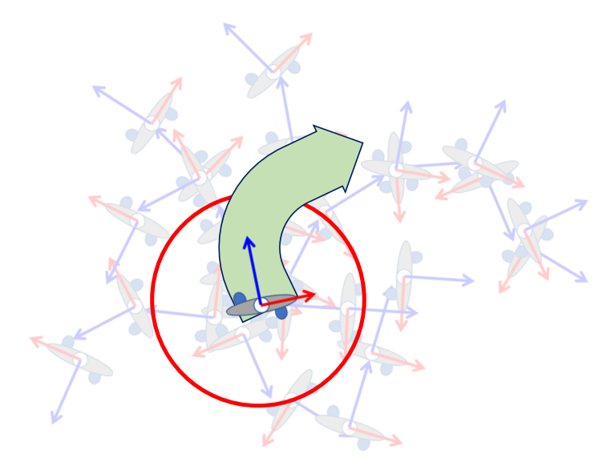   

> &#x2705; 每一帧有一些最近邻，它们来自不同动作，有不同的状态。   
> &#x2705; 绿色代表向右，挑出对应帧。做混合。  

P23   
## Motion Fields

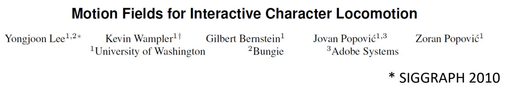   

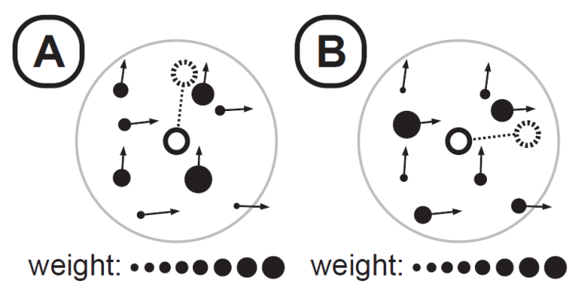   

> &#x2705; 根据用户输入设置不同权重，会得到不同结果    
> &#x2705; 优点：(1) 自由控制（2）支持外力，可结果物理仿真（3）不需要使首尾帧相似的预处理。  
> &#x2705; 缺点：需要设计一些规则来计算最近邻的混合。    
> &#x2705; 解决方法：强化学习

P24  
## Motion Fields

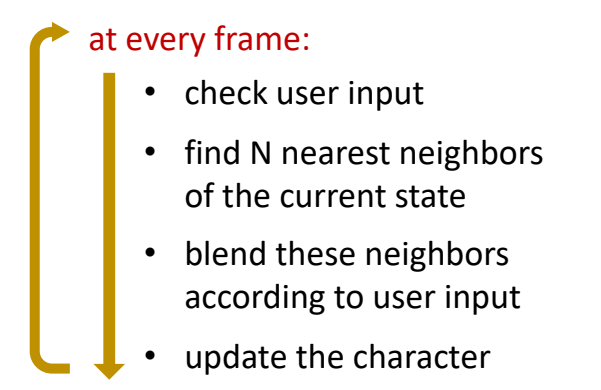   

P31   
## Motion Matching

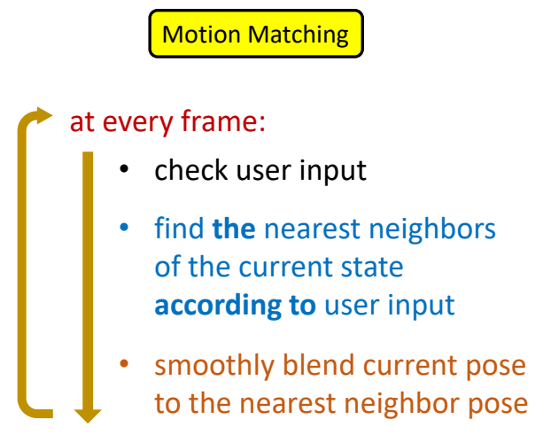   

P32  

> &#x2705; 简化一：只找一个最近邻，不需要blend. 然后用平滑解决跳变问题。

P34   
## Motion Matching   

 - We need a distance function / metric to define the nearest neighbor  

$$
\text{next-pose } = \min_{i \in\text{ Dataset}} ||x_{\text{curr}}-x_i||
$$

$$
x: \text{feature vector}
$$

A possible set of feature vectors:  

 - root linear/angular velocity   
 - position of end effectors w.r.t. root joint   
 - linear/angular velocity of end effectors w.r.t. root joint   
 - future heading position/orientation (e.g. in 0.5s, 1.0s, 1.5s, etc.)   
 - foot contacts   
 - ……   

P36   
## Motion Matching   

 - We need a smooth motion   
    - Only do the search every few frames   
    - Smoothly blend current pose to the target pose   
      - Inertialized blending (ref. <https://www.theorangeduck.com/page/spring-roll-call> by Daniel Holden)   

 - We need a good performance   
    - An efficient data structure for searching   
      - e.g. KD-tree   

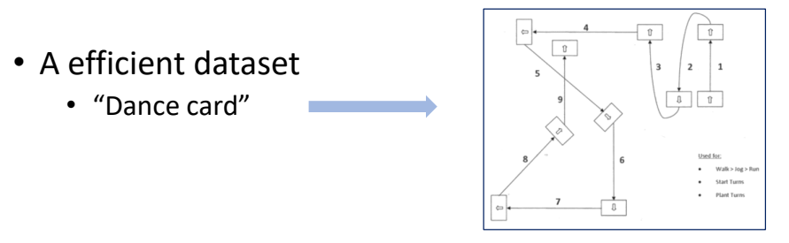   

> &#x2705; 保证所使用的动作集能够覆盖到目标。  
> &#x2705; 优点：（1）实现简单（2）控制灵活（3）可结合物理仿真。   
> &#x2705; 缺点：（1）不能解决滑步   

P39   
## Statistical Models of Human Motion   

> &#x2705; 根据已有数据，对“动作自然“建模。   

P43   
## The Low-dimensionality of Human Motions   

 - Coordinated arm/leg movement   
 - Musculoskeletal structure   
 - Laws of physics    
 - ……   

> &#x2705; “自然的动作”参数集够成高维的动作参数空间的流形曲面。   

P45   
## Principal Component Analysis (PCA)   

 - A technique for   
    - finding out the correlations among dimensions   
    - dimensionality reduction   
 

> &#x2705; PCA细节跳过。目的：降维，抓住主要特征。   

P65   

a pose \\(x\\) with smaller \\(\sum _k\frac{((x-\bar{x})\cdot u_k)^2 }{\sigma ^2_k}\\) is more likely to be a good pose   

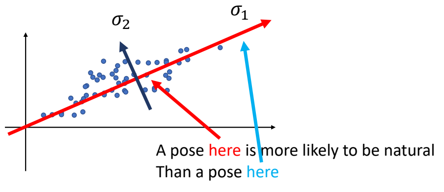   

> &#x2705; 可作为动作生成的先验，告诉我一个动作是否合理。   

P66  
## Character IK   

$$
F(\theta )=\frac{1}{2} \sum_{i}^{} ||f_i(\theta )-\tilde{x} _i||^2_2+\frac{\lambda }{2}||\theta ||^2_2 
$$

$$
\theta=(t_0,R_0,R_1,R_2\dots  \dots )
$$

P68  
## Character IK with a Motion Prior

$$
F(\theta )=\frac{1}{2} \sum_{i}^{} ||f_i(\theta )-\tilde{x} _i||^2_2
$$

$$
+\frac{w }{2}\sum_{k}^{}(\frac{(\theta -\bar{\theta })\cdot u_k }{\sigma _k} )^2
$$

> &#x2705; 把P65方法应用到IK来判断动作好坏的实例。   

P71  
## Data Distribution   

\\(p(x)\\) : probability that \\(x\\) is a natural pose    

> &#x2705; 假设存在这样一个分布，但不知道分布的具体形式，要估计这样的分布
> &#x2705;（1）从分布中采样，例如：动捕   
> &#x2705;（2）通过各种模型把分布估计出来，即从数据中估计出模型参数。   

P75   
## Gaussian Distribution

   

P76   
## PCA and Gaussian Distribution   

$$
\sum =X^TX=U\begin{bmatrix}
 \sigma ^2_1 &  &  & \\\\
  & \sigma ^2_2 &  & \\\\
  &  & \ddots  & \\\\
  &  &  &\sigma ^2_N
\end{bmatrix}U^T
$$

$$
x-\bar{x} =\sum_{k=1}^{n} w_ku_k
$$

P77   
## PCA and Gaussian Distribution

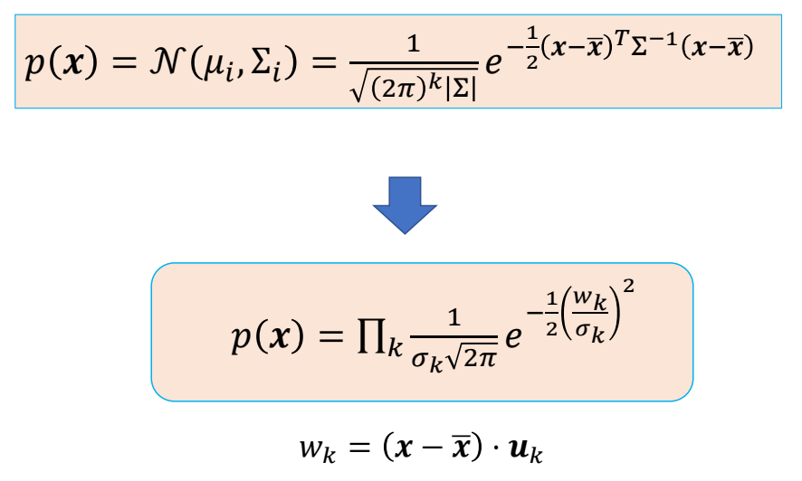   

> &#x2705; PCA可以看作一种高斯分布。  

P78   
## Character IK with a Motion Prior   

$$
F(\theta )=\frac{1}{2} \sum_{i}^{} ||f_i(\theta )-\tilde{x} _i||^2_2
$$

$$
+\frac{w }{2}\sum_{k}^{}(\frac{(\theta -\bar{\theta })\cdot u_k }{\sigma _k} )^2
$$

P79  

$$
F(\theta )=\frac{1}{2} \sum_{i}^{} ||f_i(\theta )-\tilde{x} _i||^2_2
$$

$$
-w \log \prod_{k}^{}e^{-\frac{1}{2}(\frac{(\theta -\bar{\theta })\cdot u_k }{\sigma _k} )^2 }  
$$

P80  

$$
F(\theta )=\frac{1}{2} \sum_{i}^{} ||f_i(\theta )-\tilde{x} _i||^2_2
$$

$$
-w \log p(\theta )  
$$

$$
\theta=(t_0,R_0,R_1,R_2\dots \dots )
$$

> &#x2705; 第一项：符合目标。第二项：动作合理。   

P81   
## Motion Synthesis with a Motion Prior  

Given a motion prior \\(p(x)\\) learned from a set of data points \\(D \\)= {\\(x_i\\)}, Synthesize a motion \\(x\\) that minimize the objective   

$$
f(x)=f(x)-w \log p(x )
$$

Note: \\(x\\) can represent a pose \\(\theta\\)   
\\(\quad\quad\\) or a motion clip → a sequence of poses {\\( \theta t\\)}     
\\(\quad\quad\\) or any features of a motion → e.g. \\(w_k\\) in PCA    

P82   
## Motion Synthesis with a Motion Prior

Given a motion prior \\(p(x)\\) learned from a set of data points \\(D \\)= {\\(x_i\\)}, Synthesize a motion \\(x\\) that minimize the objective   

$$
f(x)=f(x)-w \log p(x )
$$

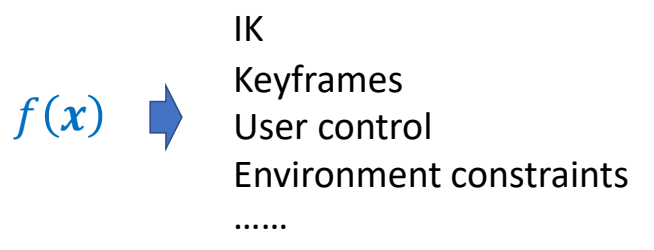   

P83   
## Motion Synthesis with a Motion Prior

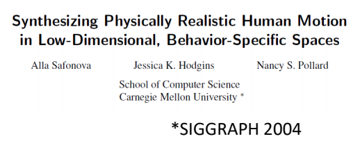   

P83   

## Gaussian Distribution is not Enough!   

P84  
## Gaussian Distribution is not Enough!

P86  

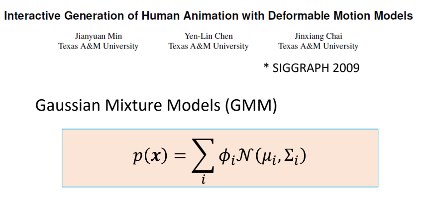   

> &#x2705; 使用高斯混合模型，用于动作编辑。   
> &#x2753; 单顺动作合理，动作序列就合理吗？

P87  
## Motion Synthesis with a Motion Prior
  
Min et al. 2009   

> &#x2705; 视频动捕是欠约束问题，但可以通过分布过滤掉不合理的结果。  

P88  
## Gaussian Distribution is not Enough!

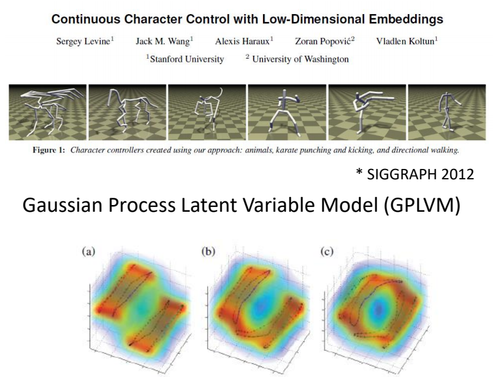   

> &#x2705; 缺点：实现麻烦，很多超参。   

P90   

## Gaussian Distribution is not Enough!   

\\(p(x)\\): motion prior   

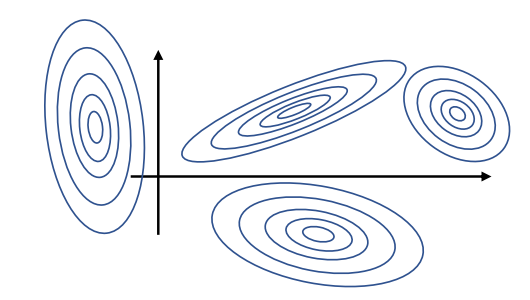   

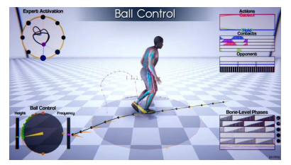   

[Starke et al 2020, Local Motion Phases for Learning Multi￾Contact Character Movements]

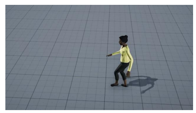   

[Henter et al. 2020, MoGlow: Probabilistic and Controllable 
Motion Synthesis Using Normalising Flows]

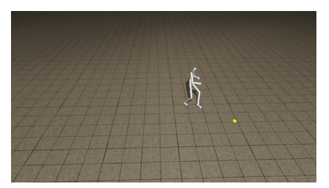   

[Lee et al 2019, Interactive Character Animation by 
Learning Multi-Objective Control]

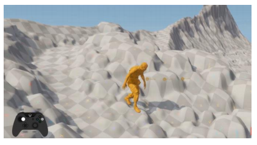   

[Holden et al 2020, Learned Motion Matching]

> &#x2705; 用DL代替复杂的模型，来估计动作先验。  

---------------------------------------
> 本文出自CaterpillarStudyGroup，转载请注明出处。
>
> https://caterpillarstudygroup.github.io/GAMES105_mdbook/