P2  
# Outline   

 - Walking and Dynamic Balance   

 - Simplified Models   
     - ZMP (Zero-Moment Point)   
     - Inverted Pendulum   
     - SIMBICON   

> &#x2705; 不能直接控制角色位置，而是通过与地面的力和反作用力。  

P3  
# Walking

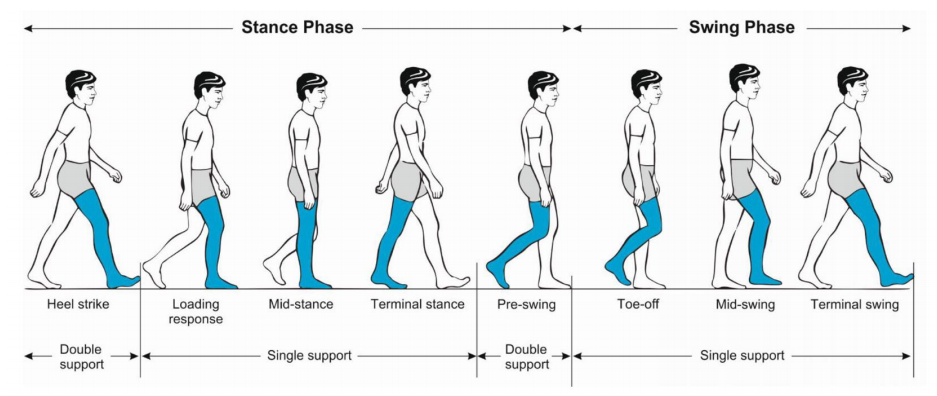

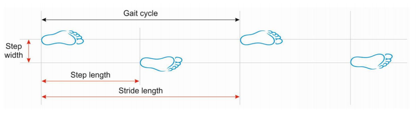

> &#x1F50E; **Gait disorders in adults and the elderly**.  
phases of a walking gait cycle   
Pirker and Katzenschlager 2017.    
 

P4   
## Walking VS Running

|Walking|Running|
|---|---|
|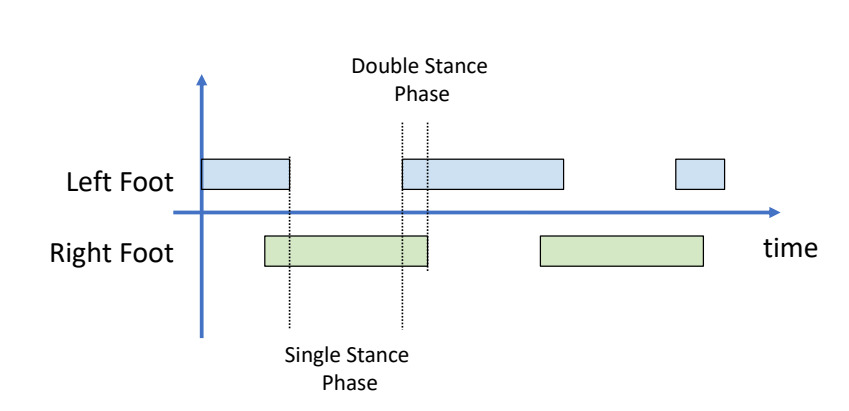 Walking: move without *loss of contact*, or flight phases|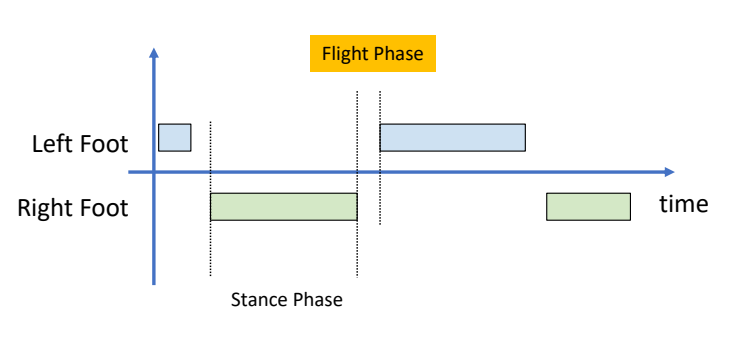|

P7  
## Walking的几个阶段  

|||
|---|---|
|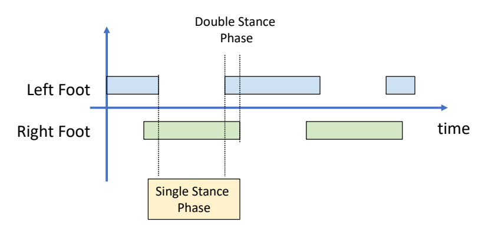|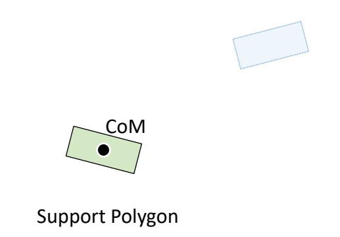|
|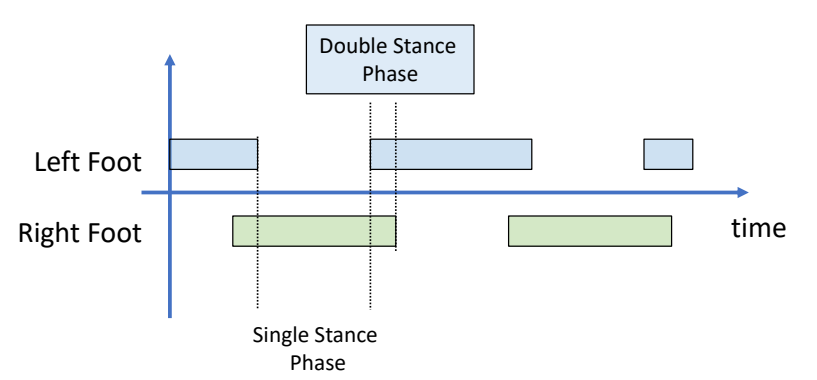|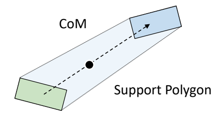|
|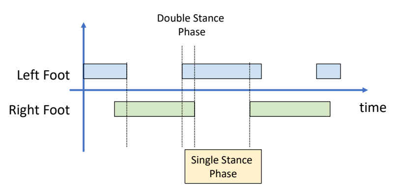|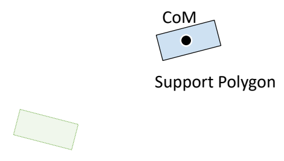|

> &#x2705; 以上过程假设角色处于 static 状态。没有考虑到移动过程中的脚的动量。因此只能勉强保持角色稳定。要以非常慢的速度相前移动。    

P11   
# Zero-Moment Point (ZMP)

> &#x2705; 通过ZMP的控制实现比较稳定的走路。  

## 全身受力分析与问题简化

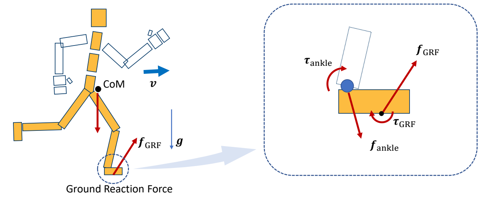   

> &#x2705; 角色受到重力和GRF力。   
> &#x2705; GRF ＝ 支持力（向上）＋ 动摩擦力（有速度时才有）   
> &#x2705; 简化：上半身受到的所有的力，都体现在 ankle 关节上。  

P12  
  
### Recall: A System of Links and Joints

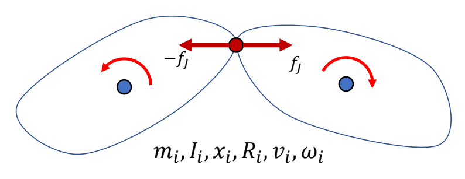   

$$
M\dot{v} +C(x,v)=f+f_J
$$

> &#x2705; 在满足这个公式的前提下，一个部分动了另一个部分就会跟着动。因此可以把问题简化，只分析ankle。  

P15  

## 脚上受力分析

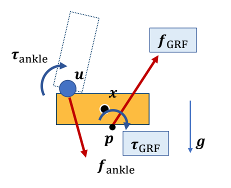   

> &#x2705; 仅分析脚上的力，\\(f_{\text{ankle}}\\) 为 ankle 上的力转化到脚上的力。    

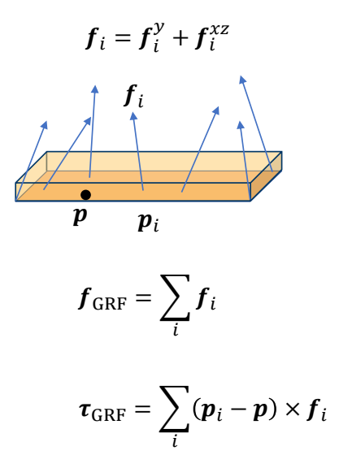   

> &#x2705; 地面对脚的力不是施加到某一个点上，但可以根据公式换算成施加到某一点的力。  

P17   

Assuming the ground is flat and level    
so \\(p_i\\) - \\(p\\)  is always in the horizontal plane   

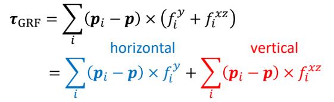   

> &#x2705; 把 \\(\tau _{GRF} \\) 分解为与地面垂直部分和与地面平行部分（力矩的方向是指它的旋转轴的方向。），其中垂直的部分为：  

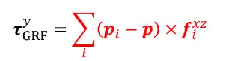   

水平的部分为： 

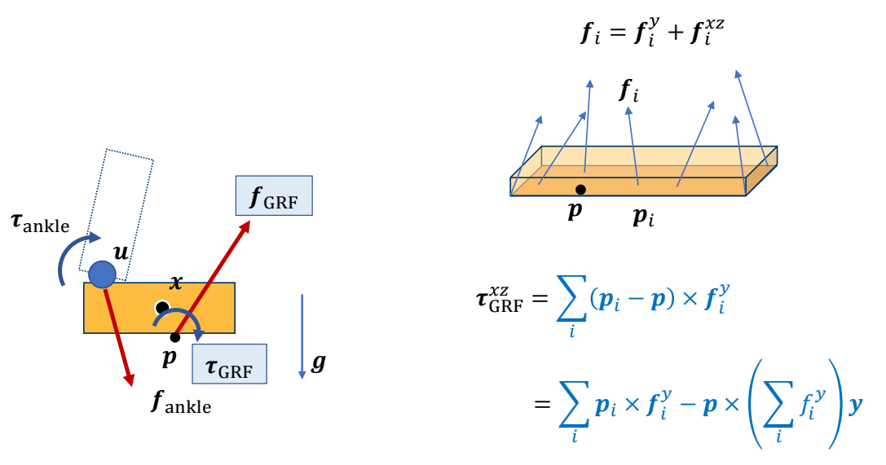   

**Can we find \\(p\\) such that \\(\tau _{GRF}^{xz}=0\\) ?**     

P21   
## Zero-Moment Point (ZMP)

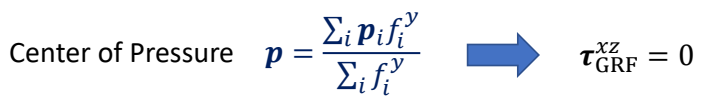   

当\\(p\\) 为 center pressure时：

$$
\begin{align*}
f_{GRF}  & =\sum _{i}^{} f_i \\\\
 \tau _{GRF} & =\tau _{GRF}^y=\sum _{i}^{}(p_i-p)\times f_i^{xz}
\end{align*}
$$

The position of \\(p\\) is not known, but we assume 以上公式成立。

## ZMP条件下支撑脚的受力分析

假设： 支撑脚 should not move in a **stance phase**，且支撑脚与地面完成接触   
则：在所有力作用下处于静平衡状态。  

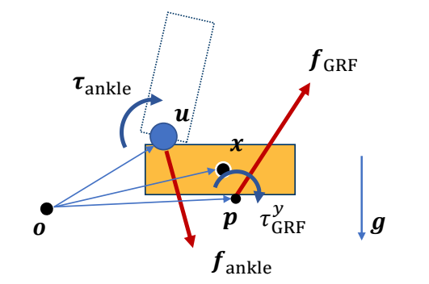   

Static Equilibrium:   

静态平衡满足：所有合力为0

$$
f_{\text{ankle}} + f_{\text{GRF}} + mg = 0  
$$

静态平衡满足：任选一个参考点，所有合力（力矩）相对于参考点的动量为0，否则会旋转。  

The moment around a reference point \\(o\\):    

$$
(u-o) \times f_{\text{ankle}} + (p-o) \times f_{\text{GRF}} + (x-o)\times mg + \tau _{GRF}^{y} + \tau _{\text{ankle}} = 0
$$
   

> &#x2705; \\(o\\) 是一个参考点，可以在任意位置  
> &#x2705; U：ankle 位置。   
> &#x2705; X：质心位置
> &#x2705; P：位置未知，高度为 0．  

同样只关心水平方向：  

Horizontal components (moment projected onto \\(xz\\) plane):       

$$
((u-o) \times f_{\text{ankle}})^{xz} +( (p-o) \times f_{\text{GRF}} ) ^{xz}+ (x-o)\times mg + \tau _{\text{ankle}}^{xz} = 0
$$

> &#x2705; 总力矩为 0，否则人会旋转。   

P28   
## 求解 Zero-Moment Point (ZMP)

We can solve this equation to find \\(p\\)   

\\(p\\) is **called Zero-Moment Point (ZMP)** because it makes   

$$
\tau _{GRF}^{xz}=0
$$

and the horizontal moment   

$$
((u-o) \times f_{\text{ankle}})^{xz} +( (p-o) \times f_{\text{GRF}} ) ^{xz}+ (x-o)\times mg + \tau _{\text{ankle}}^{xz} = 0
$$

Only when 𝑝 is **within the support polygon**!    

> &#x2705; \\(p\\) 满足（1）水平力矩为0. （2）人整体上平衡。   
> &#x2705; \\(u，O，X\\) 都是已知，\\(p\\) 的高度为 0，只有 \\(P_xP_y\\) 未知且该公式分别在 \\(X\\) 和 \\(Z\\) 上成立，实际上是两个方程。   
> &#x2705; 两个未知量和两个方程，可以解出 \\(p\\)。   

P33   

如果解出公式得到的\\(p\\) is outside the support polygon，那么：  
\\(p\\) could NOT be the center of pressure, because all the GRFs 
are applied within the polygon, so that    

$$
\tau _{GRF}^{xz}\ne 0
$$

> &#x2705; 如果求出 \\(p\\) 在 polygon外 则不能平衡，因为不是 center pressure.  

如果选择polygon上的real center of pressure\\({p}' \\) ,那么：  

$$
((u-o) \times f_{\text{ankle}})^{xz} +( ({p}'-o) \times f_{\text{GRF}} ) ^{xz}+ (x-o)\times mg + \tau _{\text{ankle}}^{xz} \ne 0
$$

> &#x2705; \\({p}' \ne p\\)，\\({p}'\\) 处水平方向的合外力不为零，脚会翻转人会摔倒。   

# Simplified Models

P35   
## 关于ZMP的思考  

The existence of ZMP is an indication of dynamic balance We can achieve balanced walking by controlling ZMP But how?    

P36   
## Simplified Models的基本套路   

 - Simplify humanoid / biped robot into an abstract model   
    - Often consists of a CoM and a massless mechanism   
    - Need to map the state of the robot to the abstract model   

> &#x2705; 因此，把最影响平衡的量拿出来，建立简化模型。   
> &#x2705; 实际上更加复杂，对上半身任何一个部位的干挠，都会影响到脚上的力。  
 
 - Plan the control and movement of the model   
    - Optimization   
    - Dynamic programming   
    - Optimal control   
    - MPC   

 - Track the planned motion of the abstract model   
    - Inverse Kinematics   
    - Inverse Dynamics   

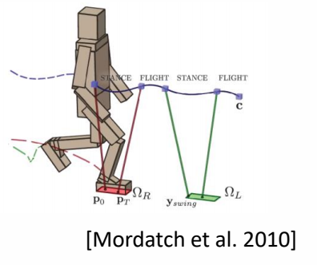   

P37  
## Example: ZMP-Guided Control   

> &#x1F50E; 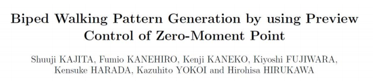   

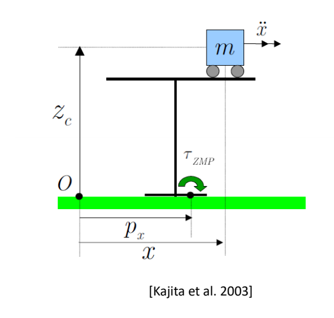  

> &#x2705; 把机器人简化为桌子和小车，通过控制小车m的运动来控制 ZMP。使 ZMP 满足预定义轨迹。   

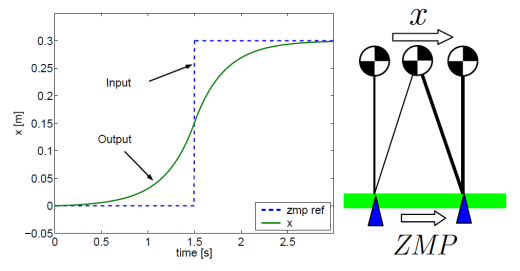  

> &#x2705; 预定义轨迹的轨迹是指保持在pologon里面。通过优化得到 \\(m\\) 的运动。  
> &#x2705; 然后通过IK和PD control控制脚的运动。

> &#x2705; ASIMO机器人局限性：(1) 脚必须与地面平行。 (2) 脚必须弯曲。 (3) 整体移动速度慢。  

P40  

## Inverted Pendulum Model (IPM)

**Walking == Falling + Step Planning**   

> &#x2705; 人的特点是重心偏离再拉回来，这样比始终保持平更省。   

P42  
### IPM问题

> &#x2705; IPM： 倒立摆模型，控制小车使杆不掉下去。    

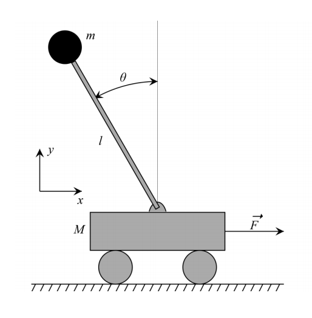   

### Step Plan with IPM   

> &#x1F50E; 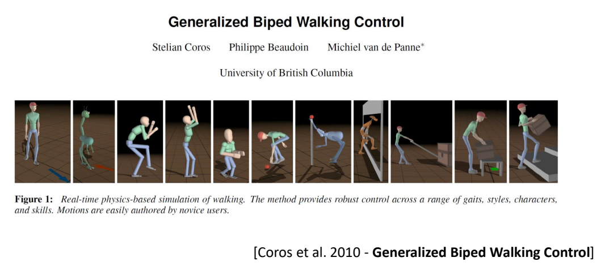  

P45   

- Map CoM of the character and the stance foot as IPM   
- Plan the position of the next foot step so that the mass point rests at the top of the pendulum   
- Create foot trajectory based on the step plan   
- Compute target poses using IK   

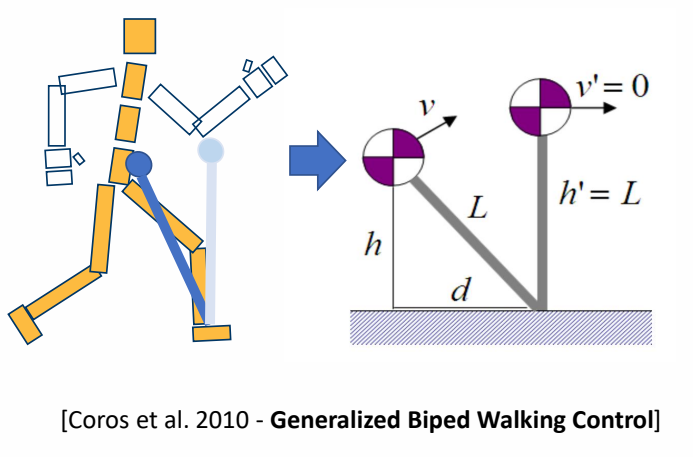  

> &#x2705; 脚到重心是一个倒立摆。  
> &#x2705; 由于失去平衡，质心有一个向前的速度，通过到一个合适的落脚点，使质心到达脚的正上方刚好到达速度稳定。  
> &#x2705; 算出脚的目标位置后，插值，IK，PD 控制。  

P46   

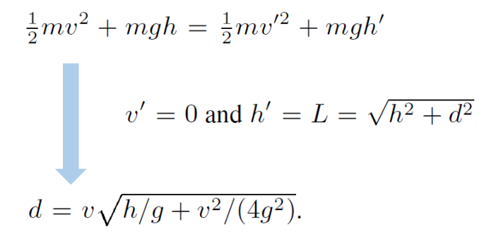  

> &#x2705; 动能转势能，能量守恒．算出高度。   
> &#x2757; 注意：杆的长度是不确定的，因为腿会弯曲。   

P47   

> &#x2705; 方法优点：可以适用于不同角色，不同动作，不同环境交互。   

P48   
## SIMBICON   

> &#x1F50E; SIMBICON (SIMple BIped Locomotion CONtrol) Yin et al. 2007   
 
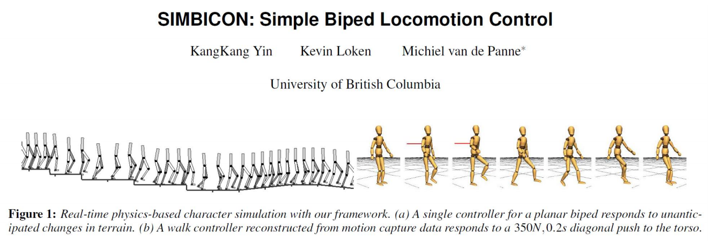  

> &#x2705; 经典工作，第一个实现了鲁棒的步态控制。  
> &#x2705; 原理：跟踪控制器上加一个反馈

P49   
### Step 1   

 - Step 1: develop a cyclical base motion   
    - PD controllers track target angles   
    - FSM (Finite State Machine) or mocap   

> &#x2705; 本质上是一个跟踪控制器，用状态机来实现的跟踪控制器  

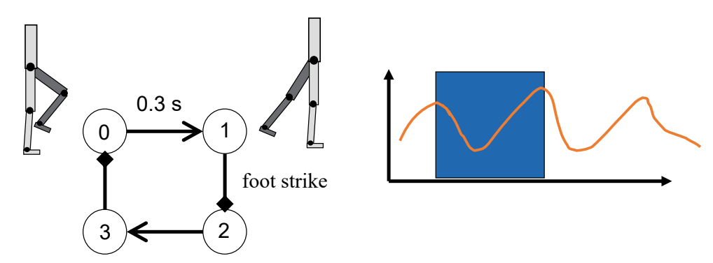  

> &#x2705; 有四个状态，通过跟踪在4个状态之间切换，也可以用动捕数据来代替

P50   
### Step 2   

 - Step 2:    
    - control torso and swing-hip wrt world frame   

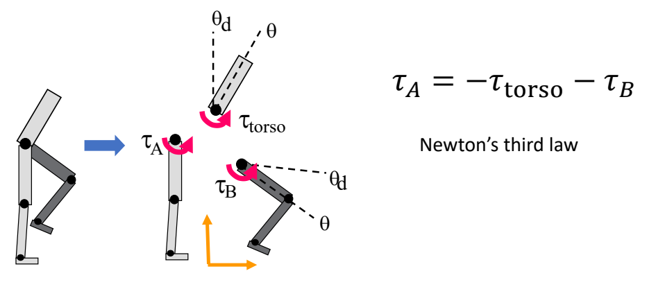  

> &#x2705; 控制目标：上半身保持竖直。  
> &#x2705; 控制方法：  
> 通过保持上半身竖直，计算出\\(\tau _{\text{torso}} \\)。  
> 通过使B跟踪目标动作，计算出\\(\tau _{B} \\)。  
> 通过 \\(\tau _{\text{torso}} \\) 和 \\(\tau _{B} \\) 控制 \\(\tau _{A} \\).   

P51  
### Step 3  

 - Step 3: COM feedback   

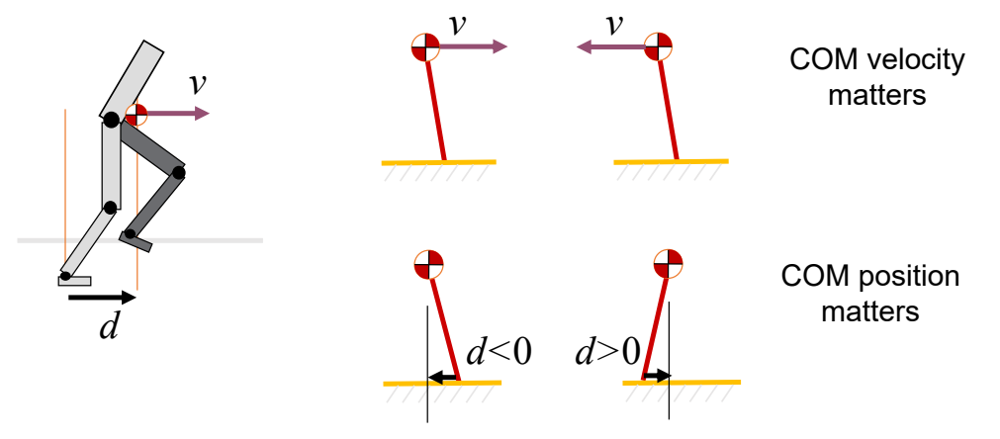  

> &#x2705; 估计下一个脚步的位置d，使质心处于可控范围内。  
> &#x2705; \\(d\\) 与 \\(D\\) 有关，但关系复杂，在此处做了简化。   
 

P52   
## SIMBICON   

 - Step 3: COM feedback    

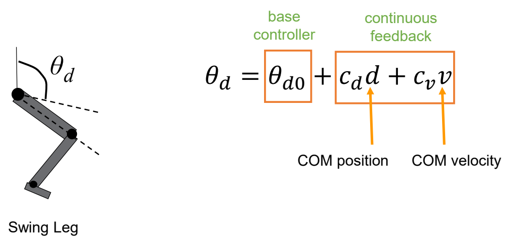  

> &#x2705; 简化问题：\\(d\\) 和 \\(v\\) 与 \\(\theta _d\\) 的速度是线性关系。速度会转化为 PD 目标的修正。   
> &#x2705; 线性的系数为手调。   

P53   
## SIMBICON   
 
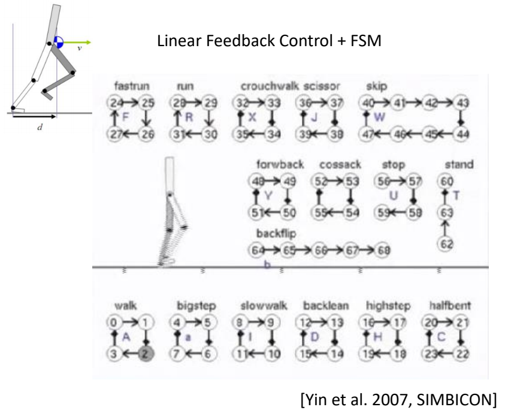  

P54   
## Outline   

 - How to generalize to other motion?    

  

---------------------------------------
> 本文出自CaterpillarStudyGroup，转载请注明出处。
>
> https://caterpillarstudygroup.github.io/GAMES105_mdbook/
