# Lecture 12

P2   
## Outline   

 - Optimal Control   
 - Model-based Approaches vs. Model-free Approaches   
 - Sampling-based Optimization   
 - Reinforcement Learning   

 - Conclusion  

P3   
## Recap: Trajectory Optimization

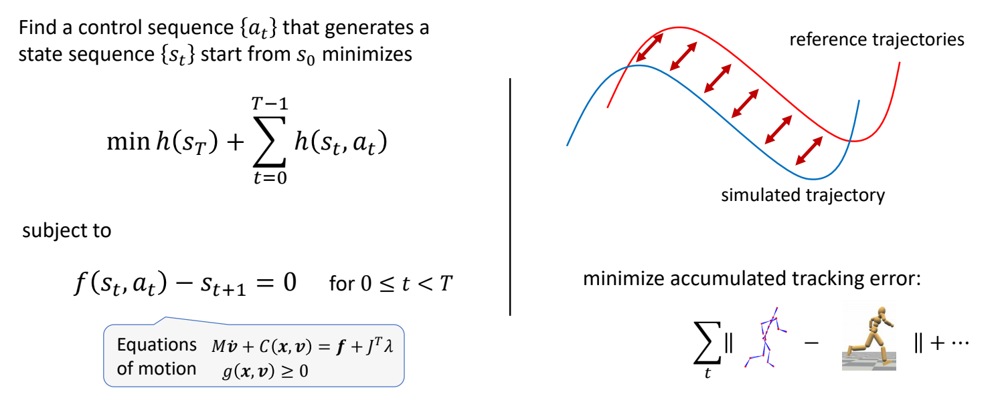

P4  
## Recap: Feedforward Control

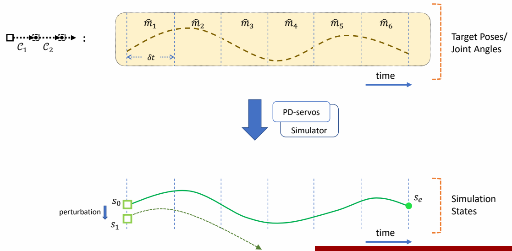   

P5   
## Recap: Feedback Control

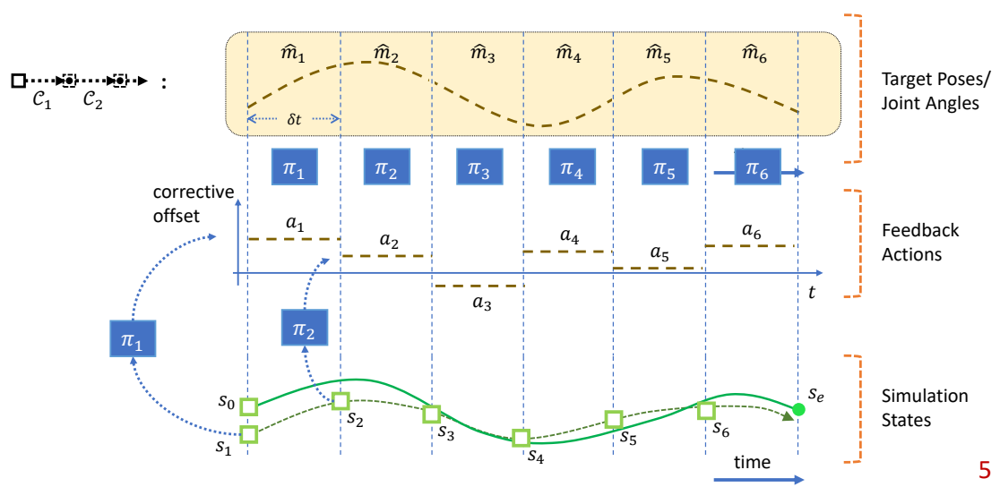  

P7   
## Recap: Feedback Control

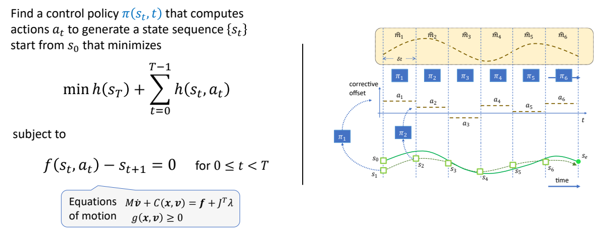  

> &#x2705; 前馈控制优化的是轨迹。  
> &#x2705; 反馈控制优化的是控制策略，控制策略是一个函数，根据当前状态优化轨迹。  

P9  

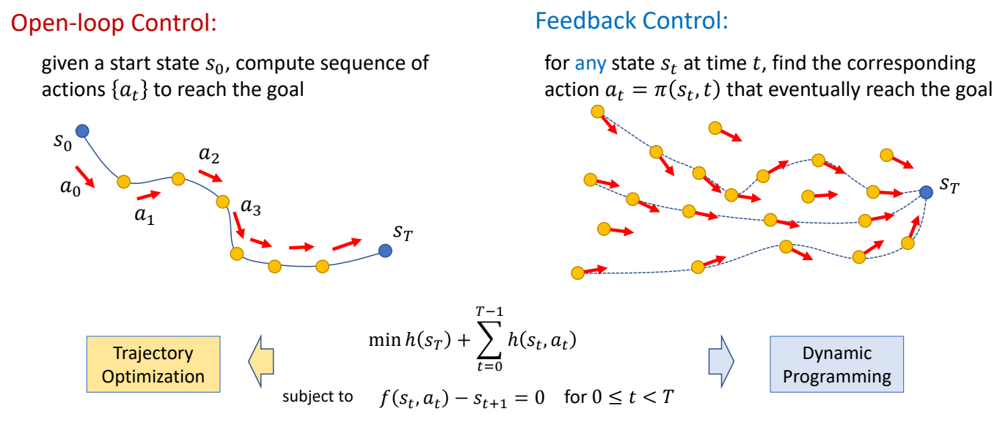  

> &#x2705; Feedback类似构造一个场，把任何状态推到目标状态。   

P10  
## Constrained Optimization

$$
\begin{matrix}
 \min_{x}  f(x)\\\\
𝑠.𝑡. g(x)=0
\end{matrix}
$$

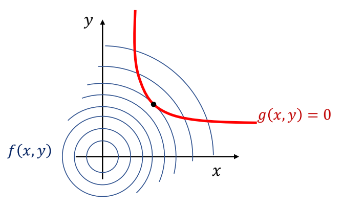    

P12  
## Constrained Optimization  

Soft constraint?   

$$
\min_{x}  f(x)+ wg(x)
$$

\\(^\ast \\) The solution \\(x^\ast\\)  may not satisfy the constraint   

 
P16   
## Lagrange Multiplier    

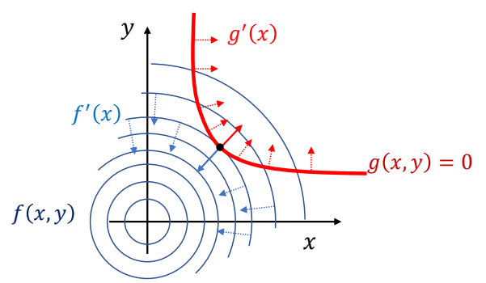  

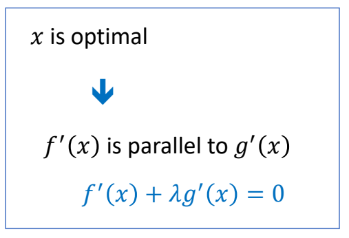  

Lagrange function   

$$
L(x,\lambda )=f(x)+\lambda ^Tg(x)
$$

> &#x2705; 充分非必要条件。  
> &#x2705; 拉格朗日乘子法。  

P18   
## Lagrange Multiplier 

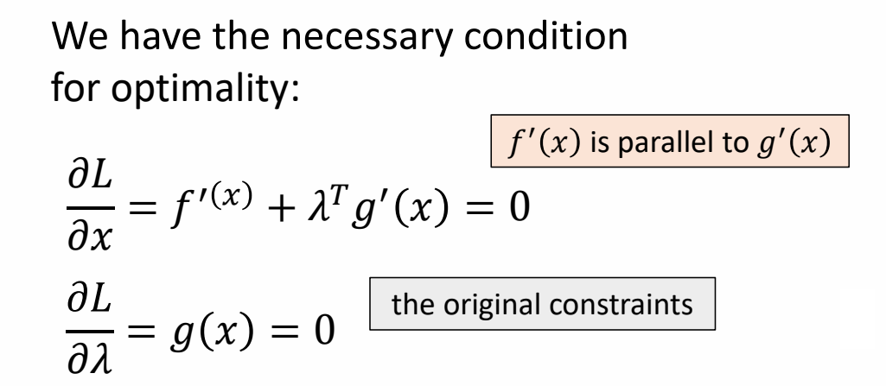  

P20   
## Solving Trajectory Optimization Problem   

Find a control sequence {\\(a_t\\)} that generates a state sequence {\\(s_t\\)} start from \\(s_o\\) minimizes    

$$
\min h (s_r)+\sum _{t=0}^{T-1} h(s_t,a_t)
$$

subject to   

$$
\begin{matrix}
 f(s_t,a_t)-s_{t+1}=0\\\\
\text{ for } 0 \le t < T
\end{matrix}
$$

The Lagrange function   

$$
L(s,a,\lambda ) = h(s _ T)+ \sum _ {t=0} ^ {T-1} h(s _t,a _t) + \lambda _ {t+1}^T(f(s _t,a _t) - s _ {t+1})
$$

P21  

> &#x2705; 因为把时间离散化，此处用求和不用积分。    

P27   
## Solving Trajectory Optimization Problem  

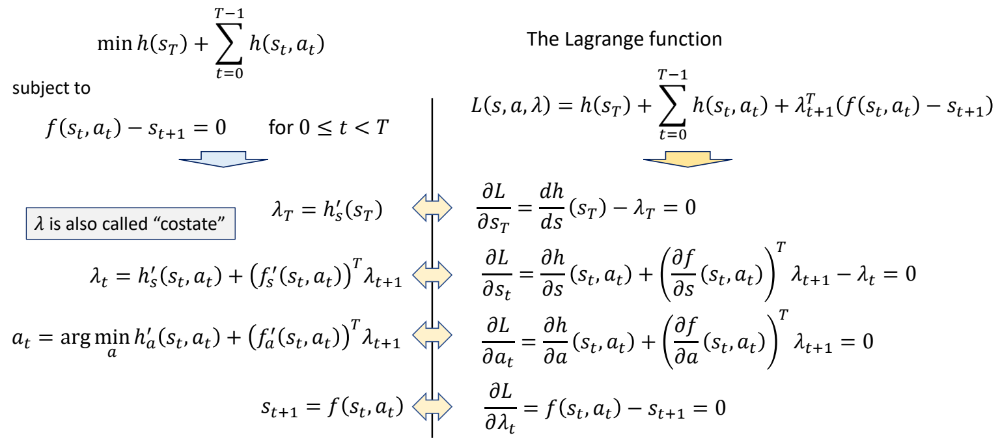  

> &#x2705; 拉格朗日方程，对每个变量求导，并令导数为零。  
> &#x2705; 因此得到方程组。

P30  
## Pontryagin’s Maximum Principle for discrete systems

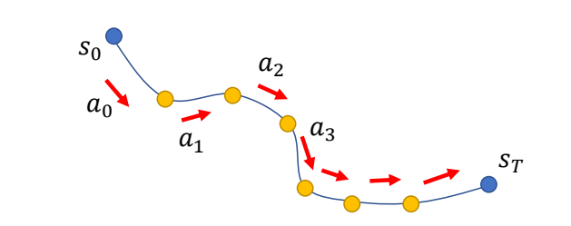  

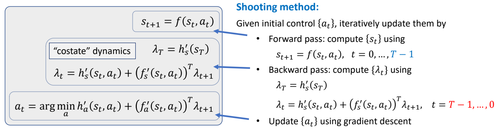  

> &#x2705; 方程组整理得到左边，称为PMP条件。  

P32   
## Optimal Control

**Open-loop Control**:    
given a start state \\(s_0\\), compute sequence of actions {\\(a_t\\)} to reach the goal   

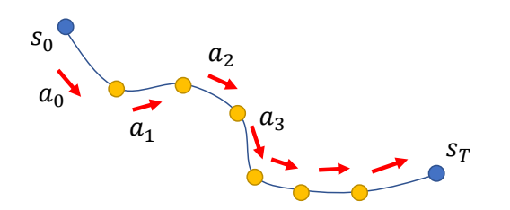  

---  

>  **Shooting method** directly applies PMP. However, it does not scale well to complicated problems such as motion control…   
\\( \\)   
Need to be combined with collocation method, multiple shooting, etc. for those problems.    
\\( \\)   
Or use derivative-free approaches.   

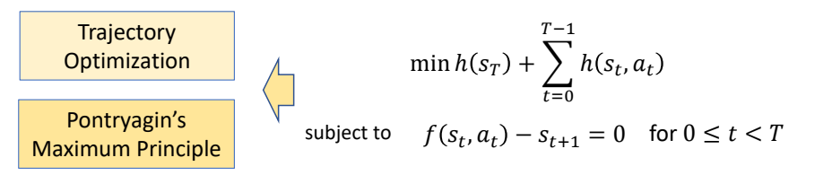  

P34  
## Dynamic Programming   

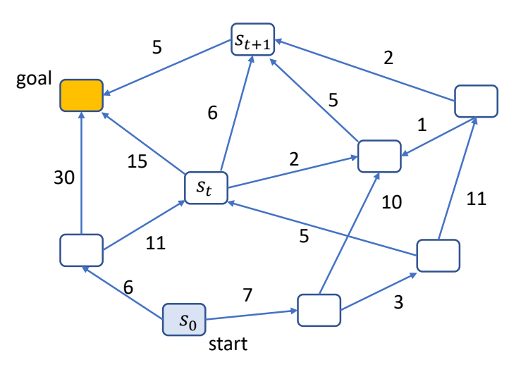 

Find a path {\\(s_t\\)} that minimizes    

$$
J(s_0)=\sum _ {t=0}^{ } h(s_t,s_{t+1})
$$

> &#x2705; 动态规划问题。  

P35  
## Dynamic Programming   

Find a sequence of action {\\(a_t\\)} that minimizes   

$$
J(s_0)=\sum _ {t=0}^{ } h(s_t,a_t)
$$

subject to   

$$
s_{t+1}=f(s_t,a_t)
$$

> &#x2705; 轨迹问题。  

P36  
## Dynamic Programming   

Find a policy \\( a_t=\pi (s_t,t)\\) that minimizes    

$$
J(s_0)=\sum _ {t=0}^{ } h(s_t,a_t)
$$

subject to   

$$
s_{t+1}=f(s_t,a_t)
$$

> &#x2705; 控制策略问题。  

P37   
## Dynamic Programming   

Find a policy \\( a_t=\pi (s_t)\\) that minimizes    

$$
J(s_0)=\sum _ {t=0}^{ } h(s_t,a_t)
$$

subject to   

$$
s_{t+1}=f(s_t,a_t)
$$

P39   
## Bellman’s Principle of Optimality   

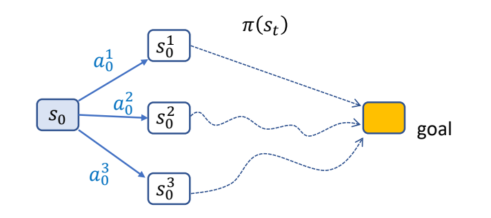 

An optimal policy has the property that whatever the initial 
state and initial decision are, the remaining decisions must 
constitute an optimal policy with regard to the state resulting 
from the first decision.   

\\(^\ast \\) The problem is said to have optimal substructure    

P40   
## Bellman’s Principle of Optimality  

Value of a state \\(V(s)\\) :    

 - the minimal total cost for finishing the task starting from \\(s\\)   
\\(\Updownarrow \\)
 - the total cost for finishing the task starting from \\(s\\) using the optimal policy    

> &#x2705; Value Funcron，计算从某个结点到 gool 的最小代价。   
> &#x2705; 后面动态规划原理跳过。   

P49   
## The Bellman Equation   

Mathematically, an optimal **value function** \\(V(s)\\) can be defined recursively as:   

$$
V(s)=\min_{a} (h(s,a)+V(f(s,a)))
$$

If we know this value function, the optimal **policy** can be computed as   

$$
\pi (s)=\arg \min_{a} (h(s,a)+V(f(s,a)))
$$

or   

$$
\begin{matrix}
 \pi (s)=\arg \min_{a} Q(s,a)\\\\
\text{where} \quad \quad  Q(s,a)=h(s,a)+V(f(s,a))
\end{matrix}
$$

Q-function State-action value function    

P50   
## The Bellman Equation   

Mathematically, an optimal value function \\(V(s)\\) can be defined recursively as:   

$$
V(s)=\min_{a} (h(s,a)+V(f(s,a)))
$$

Learning \\(V(s)\\) and/or \\(Q(s,a)\\) is the core of optimal control / reinforcement learning methods   

\\( \\)   

If we know this value function, the optimal policy can be computed as

$$
\pi (s)=\arg \min_{a} (h(s,a)+V(f(s,a)))
$$

This arg max can be easily computed for discrete control problems.   
But there are not always closed-forms solution for continuous control problems.   

\\( \\)   

or   

$$
\begin{matrix}
 \pi (s)=\arg \min_{a} Q(s,a)\\\\
\text{where} \quad \quad  Q(s,a)=h(s,a)+V(f(s,a))
\end{matrix}
$$

Q-function State-action value function    

> &#x2705; 强化学习最主要的目的是学习 \\(V\\) 函数和 \\(Q\\) 函数，如果 \\(a\\) 是有限状态，遍历即可。  
> &#x2705; 但在角色动画里，\\(a\\) 是连续状态。  

P52   
## Linear Quadratic Regulator (LQR)   

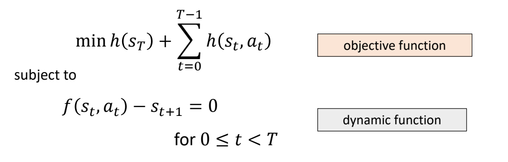 

 - LQR is a special class of optimal control problems with   
    - **Linear** dynamic function   
    - **Quadratic** objective function   

> &#x2705; LQR 是控制领域一类经典问题，它对原控制问题做了一些特定的约束。

P53   
## A very simple example   

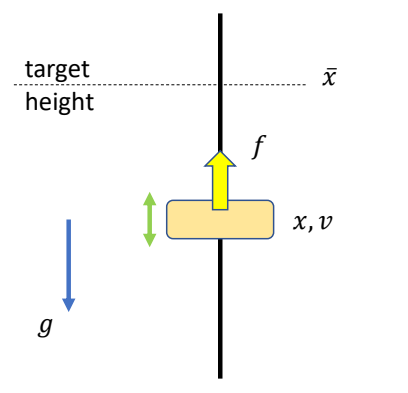 

Compute a target trajectory \\(\tilde{x}(t)\\) such that the simulated trajectory \\(x(t)\\) is a sine curve.   

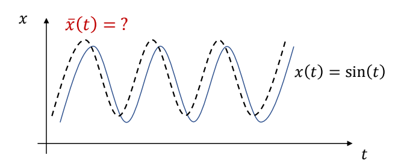 

$$
\min _{(x_n,v_n,\tilde{x} _n)} \sum _{n=0}^{N} (\sin (t_n)-x_n)^2+\sum _{n=0}^{N}\tilde{x}^2_n 
$$

$$
\begin{align*}
 s.t. \quad \quad v _ {n+1} & = v _ n + h(k _p ( \tilde{x} _ n - x _ n) - k _ dv _ n ) \\\\
 v _ {x+1} & = x _ n + hv _ {n+1}
\end{align*}
$$

P54  
objective function   

$$
\min s^T_TQ_Ts_T+\sum_{t=0}^{T} s^T_tQ_ts_t+a^T_tR_ta_t
$$

subject to   

$$
s_{t+1}=A_ts_t+B_ta_t   \quad \quad \text{for }   0\le t <T 
$$

dynamic function   

P58   
## Linear Quadratic Regulator (LQR)

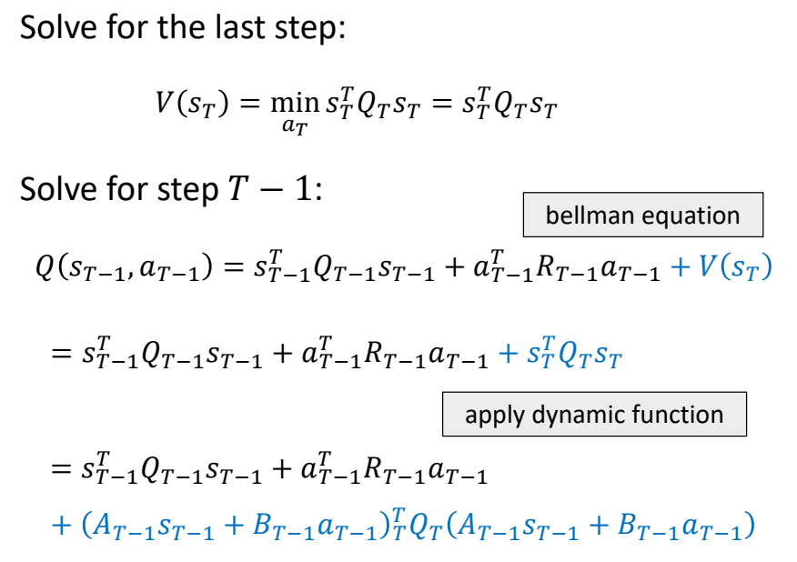 

P60   
## Linear Quadratic Regulator (LQR)

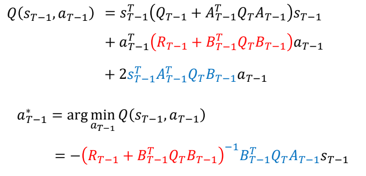 

P61 
## Linear Quadratic Regulator (LQR)

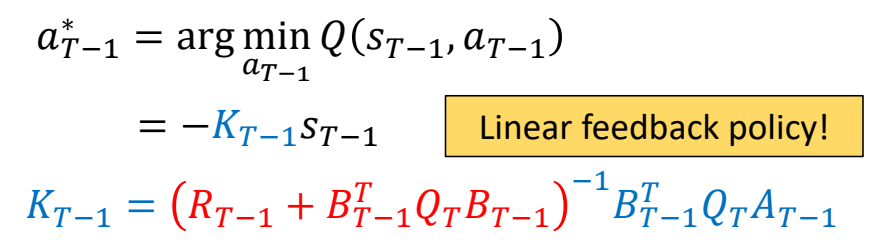 

P62   
## Linear Quadratic Regulator (LQR)

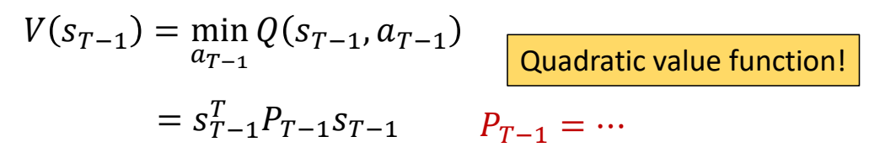  

P63  
## Linear Quadratic Regulator (LQR)

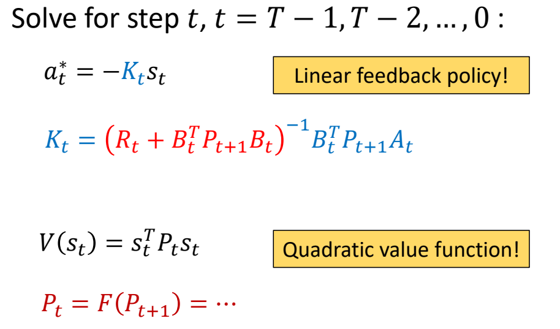 

P64   
## Linear Quadratic Regulator (LQR)

 - LQR is a special class of optimal control problems with   
    - Linear dynamic function   
    - Quadratic objective function   
 - Solution of LQR is a linear feedback policy  

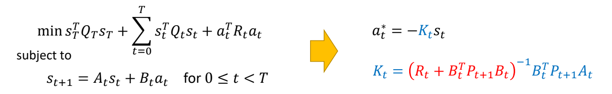 

P65   
## Linear Quadratic Regulator (LQR)

 - How to deal with   
    - Nonlinear dynamic function?   
    - Non-quadratic objective function?   

> &#x2705; 人体运动涉及到角度旋转，因此是非线性的。  

P68  
## Linear Quadratic Regulator (LQR)  

 - Nonlinear problems   

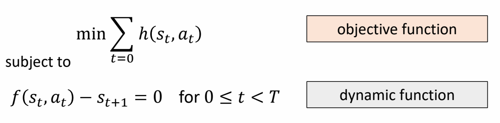 

Approximate cost function as a quadratic function:   

$$
h(s_t,a_t)\approx h(\bar{s}_t ,\bar{a}_t)+\nabla h(\bar{s}_t ,\bar{a}_t)\begin{bmatrix}
 s_t-\bar{s} _t\\\\
a_t-\bar{a} _t
\end{bmatrix} + \frac{1}{2} \begin{bmatrix}
 s_t-\bar{s} _t\\\\
a_t-\bar{a} _t
\end{bmatrix}^T\nabla^2h(\bar{s}_t ,\bar{a}_t)\begin{bmatrix}
 s_t-\bar{s} _t\\\\
a_t-\bar{a} _t
\end{bmatrix}
$$

Approximate dynamic function as a linear function:    

$$
f(s_t,a_t)\approx f(\bar{s}_t ,\bar{a}_t)+\nabla f(\bar{s}_t ,\bar{a}_t)\begin{bmatrix}
 s_t-\bar{s} _t\\\\
a_t-\bar{a} _t
\end{bmatrix}
$$

iLQR: iterative LQR 

Or a quadratic function:   

$$
f(s_t,a_t)\approx \ast \ast \ast \frac{1}{2} \begin{bmatrix}
 s_t-\bar{s} _t\\\\
a_t-\bar{a} _t
\end{bmatrix}^T\nabla^2f(\bar{s}_t ,\bar{a}_t)\begin{bmatrix}
 s_t-\bar{s} _t\\\\
a_t-\bar{a} _t
\end{bmatrix}
$$

DDP: Differential Dynamic Programming  

> &#x2705; 方法：把问题近似为线性问题。  
> &#x2705; 目标函数：泰勒展开，保留二次。  
> &#x2705; 转移函数：泰勒展开，保留一次或二次。  

P69  
## Locomotion Using Optimal Control

[Muico et al 2011 - Composite Control of Physically Simulated Characters]   

> &#x2705; 选择合适的 \\(Q\\) 和 \\(R\\)，需要一些工程上的技巧。   
> &#x2705; 为了求解方程，需要显式地建模运动学方程。  

P70  
## Model-based Method vs. Model-free Method   

> What if the dynamic function \\(f(s,a)\\) is not know?  

> What if the dynamic function \\(f(s,a)\\) is not accurate?    

> What if the system has noise?    

> What if the system is highly nonlinear?     

> &#x2705; \\(f\\) 未知只是把 \\(f\\) 当成一个黑盒子，仍需要根据 \\(S_t\\) 得到 \\(S_{t＋1}\\) .   

P72  
## Sampling-based Policy Optimization   

 - Iterative methods
    - Goal: find the optimal **policy** \\(\pi (s;\theta )\\) that minimize the objective \\(J(\theta )=\sum_{t=0}^{}h(s_t,a_t) \\)     
    - Initialize policy parmeters \\(\pi (x;\theta )\\)   
    - Repeat:   
      - Propose a set of candidate parameters {\\(\theta _i \\)} according to \\(\theta \\)    
      - Simulate the agent under the control of each \\( \pi ( \theta _i)\\) 
      - Evaluate the objective function \\( J (\theta_i )\\)  on the simulated state-action sequences    
      - Update the estimation of \\(\theta \\) based on {\\( J (\theta_i )\\)}     

 - Example: CMA-ES

> &#x2705; 基于采样的方法。  

P73   
## Example: Locomotion Controller with Linear Policy

[Liu et al. 2012 – Terrain Runner]

P74  
## Stage 1a: Open-loop Policy   

Find open-loop control using SAMCON

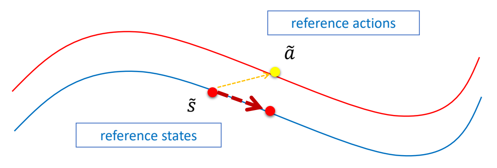 

> &#x2705; 使用开环轨迹优化得到开环控制轨迹。    

P76  
## Stage 1b: Linear Feedback Policy

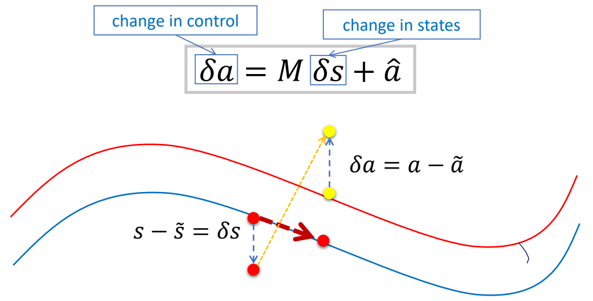   

> &#x2705; 使用反馈控制更新控制信号。由于假设了线性关系，根据偏离offset可直接得到调整offset.  

P78   
## Stage 1b: Reduced-order Closed-loop Policy

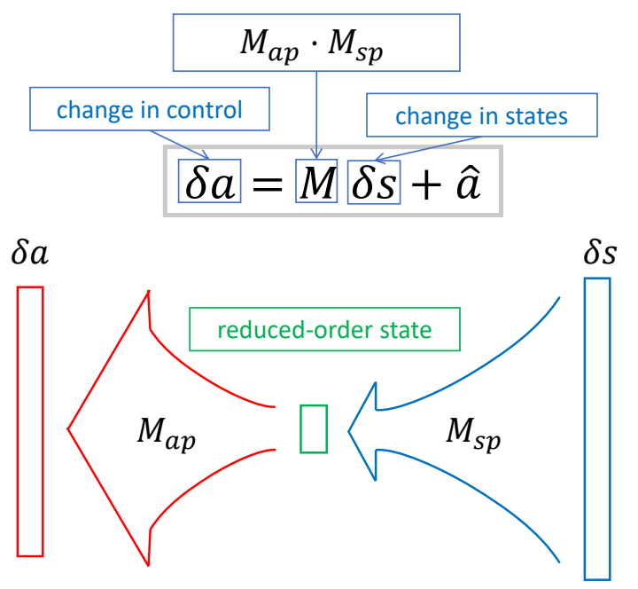  

> &#x2705; 把 \\(M\\) 分解为两个矩阵，\\(M_{AXB}=M_{AXC}\cdot M_{CXB}\\) 如果 \\(C\\) 比较小，可以明显减少矩阵的参数量。    
> &#x2705; 好处：(1) 减少参数，减化优化过程。  
> &#x2705; (2) 抹掉状态里不需要的信息。  

P79   
## Manually-selected States: s   

 - Running: 12 dimensions

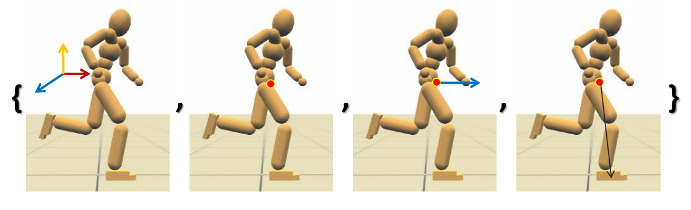 

> &#x2705; （1）根结点旋转（2）质心位置（3）质心速度（4）支撑脚位置   

P80  
## Manually-selected Controls: a  

 - for all skills: 9 dimensions   

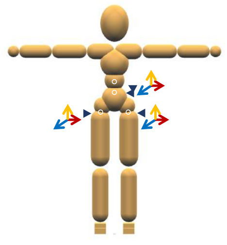   

> &#x2705; 仅对少数关节加反馈。   

P81   
## Optimization

$$
\delta a=M\delta s+\hat{a} 
$$

 - Optimize \\(M\\)   
    - CMA, Covariance Matrix Adaption ([Hansen 2006])
    - For the running task:
      - #optimization variables: \\(12 ^\ast 9 = 108 / (12^\ast 3+3 ^\ast 9) = 63\\)   
     - 12 minutes on 24 cores   

P82   
## Example: Locomotion Controller with Linear Policy

[Liu et al. 2012 – Terrain Runner]   

P85  
## Optimal Control \\(\Leftrightarrow \\) Reinforcement Learning   

• RL shares roughly the same overall goal with Optimal Control   

$$
\max \sum_{t=0}^{} r (s_t,a_t)
$$

• But RL typically does not assume perfect knowledge of system   

 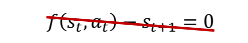 

 - RL can still take advantage of a system model → model-based RL   
    - The model can be learned from data   
 $$
 s_{t+1}=f(s_t,a_t;\theta )
 $$

> &#x2705; 最优控制要求有精确的运动方程，而RL不需要。   
> &#x2705; RL通过不断与世界交互进行采样。   

P87   
## Markov Decision Process (MDP)  

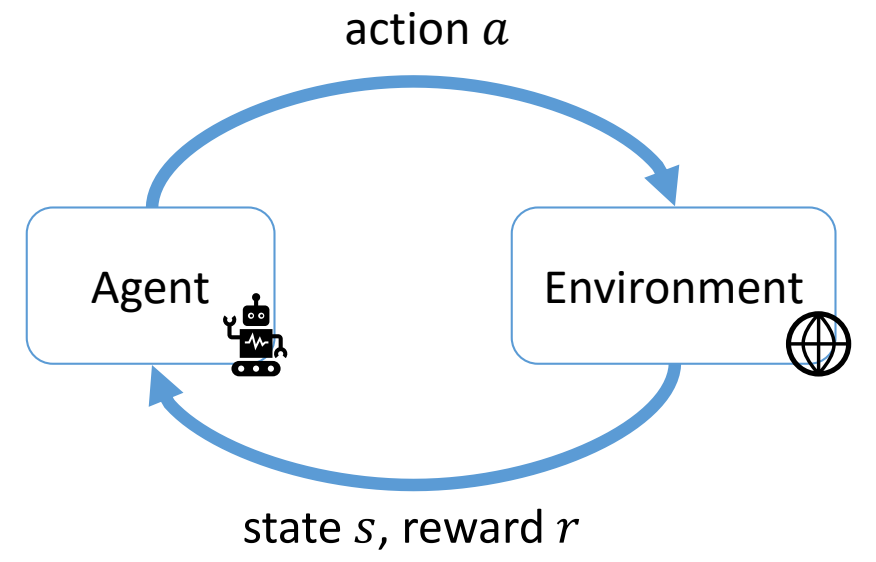   

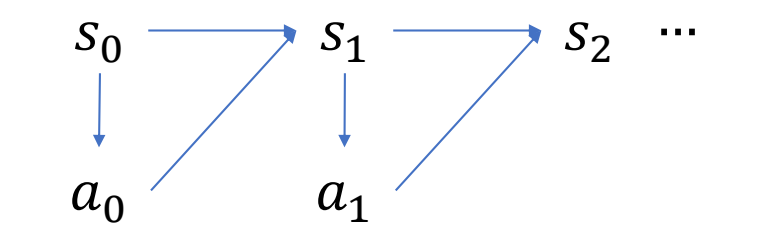   

State  \\(\quad s_t \quad \quad \\)Action \\(\quad a_t\\)

Policy \\(\quad \quad a_t\sim \pi (\cdot \mid s_t)\\)   

Transition probability  \\(\quad \quad s_{t+1}\sim p  (\cdot \mid s_t,a_t)\\)   

Reward  \\(\quad \quad r_t=r (s_t,a_t)\\)   

$$
\text{Return }\quad \quad R = \sum _{t}^{} \gamma ^t r (s_t,a_t)\quad \quad \quad \quad \quad \quad \quad \quad \quad \quad \quad \quad \quad \quad \quad \quad \quad \quad \quad \quad \quad \quad \quad \quad 
$$   

> &#x2705; 真实场景中轨迹无限长，会导到 \\(r\\) 无限大。   
> &#x2705; 因此会使用小于 1 的 \\(r,t\\) 越大则对结果的影响越小。   

P88  
## Markov Decision Process (MDP)   

Trajectory    

$$
\begin{matrix}
  \tau =& s_0 & a_0 & s_1 & a_1 & s_2&\dots 
\end{matrix}
$$

Reward   

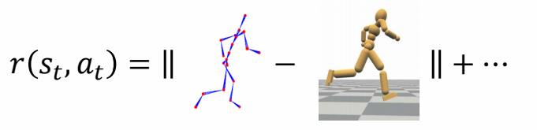   

P90   
## Markov Decision Process (MDP)

MDP is a **discrete-time** stochastic control process.    
It provides a mathematical framework for modeling decision making in situations     
where outcomes are **partly random and partly under the control of a decision maker**.   

A MDP problem:    

\\(\mathcal{M}\\) = {\\(S,A,p,r\\)}    
\\(S\\): state space   
\\(A\\): action space   

> &#x2705; Markov性质：当当前状态已知的情况下，下一时刻状态只与当前状态相关，而不与之前任一时刻状态相关。   
> &#x2705; p：状态转移概率，即运动学方程。   
> &#x2705; r：代价函数。   

P91  
## Markov Decision Process (MDP)   

A MDP problem:    

\\(\mathcal{M}\\) = {\\(S,A,p,r\\)}   

Solve for a policy \\(\pi (a\mid s)\\) that optimize the **expected return**    

$$
J=E[R]=E_{\tau \sim \pi }[\sum_{t}^{} \gamma ^tr(s_t,a_t)]
$$

Overall all trajectories \\(\tau \\) = { \\(s_0, a_0 , s_1 , a_1 ,  \dots  \\)} induced by \\(\pi \\)   

> &#x2705; 使期望最优，而不是直接找最优解。   
> &#x2705; 假设 \\(\pi \\) 函数和 \\(p\\) 函数都是有噪音的，即得到的结果不是确定值，而是以一定概率得到某个结果。   

P93   
## Bellman Equations

In optimal control:    

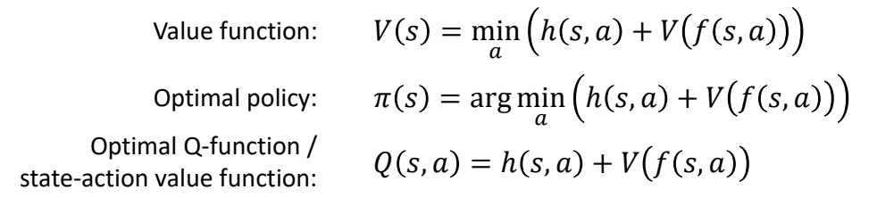   

In RL control:    

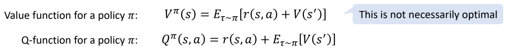   

P94   
## How to Solve MDP  

 - Value-based Methods
    - Learning the value function/Q-function using the Bellman equations   
    - Evaluation the policy as    

    $$
    \pi (s) = \arg \min_{a} Q(s,a)
    $$

    - Typically used for discrete problems   
    - Example: Value iteration, Q-l a ning, DQN, …   

P95   
## How to Solve MDP  

DQN [Mnih et al. 2015, Human-level control through deep reinforcement learning]   

P96  
## Multi-skill Characters

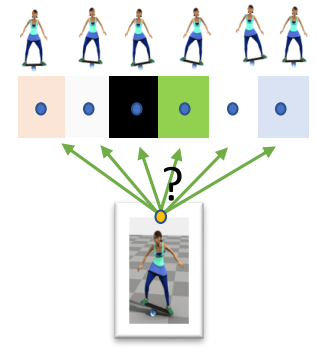   

[Liu et al. 2017: Learning to Schedule Control Fragments ]   

> &#x2705; DQN 方法要求控制空间必须是离散的，但状态空间可以是连续的。  
> &#x2705; 因此可用于高阶的控制。  

P97   
## How to Solve MDP   

 - Policy Gradient approach
    - Learning the value function/Q-function using the Bellman equations   
    - Compute approximate **policy gradient** according to value functions using Monte-Carlo method   

    - Update the policy using policy gradient  

    - Suitable for **continuous** problems   

    - Exa pl : REINFORCE, TRPO, PPO, …   

> &#x2705; policy grodient 是 Value function 对状态参数的求导。但这个没法算，所以用统计的方法得到近似。

P98   
## How to Solve MDP

||||
|--|--|--|
| 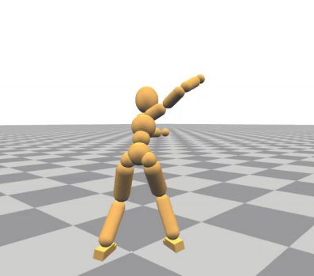   |  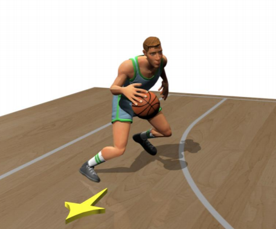   |  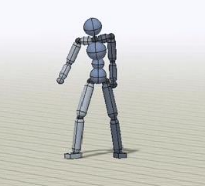   | 
| [Liu et al. 2016. ControlGraphs] | [Liu et al. 2018]   | [Peng et al. 2018. DeepMimic] |  

P100  
## Generative Control Policies   

[Yao et al. Control VAE]   

P101  
## What’s Next?   

 - Digital Cerebellum – Large Pretrained Model for Motion Control

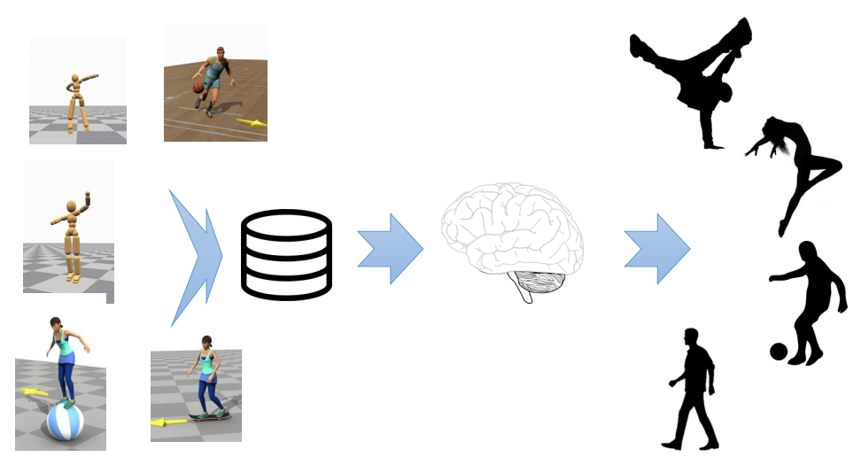   

P102  
## What’s Next?    

 - Cross-modality Generation
    - \\(\Leftrightarrow\\) LLM \\(\Leftrightarrow\\) Text/Audio \\(\Leftrightarrow\\) Motion/Control \\(\Leftrightarrow\\) Image/Video \\(\Leftrightarrow\\)     
    - Digital Actor?    

---------------------------------------
> 本文出自CaterpillarStudyGroup，转载请注明出处。
>
> https://caterpillarstudygroup.github.io/GAMES105_mdbook/