P2   
# Outline   

 - Skinning   
    - Linear Blend Skinning (LBS)   
    - Dual Quaternion Skinning (DQS)   
    - Blendshapes   

 - Examples:   
    - The SMPL model  
    - Facial Animation  

> &#x1F50E; SIGGRAPH 经典的蒙皮课程。  
Many images are from: <https://skinning.org/>   
*Alec Jacobson, Zhigang Deng, Ladislav Kavan, and J. P. Lewis. 2014*.   
**Skinning: real-time shape deformation**.     
*In ACM SIGGRAPH 2014 Courses (SIGGRAPH '14)*    

 

P7  
# Skinning Deformation   

## 绑定与蒙皮概念

> &#x2705; Rigging：创建脸部控制器或身体骨骼。黄色为在 Mesh 顶点内放置的骨骼。      
> &#x2705; Sinning：让控制器带动皮肤运动。或让 Mesh 顶点跟着骨骼运动。    

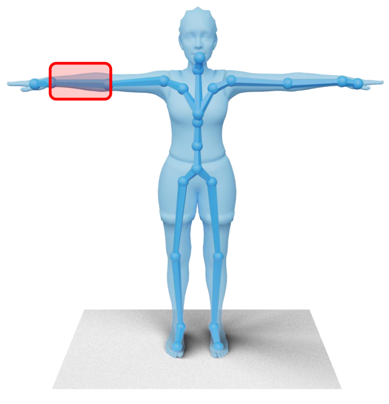   

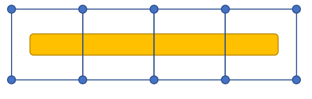   

P12   
## Skinning Deformation    

### 计算方式一

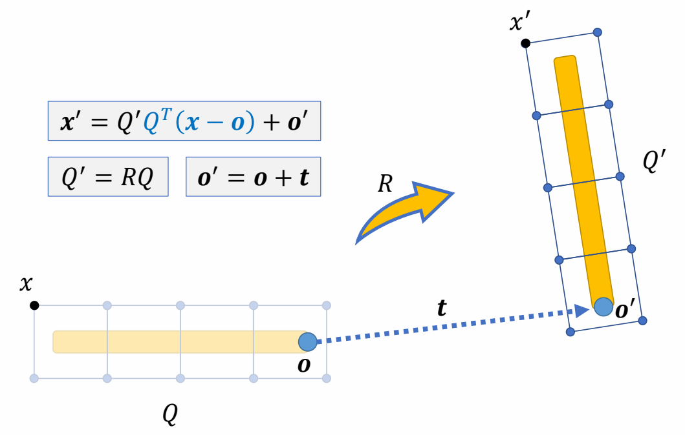   

> &#x2705; 骨骼运动的旋转和平移分别为 \\(R\\) 和 \\(t\\)，关节的位置和朝向则变成了 \\({Q}'\\) 和 \\({o}'\\).   
> &#x2705; 求 \\(x\\) 的新位置 \\({x}'\\). 本质上就是坐标系变换：世界坐标系 → \\({o}\\) 坐标系 → \\({o}'\\) 坐标系 → 世界坐标系    

P13   
### 计算方式二

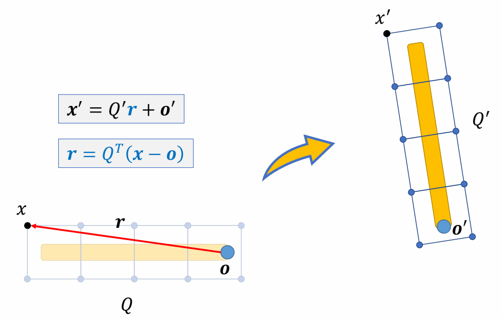 

> &#x2705; \\(r\\) 为 \\(x\\) 在骨骼坐标的表达，用 \\(r\\) 计算更简洁。 

P16   
## Bind Pose

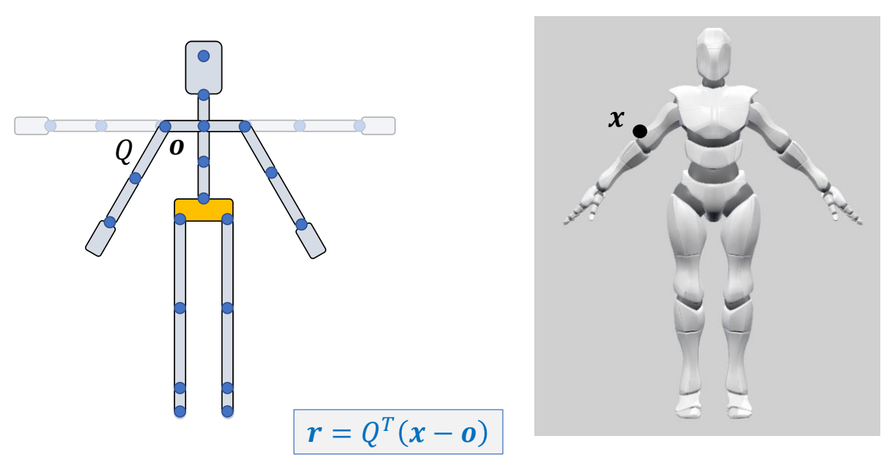   

> &#x2705; 当骨骼参考姿态与 Mesh 参考姿态不一致时，需要先旋转骨骼到 Mesh 姿态。  

P20   
## Skinning Deformation - 2 joints

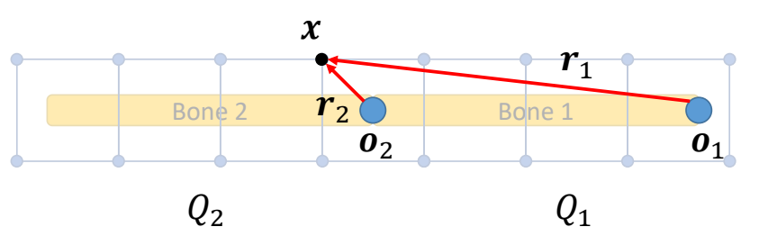   

$$
r_2=Q^T_2(x-o_2)   \quad \quad  r_1=Q^T_1(x-o_1)
$$

> &#x2705; 多骨骼场景，\\(x\\) 在关节 \\(O_1\\) 和 \\(O_2\\) 下分别 \\(r_1\\) 和 \\(r_2\\) 两种表达。  

P23   
   

> &#x2705; 得到的旋转后表达分别为 \\({x}'_1\\) 和 \\({x}'_2\\)，通过权重对它们结合。   

P29   
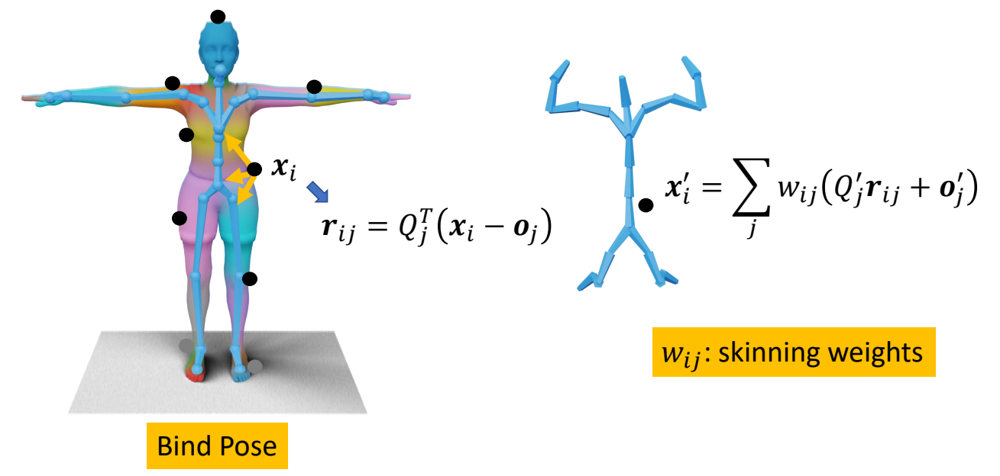   

> &#x2705; 同时考虑所有 Mesh 顶点和所有关节。   

P31   
## Linear Blend Skinning (LBS)

$$
{x}'_ i= \sum_ {j=1} ^ {m} w _ {ij}({Q}'_ jr_{ij}+{o}'_j)
$$

 - Used widely in industry   
 - Efficient and GPU-friendly  
    - Games like it   

> &#x2705; Bind Pose：让骨骼与 Mesh 对齐，为 Bind Pose．   
> &#x2705; Bind Pose 情况下 Motion 不一定为零。   

P33  
## Automatic Skinning?

||
|---|
| 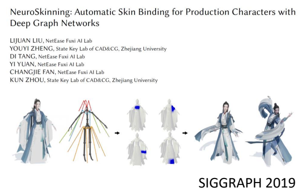   |
| 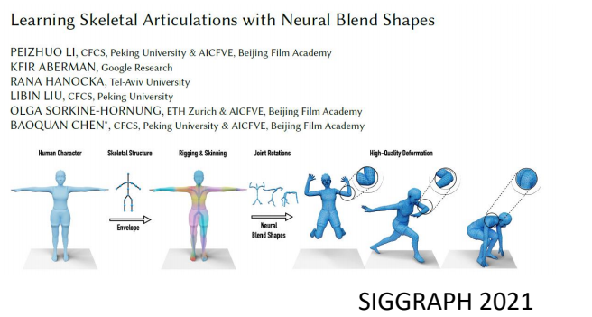   |

Pinocchio [Baran et al., 2007]   

P37   
## Linear Blend Skinning (LBS)

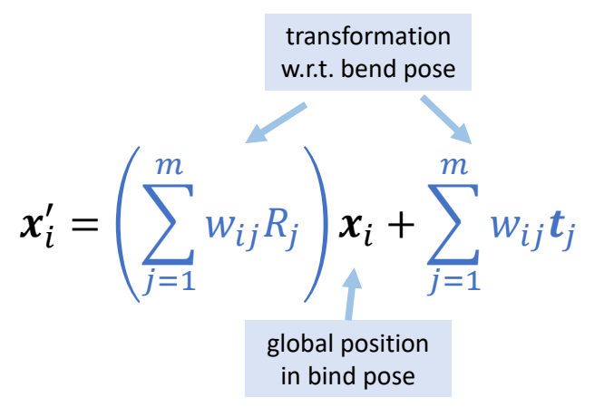   

> &#x2705; 公式第一项对 \\(R_j\\) 所加权，所得到的很有可能不再是旋转矩阵。   

存在的问题： Candy-Wrapper Artifact

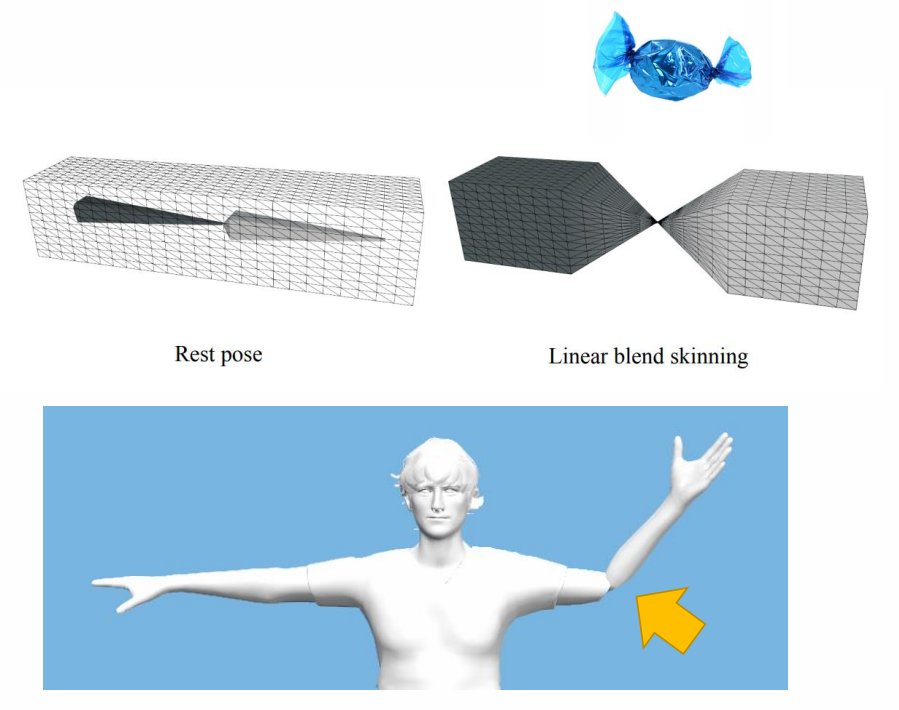   

P40  
## Advanced Skinning Methods   

 - Multi-linear Skinning (we will not cover this)   
    - Multi-weight enveloping [Wang and Phillips 2002]   
    - Animation Space [Merry et al. 2006]   
    - ……   

 - Nonlinear Skinning   
    - Dual-quaternion Skinning (DQS)   

   

> &#x2705; DQ：对偶四元数。   

P41   
## Non-linear Skinning

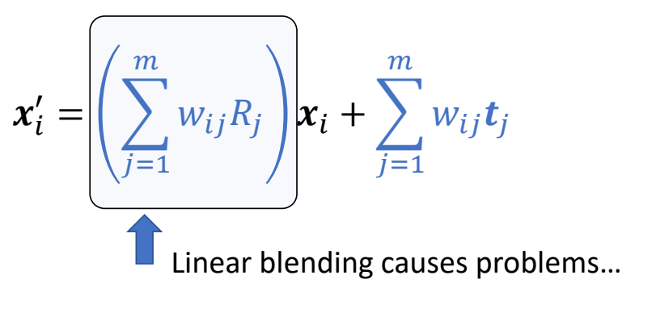   

### quaternions and SLERP

Can we use quaternions and SLERP?    

P42  

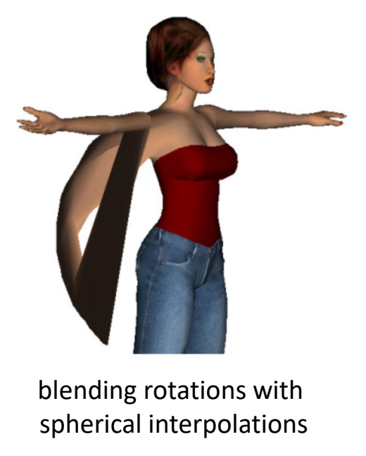   

> &#x2705; 不行。原因：第一项与第二项必须要配合好，否则会乱掉。   

P43  
### 从公式角度来解释不行的原因   

$$
{x}' _ i = ( \sum _ {j=1}^{m} w _ {ij} R _ j) x _ i+ \sum _ {j=1}^{m}w _ {ij}t_ j
$$

$$
R \in SO(3)
$$

$$
T_j=\begin{bmatrix}
 R_j & t_j\\\\
 0 &1
\end{bmatrix} \in SE(3)
$$

> &#x2705; \\(T_j\\) 构成一个刚性变换群。  

P46  
### Interpolation in 𝑆𝑂(3)

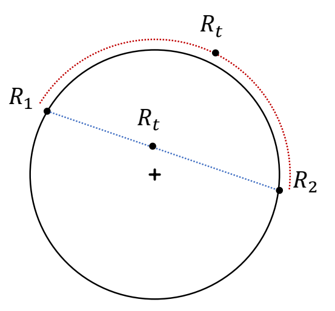   

> &#x2705; 线性插值和 SLERP 插值 SO(3) 上。   

P49  
### Interpolation in 𝑆𝐸(3)

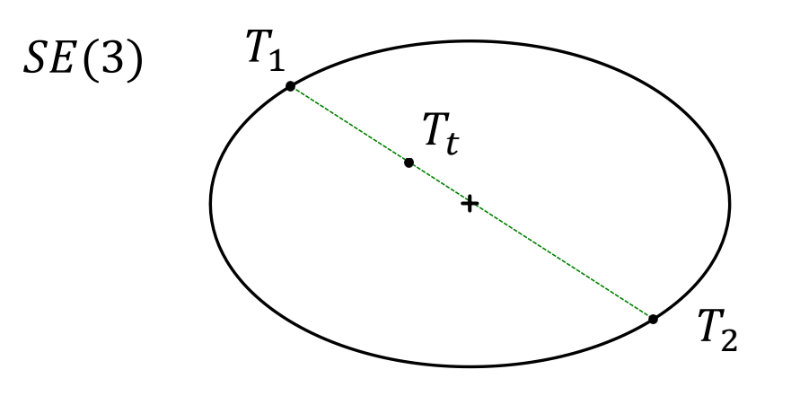   

> &#x2705; SE（3）上的线性插值，插值到一个退化的点。   

P51  
### Intrinsic Blending

   

P52   
## Dual-Quaternion Skinning (DQS)

 - Approximation of intrinsic averages in SE(3)   

Ladislav Kavan, Steven Collins, Jiri Zara, Carol O‘Sullivan. **Geometric Skinning with**    
**Approximate Dual Quaternion Blending**, ACM Transaction on Graphics, 27(4), 2008.   

> &#x2705; 把旋转 ＋ 平移的刚性变换表达为对偶四元数。  

P54   
### Dual Numbers  

   

P55  
### Dual Quaternion   

 - Dual quaternion   

$$
\hat{q} =q_0 + \varepsilon q_\varepsilon
$$

$$
\text{where } \varepsilon^2=0
$$

A good note of dual-quaternion:   
<https://faculty.sites.iastate.edu/jia/files/inline-files/dual-quaternion.pdf>   

P56   
### Dual Quaternion   

 - Scalar Multiplication   

$$
s\hat{q}=sq_r+sq_\varepsilon\varepsilon
$$

 - Addition   

$$
\hat{q} _ 1 + \hat{q} _2=q _ {r1}+ q _ {r2} + \varepsilon (q _ {\varepsilon 1} + q _ {\varepsilon 2})
$$

 - Multiplication  

$$
\hat{q} _ 1 \hat{q} _ 2 = q _ {r1} q _ {r2} + \varepsilon (q _ {r1} q _ {\varepsilon 2} + q _ {r2} q _ {\varepsilon 1})
$$

P57   
### Dual Quaternion  

 - Dual quaternion   

$$
\hat{q}=q_0+\varepsilon q_\varepsilon
$$

 - Conjugation   

$$
\mathrm{I}:\hat{q}^* =q ^ * _ 0+\varepsilon q ^ * _ \varepsilon
$$

$$
\mathrm{II}:\hat{q}^ {\circ}  =q _ 0 - \varepsilon q _ \varepsilon 
$$

$$
\mathrm{III}: \hat{q} ^ \star    = q ^ * _ 0 - \varepsilon q ^ *_ \varepsilon 
$$

$$
\quad \quad \quad \quad = ({\hat{q} ^ *}) ^ {\circ} = (\hat{q} ^ {\circ}) ^ *
$$

$$
(\hat{q} _1\hat{q}_2)^\times =\hat{q} _1 ^\times \hat{q}_2^\times
$$

 - Norm   

$$
||\hat{q}||=\sqrt{\hat{q}^*\hat{q}} =||q_0||+\frac{\varepsilon (q_0\cdot q_\varepsilon) }{||q_0||} 
$$

P58  
### Dual Quaternion

 - Unit dual quaternion: \\(||\hat{q}||=1\\), which requires:   

$$
||q_0||=1
$$

$$
q_0 \cdot q_\varepsilon=0
$$

P59  
### Dual Quaternion ⇔ Rigid Transformation   

 - Like quaternion, any rigid transformation \\(T \in SE(3)\\) can be converted **into a unit dual quaternion**    

$$
Tx=Rx+t
$$

$$
T=[R\mid t]\to \hat{q} =q_0+\varepsilon q_\varepsilon 
$$

$$
\begin{matrix}
 q_0=r \quad & \text{ quaternion of } R \quad \quad\quad\quad\\\\
 q_\varepsilon =\frac{1}{2} tr & \text{ pure quaternion } t = (0,t)
\end{matrix}
$$

> &#x2705; 把一个刚性变换表示为对偶四元数。  

P60   
### Dual Quaternion ⇔ Rigid Transformation   

 - Transform a vector \\(v\\) using unit dual quaternion   

$$
{\hat{v} }' =\hat{q} \hat{v} \hat{q} ^\star 
$$

where   

$$
\begin{align*}
 \hat{v} & = 1+\varepsilon (0,v) \\\\
  & =(1,0,0,0)+\varepsilon (0,v_x,v_y,v_z)
\end{align*}
$$

$$
\quad
$$

$$
\mathrm{III}: \hat{q} ^ \star    = q ^ * _ 0 - \varepsilon q ^ *_ \varepsilon 
$$

$$
\quad \quad \quad \quad = ({\hat{q} ^ *}) ^ {\circ} = (\hat{q} ^ {\circ}) ^ *
$$

P61   
### Dual Quaternion ⇔ Rigid Transformation

 - Like quaternion, any rigid transformation \\(T \in SE(3)\\) can be converted **into a unit dual quaternion**    

$$
T=[R\mid t]\to \hat{q} =q_0+\varepsilon q_\varepsilon 
$$

$$
\begin{matrix}
 q_0=r \quad \\\\
 q_\varepsilon =\frac{1}{2} tr 
\end{matrix}
$$

\\(\hat{q}\\) and \\(-\hat{q}\\) represent the same transformation
\\(\hat{Q}\\) is a **double cover** of \\(SE(3)\\)   

P62   
## Double Cover Visualized

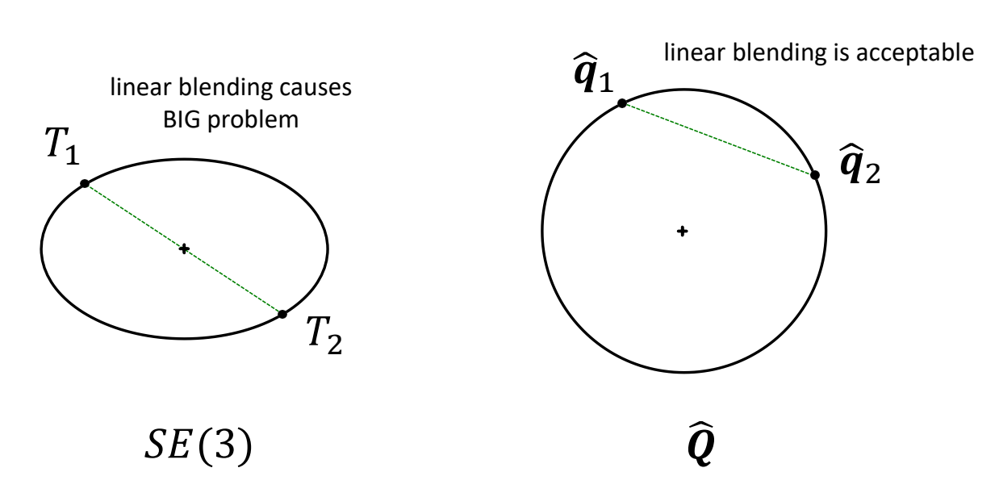   

P63   
## Interpolating Dual-Quaternion

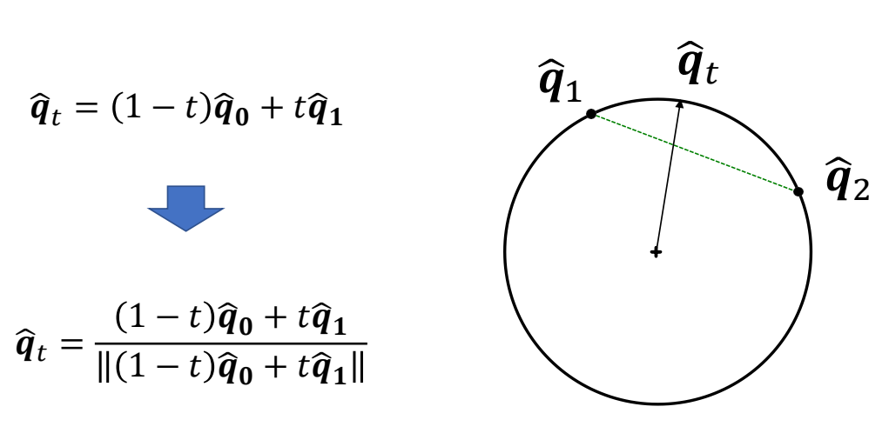   

P64  
## Dual-Quaternion Linear Blending (DLB)

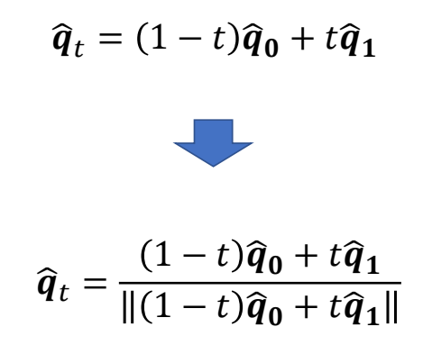   

P65   
## Dual-Quaternion Skinning (DQS)

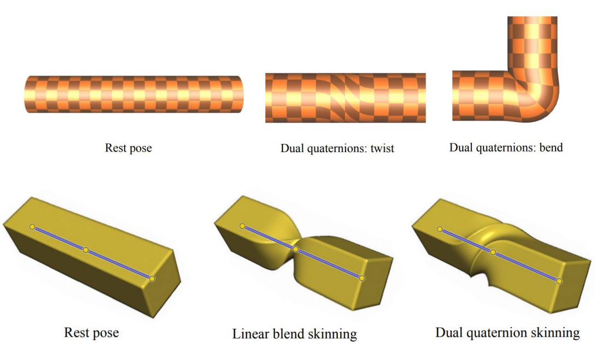   

P66   
## Budging Artifact of DQS

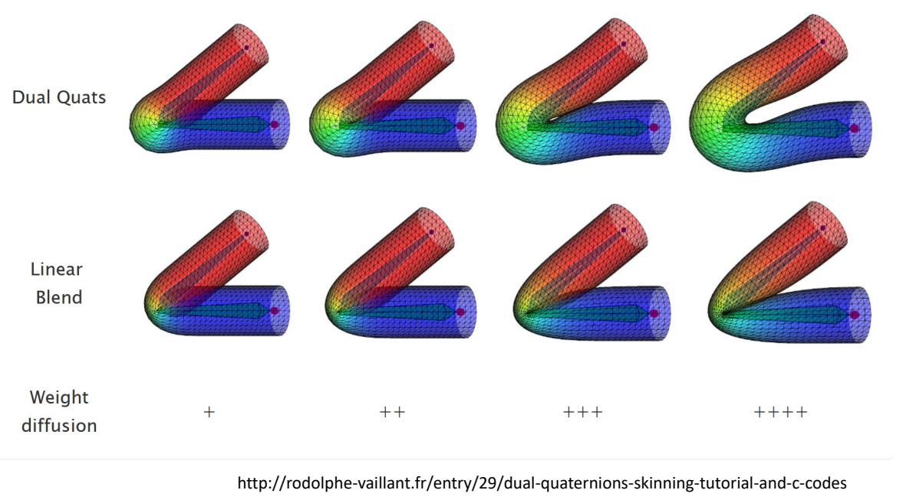   

> &#x2705; 越往右蒙皮权重越光滑。   
> &#x2705; DQBS 也有比较严重的 artifacts.   

P67   
## How to Correct LBS?

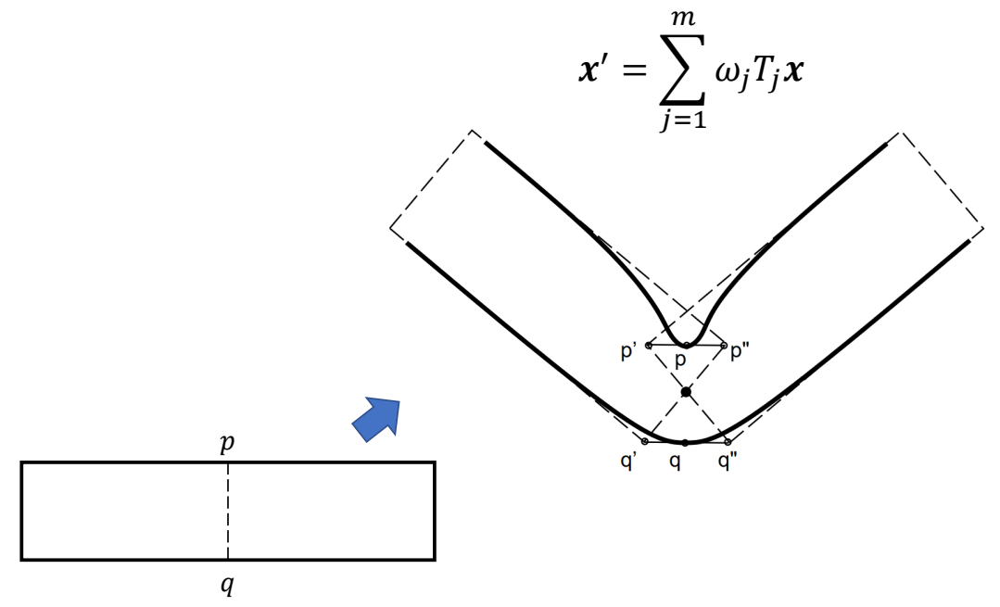   

> &#x2705; LBS 的天然缺陷   

P69   
## How to Correct LBS?

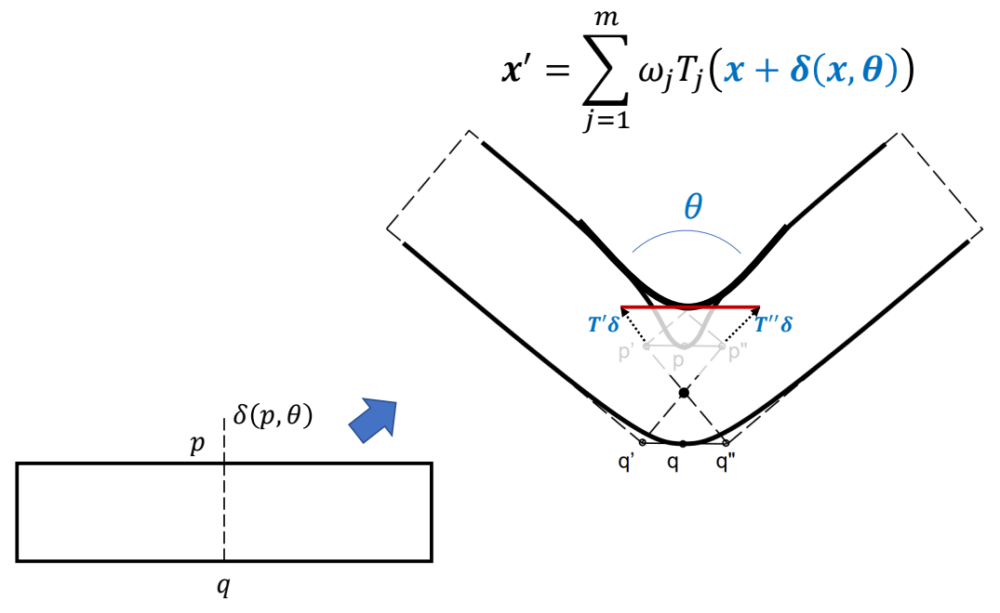   

P74   
## Scattered Data Interpolation

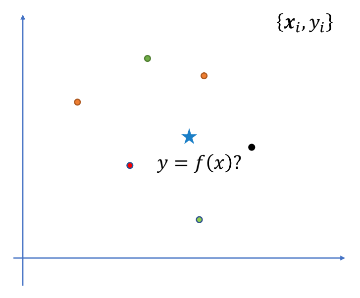   

P76   
## Scattered Data Interpolation  

 - Linear   
    - Least squares   
 - Splines   
 - Inverse distance weighting   
 - Gaussian process   
 - Radial Basis Function   
 - ……   

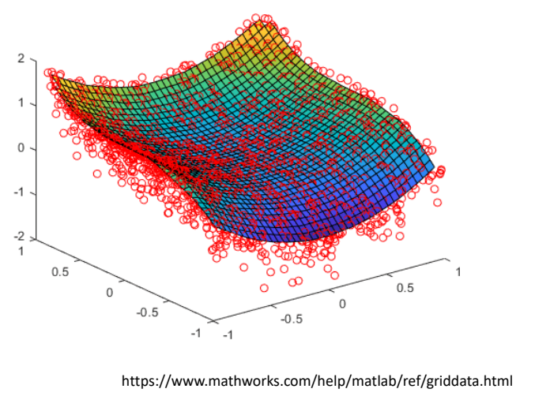   

P81   
## Radial Basis Function (RBF) Interpolation

$$
y=\sum_{i=1}^{k} w_i\varphi (||x-x_i||)
$$

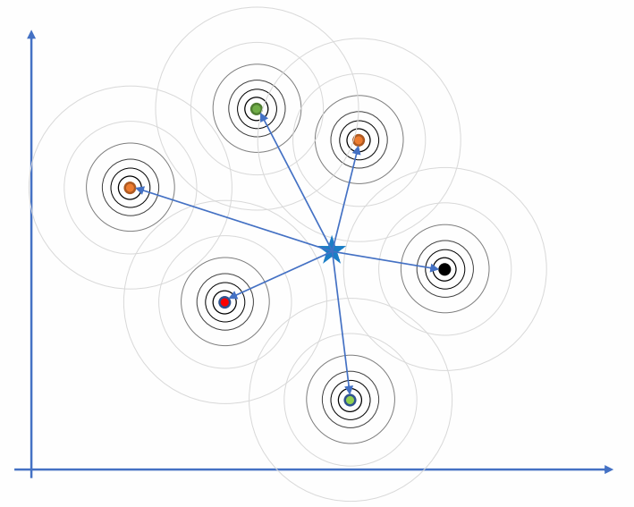   

P83   
## Radial Basis Function (RBF) Interpolation

$$
y=\sum_{i=1}^{k} w_i\varphi (||x-x_i||)
$$

How to compute \\(w_i\\) ? We need \\(f(x_i)=y_i\\)  

$$
\begin{bmatrix}  
  R_{1,1} & R_{1,2} & \cdots & R_{1,K} \\\\  
  R_{2,1} & R_{2,2} &   & \vdots \\\\  
  \vdots &   & \ddots & \vdots \\\\  
  R_{K,1} & \cdots & \cdots & R_{K,K}  
\end{bmatrix} \begin{bmatrix}
 w_1\\\\
w_2 \\\\
 \vdots\\\\
w_K
\end{bmatrix}=\begin{bmatrix}
 y_1\\\\
y_2 \\\\
 \vdots\\\\
y_K
\end{bmatrix}
$$

$$
R_{i,j}=\varphi (||x_i-x_j||)
$$

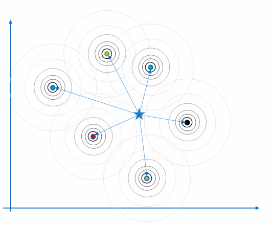   

P84   
## Radial Basis Function (RBF)

$$
y=\sum_{i=1}^{k} w_i\varphi (||x-x_i||)
$$

 - Gaussian:   

$$
\varphi (r)=e^{-(r/c)^2}
$$

 - Inverse multiquadric:    

$$
\varphi (r)=\frac{1}{\sqrt{r^2+c^2} } 
$$

 - Thin plate spline:    

$$  
\varphi (r)=r^2 \log r
$$

 - Polyharmonic splines:  

$$
\varphi (r)=\begin{cases}
 r^k,k=2n+1\\\\
\\\\\
r^k \log r,k=2n
\end{cases}
$$

P85     
## Pose Space Deformation   
$$
{x}' =\sum_{j=1}^{m} w_iT_j (x+\delta (x,\theta ))
$$

 - \\({x}'= SKIN(PSD(x))\\)   
 - 𝑃𝑆𝐷 is implemented as RBF interpolation   
 - Example shapes can be created manually   
    - Or by 3D scanning real people → the SMPL model   

J. P. Lewis, Matt Cordner, and Nickson Fong. 2000. **Pose space deformation: a unified approach to shape**   

**interpolation and skeleton-driven deformation**. In *Proceedings of the 27th annual conference on Computer*    

*graphics and interactive techniques* (SIGGRAPH ’00), ACM Press/Addison-Wesley Publishing Co., USA, 165–172.   

P86   
## Pose Space Deformation

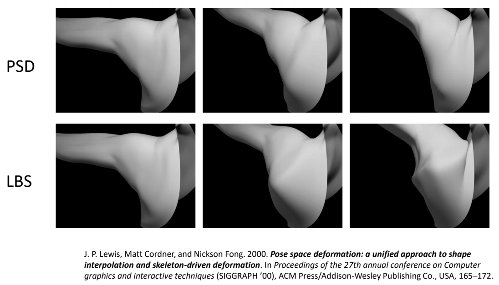   

P87   
## Issues   

 - Per-shape or per-vertex interpolation   
    - Should we interpolate a shape as a whole?   
 - Local or global interpolation?   
    - Should a vertex be affected by all joints?   
 - Interpolation algorithm?   
    - Is RBF the only choice?   

SIGGRAPH Course 2014 — Skinning: Real-time Shape Deformation   

P88  
## Example-based Skinning (EBS) vs. Skeleton Subspace Deformation (SSD)    

\\(^\ast \\)EBS: PSD   
\\(\quad\\)

 - Good: Easy to control   
 - Good: Good quality   
 - Good: **Pose-dependent details** (e.g. bulging muscle and extruding veins)   

\\(\quad\\)

 - Bad: Creating examples can be cumbersome   
 - Bad: Extra storage for examples   
 - Bad: Interpolation needs careful tuning   

\\(\quad\\)

\\(^\ast \\)SSD: LBS, DQS, etc.   
\\(\quad\\)

 - Good: Easy to implement   
 - Good: Fast and GPU friendly   

\\(\quad\\)

 - Bad: Various artifacts   
 - Bad: Skinning weights needs careful tuning   
 - Bad: Hard to create pose-dependent details   

P89   
## Example: SMPL Model   

 - A widely adopted human model in ML/CV   
 - Learned on real scan data   
 - Combines SSD and EBS techniques   

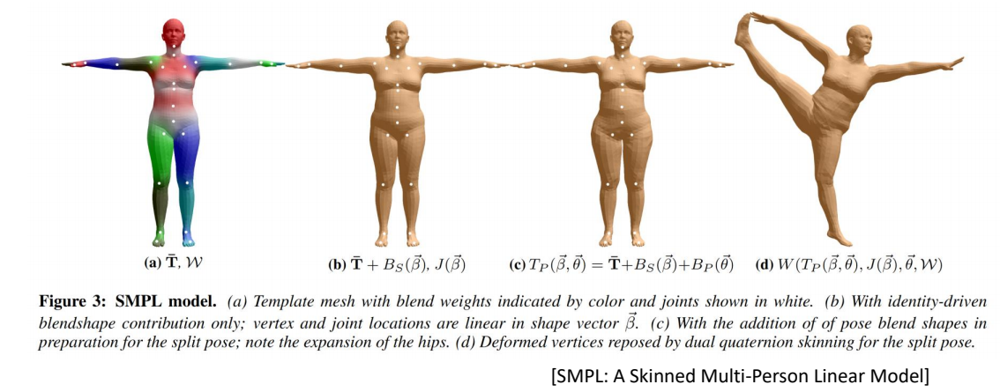   

P92   
## Recall: Principal Component Analysis (PCA)  

 - Given a dataset {\\(x_i\\)}, \\(x_i \in \mathbb{R} ^N\\), then PCA gives    

$$
x_i=\bar{x}+\sum_{k=1}^{n} w_{i,k}u_k
$$

 - \\(u_k\\) is the \\(k\\)-th principal component    
    - A direction in \\( \mathbb{R} ^N\\) along which the rojection of {\\(x_i\\)} has the \\(k\\)-th maximal **variance**   
 - \\(w_{i,k}=(x_i-\bar{x})\cdot u_k\\) is the score of \\(x_i\\) on \\(u_k\\)    

P93   
## Recall: Principal Component Analysis (PCA)   

• Given a dataset  {\\(x_i\\)}, \\(x_i \in \mathbb{R} ^N\\), the PCA can be computed by apply **eigen decomposition** on the covariance matrix   

$$
\sum =X^TX=U\begin{bmatrix}
 \sigma ^2_1 &  &  & \\\\
  & \sigma ^2_2 &  & \\\\
  &  & \ddots  & \\\\
  &  &  \sigma ^2_N
\end{bmatrix}U^T
$$

 - \\(X=[x_0-\bar{x}, x_1-\bar{x},\dots ,x_N-\bar{x}]^T\\)   

 - \\(\sigma _i\ge \sigma _j\ge 0\\) when \\(i< j\\), corresponds to the Explained Variance   

 - \\(U=[u_1,u_2,\dots,u_N]\\)   

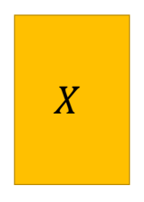   

P94   
## PCA over Body Shapes

   

P95  
## SMPL Model: Body Shape

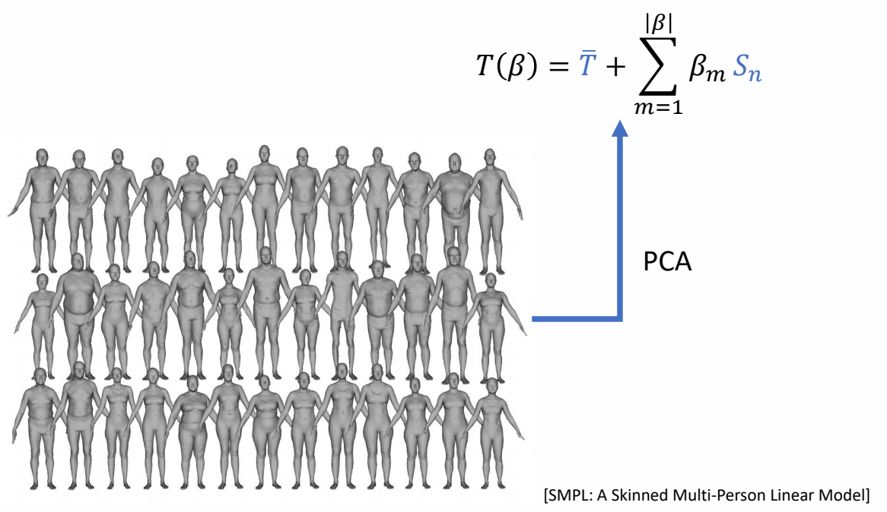   

P96   
## SMPL Model: Pose Blend Shapes

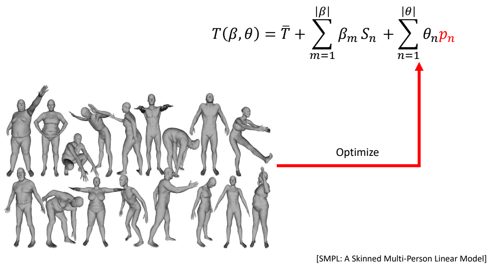   

P97   
## SMPL Model: Deformation

$$
T(\beta ,\theta )=\bar{T} + \sum _ {m=1}^{|\beta |} \beta _ m S_ n + \sum _ {n=1}^{|\theta |}\theta _np_n
$$

$$
x=SKIN(T(\beta ,\theta ),\theta ,w)
$$

$$
SKIN:\text{LBS, DQS, etc}\dots 
$$

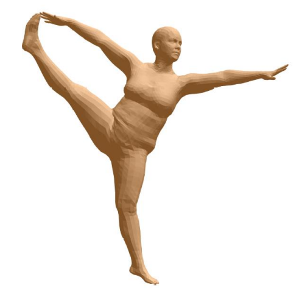   

[SMPL: A Skinned Multi-Person Linear Model]   

P99   
## Facial Animation

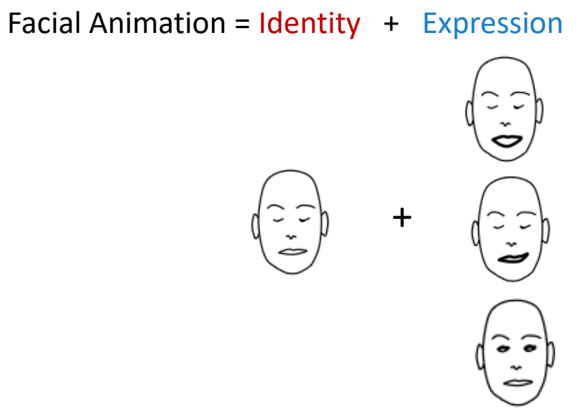   

P101   
## Facial Animation

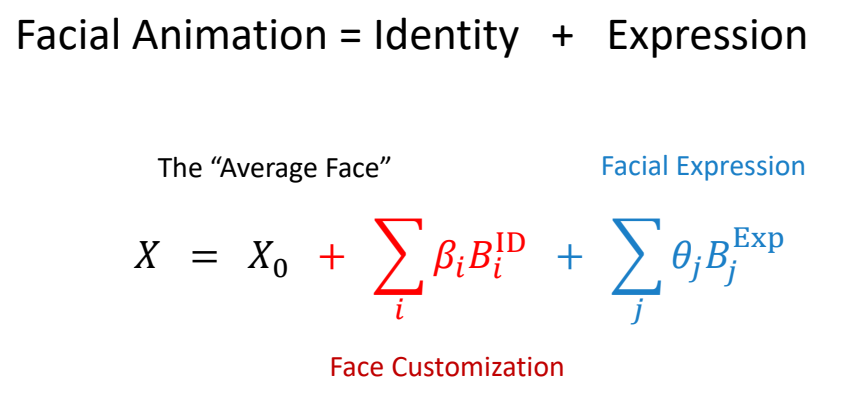   

> &#x2705; \\(B_j\\) 与 ID 无关，能做出差不多的效果。   
> &#x2705; 要更精细的效果，可以定义与 ID 相关的 \\(B_j\\).   

P102   
## Facial Blendshapes   

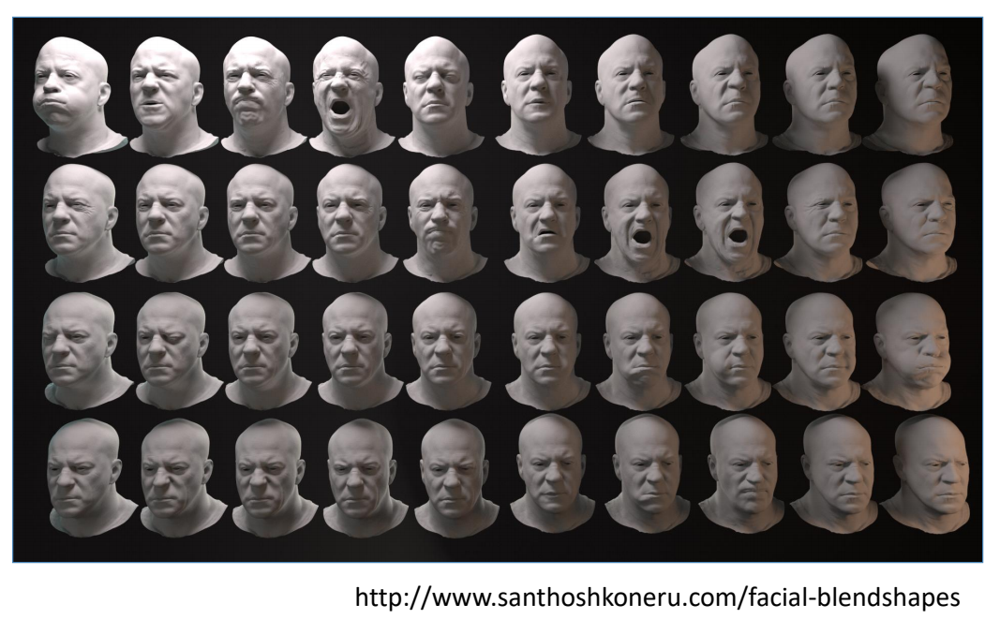   

P103   
## A Typical Set of Blendshapes (ARKit)

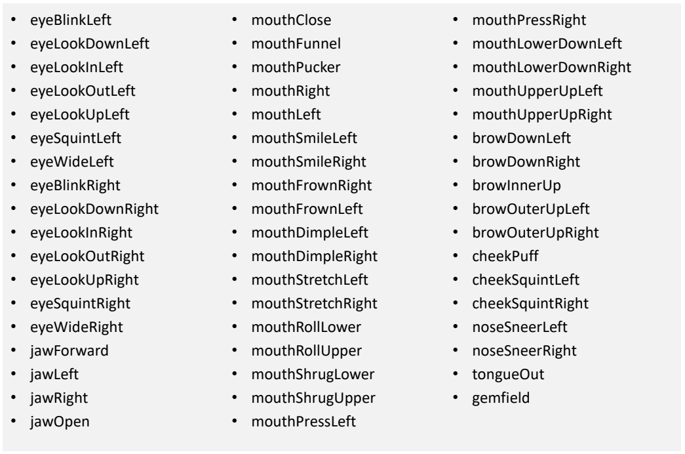   

P104   
## Blendshapes vs. Example-based Skinning

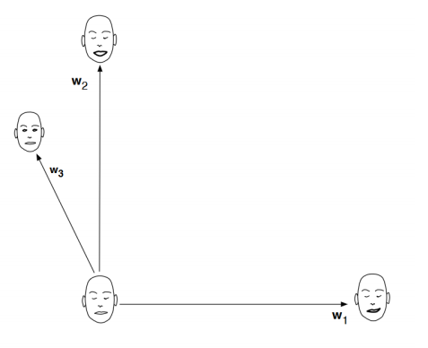   

   

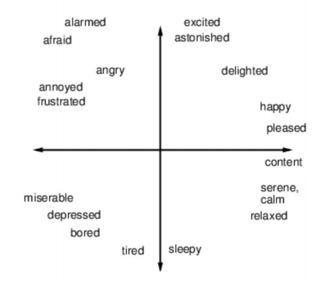   

> &#x2705; 几种不同的表情基混合方式。   
> &#x2705; 第二种，直接在几个脸之间做混合，适用于数据少的情况。   

P105  
## Morphable Face Models

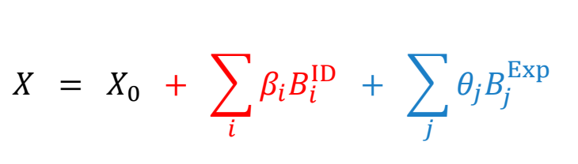   
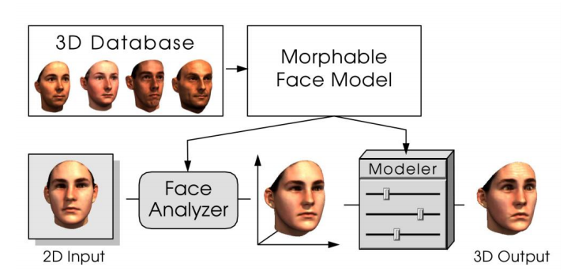   
   

Egger et al. 2020. **3D Morphable Face Models - Past, Present, and Future**. *ACM Trans. Graph*. 39, 5 (June 2020), 157:1-157:38.   

> &#x2705; 第一项：平均脸。第二项：PCA. 第三项：表情基。   
> &#x2705; \\(B_i^{ID}\\) 通常由 PCA 得到。   
> &#x2705; 基于脸部肌肉的物理仿真。   

P107   
## How to Animate a Face?

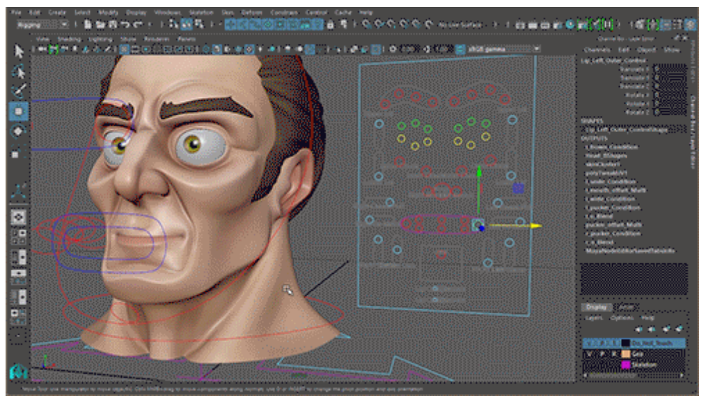

P110   
## Face Tracking

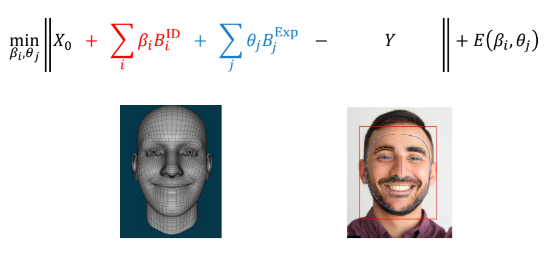

> &#x2705; 用一个视频人脸驱动 3D 人脸。    
> &#x2705; 人脸 \\(\overset{①}{\rightarrow} \\) 特征点  \\(\overset{②}{\rightarrow} \\) 表情参数    
> &#x2705; 1、提取    \\(\quad\\)   2、IK．

---------------------------------------
> 本文出自CaterpillarStudyGroup，转载请注明出处。
>
> https://caterpillarstudygroup.github.io/GAMES105_mdbook/