# Lecture 06+

P2   
## Outline  

 - Learning-based Character Animation (cont.)   
    - Motion Models   
    - Autoregressive models: PFNN   
    - Generative models   

P4   
## Learning Motion Models  

\\(p(x)\\): probability that 𝒙 is a natural motion     

Given a set of example motions {\\(x_i\\)}∼ \\(p(x)\\)   

> &#x2705; 由于\\(p(x)\\) 无法由计算得出，所以从数据去学。   

P5   
## Learning Motion Models

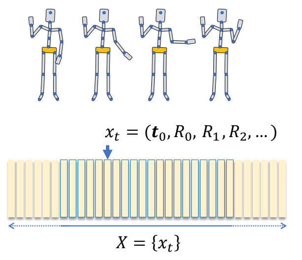   

P6   
## Learning Motion Models   

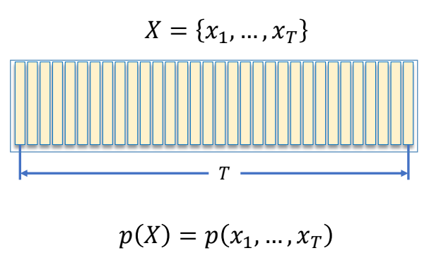  

> &#x2705; 不止是每个动作合理，一组动作序列也要合理。   

P7   
## Learning Motion Models

$$
p(X\mid z)=p(x_1,\dots ,x_T\mid z)
$$

$$
\begin{align*}
 𝑧: & \text{ control parameters} \\\\
  & \text{ latent variables} \\\\
  & …… 
\end{align*}
$$

P8   

$$
(x_1,\dots ,x_T)=f(z)
$$

$$
\begin{align*}
 𝑧: & \text{ control parameters} \\\\
  & \text{ latent variables} \\\\
  & …… 
\end{align*}
$$

> &#x2705; 如果概率分布是正确的，基于这个分布采样能得到一个合理的动作，且满足前提条件。   

P13   

> &#x2705; 序列 \\(\times \\) 合理 ＝ 已知序列中的前 \\(t-1\\) 帧时第 \\(t\\) 帧应当合理。  

P14   
## Two Perspectives on a Motion Sequence

$$
p(X\mid z)=p(x_1,\dots ,x_T\mid z)
$$

$$
=p(x_1)\prod_{t}^{} p(x_t\mid x_{t-1},\dots ,x_1;z)
$$

\\(^\ast \\) The chain rule of conditional probabilities:   

$$
\begin{align*}
 p(x_1,x_2,x_3) & = p(x_2,x_3 \mid x_1)p(x_1) \\\\
   & = p(x_3 \mid x_2, x_1)p( x_2 \mid x_1)p(x_1)
\end{align*}
$$

P15  
## Two Perspectives on a Motion Sequence

$$
x_t=f(x_{t-1},x_{t-2},\dots x_1;z)
$$

P17   
## Two Perspectives on a Motion Sequence

$$
x_t=f(x_{t-1};z)
$$

Markov Property   

> &#x2705; Markov性：无记忆性  

P18   
## Two Perspectives on a Motion Sequence

|||
|---|---|
|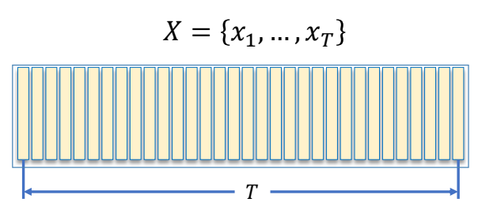 |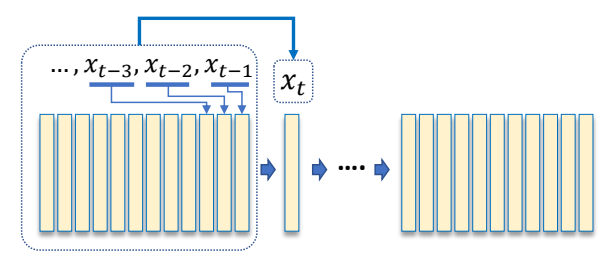 |
|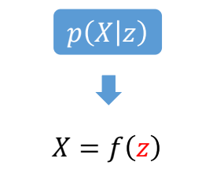 |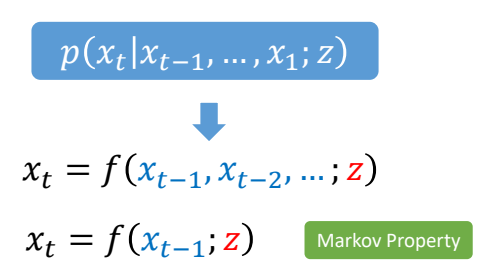 |

> &#x2705; 游戏里面通常用后者    
> &#x2705; 无交互无实时通常用前者   

P25   

## Learning Motion Models

$$
x_t=f(x_{t-1})
$$

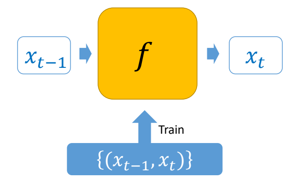   

> &#x2705; 由于只和上一帧相关，二元组\\(（X_{t-1}，X_t）\\)构成了一个数据，希望从里面学到一些信息。   
> &#x2705; Neural Network相关部分跳过。  

P40   
## Ambiguity Issue   

$$
x_t=f(x_{t-1})
$$

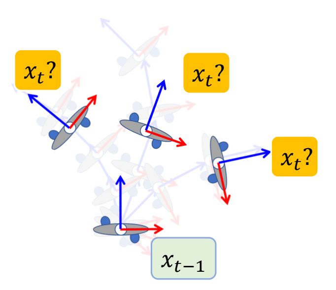   

> &#x2705; 但是 \\(x_t\\) 和 \\(x_{t-1}\\) 的关系是有歧义性的，最后学到一个平均的\\(x_t\\).   

P41   
## Hidden Variables

$$
x_t=f(x_{t-1};z)
$$

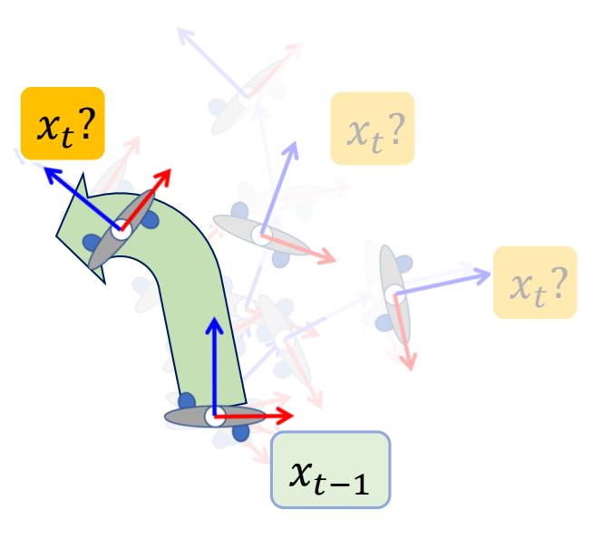    

> &#x2705; 需要加入一个额外的变量，可以来自用户输入或先验信息。关键是怎么找到 \\(z\\)，使学习比较有效。   

P42  

## PFNN: Phase-Functioned Neural Networks

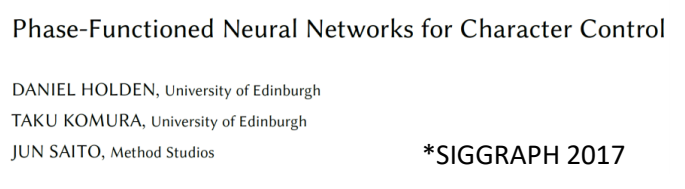   

P43  
## PFNN: Phase-Functioned Neural Networks

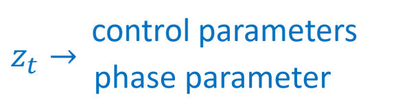  

> &#x2705; 控制参数，表明用户希望角色怎么走。   

P44  
## PFNN: Phase-Functioned Neural Networks

 
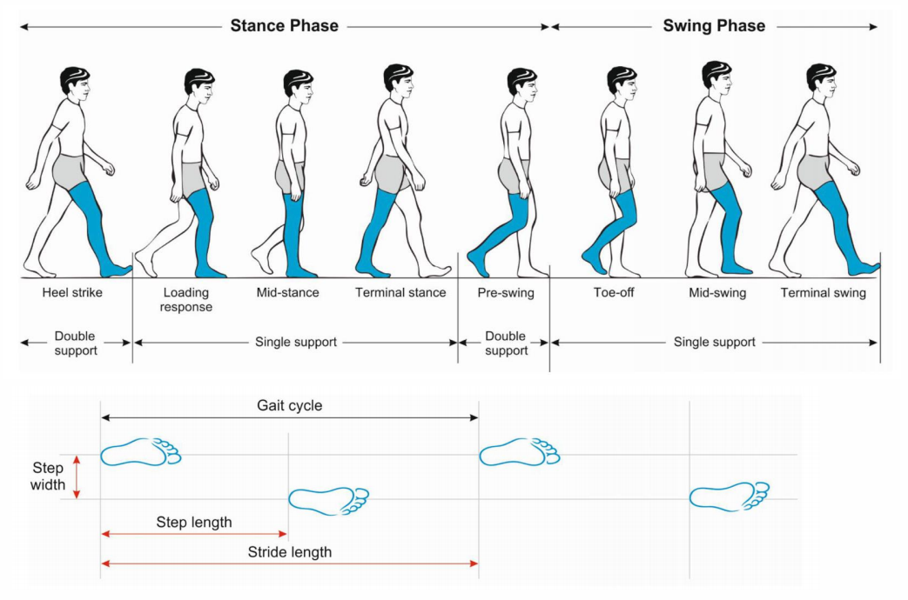 

phases of a walking gait cycle   
Pirker and Katzenschlager 2017.    
*Gait disorders in adults and the elderly*   

P45  
## PFNN: Phase-Functioned Neural Networks

$$
x_t=f(x_{t-1};z_t)  \quad \quad z_t=(c_t,\phi _t)
$$

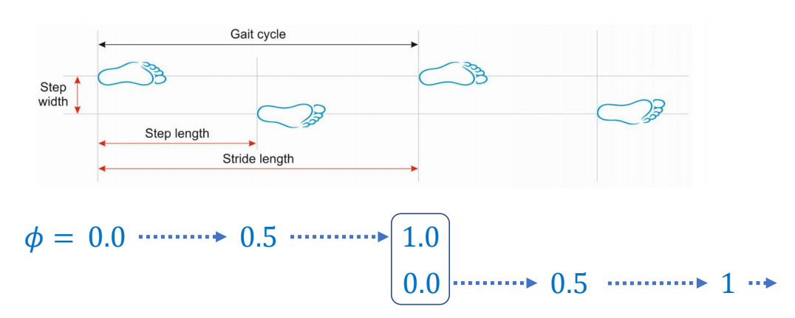   

> &#x2705; 调整相位与时间的对应关系，可影响走路速度。   

P47    
## Mixture of Experts

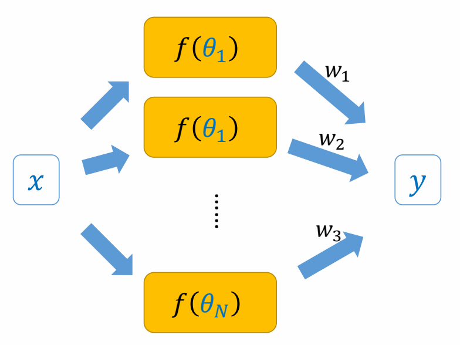   

$$
y=\sum_{i}^{} w_if(x;\theta _i)
$$

> &#x2705; 对专家结果混合。  

P48  

## Weighted-Blended Mixture of Experts

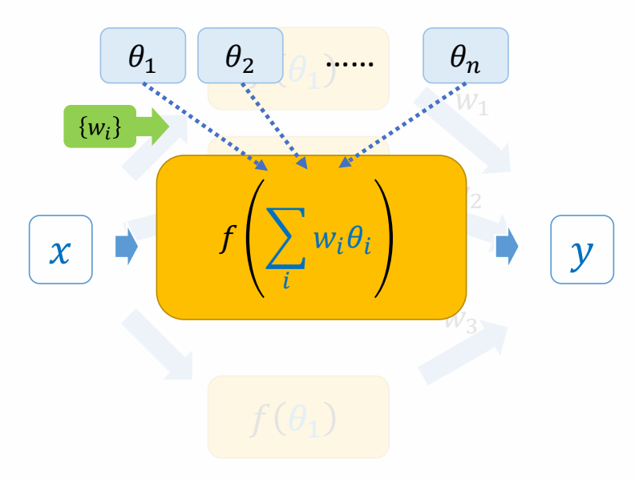   

$$
y=f(x;\sum_{i}^{} w_i\theta _i)
$$

> &#x2705; 对专家模型参数混合。

P49   
## PFNN: Phase-Functioned Neural Networks

$$
x_t = f (x_{t-1}; c_t, \theta _ t = \sum _ {i}^{} w_i(\phi _t) \theta _i)
$$

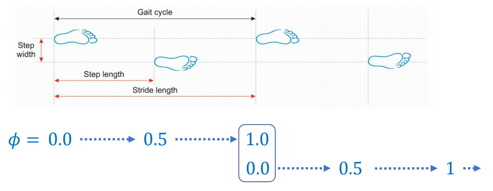   

> &#x2705; 专家混合的权重由phase决定。  
> &#x2705; 让每个专家专一地学特定的phase.   

P50   
## PFNN: Phase-Functioned Neural Networks

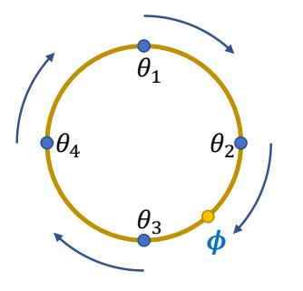   

Cubic Catmull-Rom Spline:   

$$
\begin{align*}
 \theta _t & = \theta _2 \\\\
  & +\phi (-\frac{1}{2} \theta _1 + \frac{1}{2} \theta _3) \\\\
  & +\phi^2 (\theta _1-\frac{5}{2} \theta _2 + 2\theta _3-\frac{1}{2} \theta _4)\\\\
  & +\phi^3 (-\frac{1}{2} \theta _1+\frac{3}{2} \theta _2 - \frac{3}{2} \theta _3+\frac{1}{2} \theta _4)
\end{align*}
$$

> &#x2705; PFNN缺点 （1）轻微滑步  （2）急转身时无减速。   

P53   
## Advanced Phase Functions

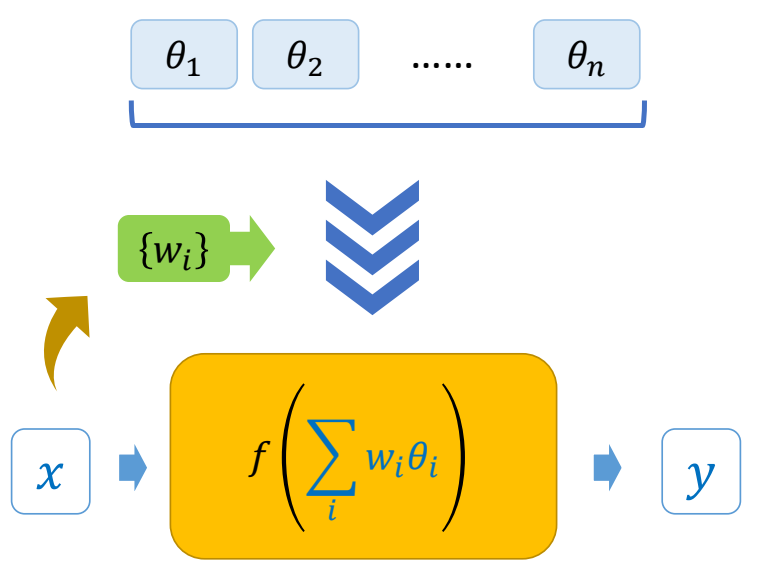     

P54  
## Advanced Phase Functions

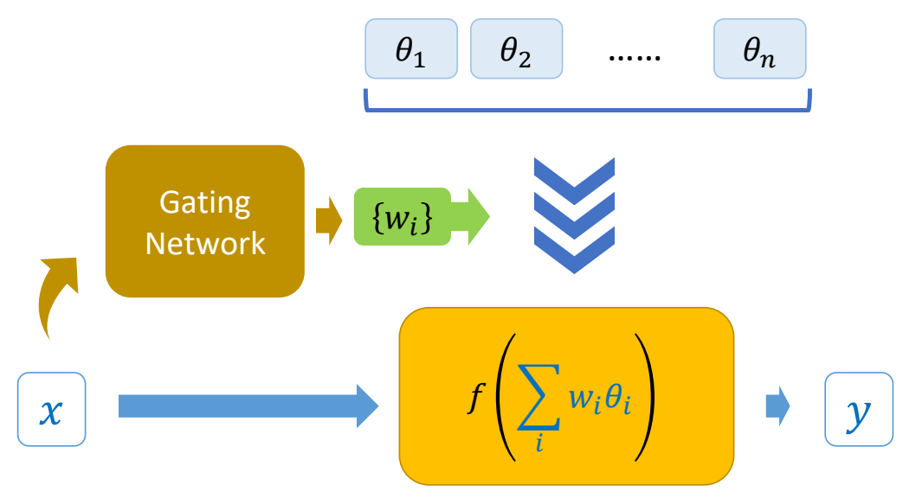   

> &#x2705; PFNN有确定的象位及对应的权重，但打篮球等动作，或动物走路，没有确定的象位。  
> &#x2705; 因此权重由当前状态与用户输入算出来。   

P55   
## Advanced Phase Functions

|||
|---|---|
|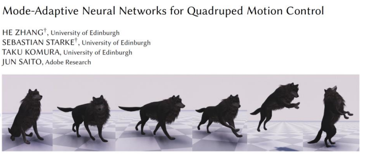  | *SIGGRAPH 2018 |
| 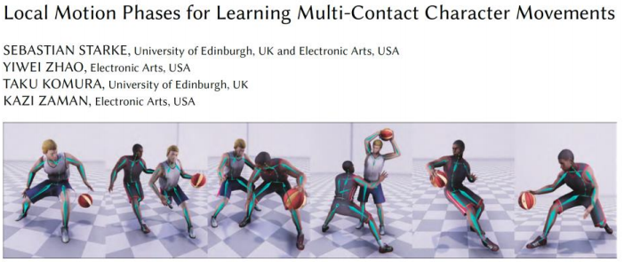  | *SIGGRAPH 2020 |
| 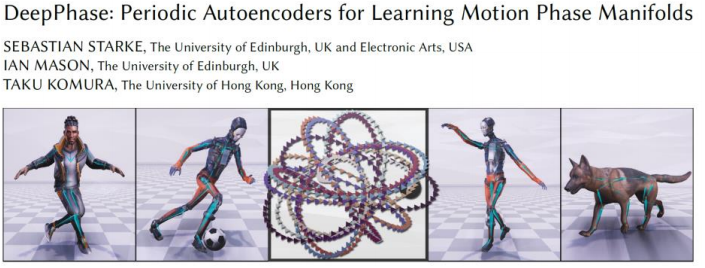  | *SIGGRAPH 2022 |

P57  
## Generative Models

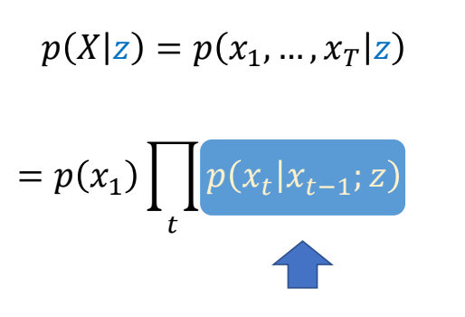   

> &#x2705; 不学两帧关系，而是直接学概率密度函数。   
> &#x2705; 难点：(1) 真实PDF可能非常复杂 (2) 从一个PDF中采样也很难。   

P59   
## Generative Models

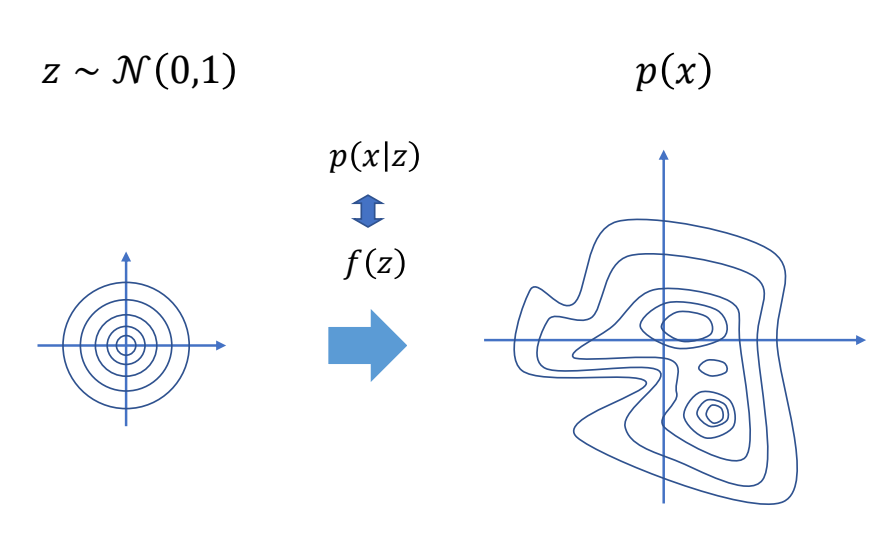   

> &#x2705; 一般生成式模型是这样的形式：从一个简单的PDF，通过 \\(f(z)\\)，映射到 \\(p(x)\\).   
> &#x2705; 关键是 \\(f(z)\\) 要学好。  

P60   
## Generative Models

|||
|--|--|
| Variational Autoencoders |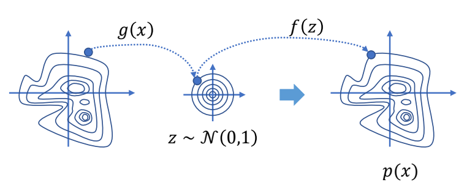   |
| Generative Adversarial Network |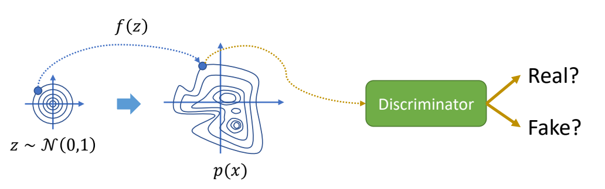 |

> &#x2705; VAE：已知一些真实数据采样，用Encoder编码到简单分布上的点，再用Decoder变回原分布上的点。  
> &#x2705; GAN：无Encoder，增加一个判别器。   

P61   
## Generative Models

|||
|--|--|
| Normalizing Flows |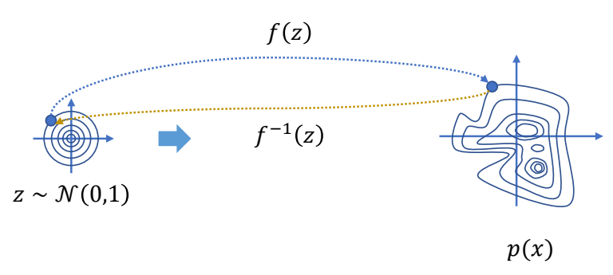   |
| Diffusion Models  |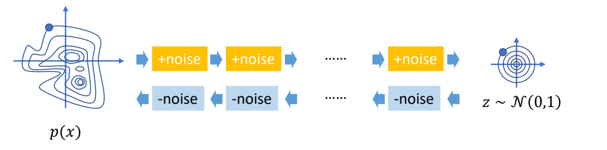   |

> &#x2705; 标准化流：类似VAE，使用一个可逆函数。   
> &#x2705; 扩散模型：多次编码与解码。   
> &#x2705; 一个动作序列相当于隐空间里的一条轨迹。   

P62  
## Generative Models

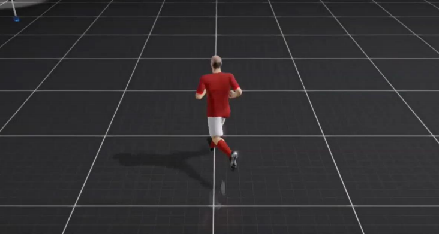 

[Ling et al. 2021 Character Controllers Using Motion **VAEs**] 

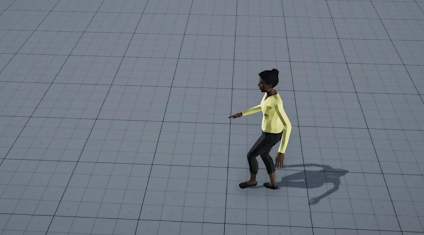 

[Henter et al. 2020, MoGlow: Probabilistic and Controllable 
Motion Synthesis Using **Normalising Flows**]

P63  
## Generative Models  

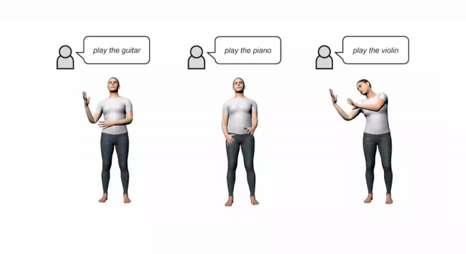   

[Zhang et al. 2022, **arXiv**, MotionDiffuse: Text-Driven Human Motion Generation with **Diffusion Model**]

   

[Tevet et al. 2022, **arXiv**, MDM: Human Motion **Diffusion Model**]  

---------------------------------------
> 本文出自CaterpillarStudyGroup，转载请注明出处。
>
> https://caterpillarstudygroup.github.io/GAMES105_mdbook/